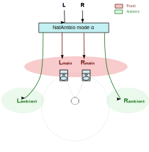
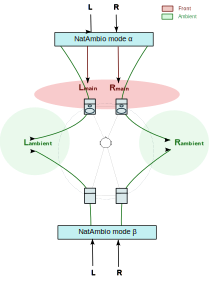
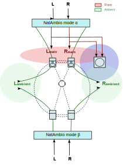

# Nat(ural) Ambio(phonics): NatAmbio

***El espacio ya está en la grabación. NatAmbio simplemente lo hace audible***

NatAmbio es un sistema de reproducción espacial diseñado para escuchar grabaciones estéreo convencionales mediante procesamiento digital en tiempo real. Puede emplearse tanto en entornos profesionales como, especialmente, domésticos, dado que su coste de implementación no es elevado. De hecho, su desarrollo ha tenido lugar en un domicilio particular, en una sala de estar estándar multiusos.

NatAmbio persigue un objetivo sencillo: reproducir grabaciones estéreo convencionales ampliando, y a la vez focalizando, la escena frontal de la interpretación, y proyectando la información ambiental contenida en la grabación hacia un espacio sonoro no localizado alrededor del oyente. Para ello, NatAmbio extrae la información ambiental ya presente en la grabación original estéreo, generando una experiencia envolvente sin recurrir a formatos multicanal específicos ni a efectos espaciales artificiales.

A diferencia de los sistemas multicanal convencionales, NatAmbio no requiere grabaciones específicas ni genera canales ambientales artificiales. Toda la información espacial reproducida procede exclusivamente de la señal estéreo original.

Existen dos disposiciones del sistema. La de un solo dipolo estéreo:

Y la de dos dipolos estéreo, uno frontal y otro ambiental trasero:

En cualquiera de ambos casos, se puede incorporar al sistema uno o más subwoofers:

La primera disposición, basada en un único ambiopolo frontal, ya proporciona la mayor parte de la percepción espacial aportada por NatAmbio. El segundo ambiopolo permite potenciar un pequeño paso más la sensación ambiental inherente a la grabación. Y la incorporación de subwoofer dependerá de la respuesta en graves buscada y del tipo de altavoces frontales que forma parte del sistema (p.e. monitores pequeños con muy buena dispersión con el apoyo de un subwoofer para frecuencias por debajo de 100 Hz).

NatAmbio extrae la señal ambiental de la propia grabación estéreo, no la genera mediante algún efecto diseñado con este motivo. Por ejemplo, a partir de una grabación monofónica (dos canales idénticos) no hay ninguna envolvente espacial; este tipo de grabaciones NatAmbio las reproduce con foco completo en el centro de la escena.

Es en grabaciones con ambiente natural como son actuaciones en vivo, música acústica en entornos especiales (de modo destacado jazz y pop acústico, y de modo muy destacado la música clásica orquestal y óperas) donde NatAmbio suele ofrecer los resultados más evidentes, proyectando el ambiente natural recogido en la grabación a un espacio sonoro no localizado, es decir, completamente ambiental. NatAmbio permite parametrizar esta sensación para hacer la reproducción de la grabación más seca o más ambiental, al gusto del oyente.

Para música pop comercial, donde es habitual el uso de algoritmos artificiales (ecos, reverb, panning, etc.) para generar la necesaria sensación ambiental, también NatAmbio detecta y extrae este ambiente menos natural, ubicándolo también en un espacio sonoro indeterminado alrededor de la escena sonora principal.

En todo momento, NatAmbio sigue manteniendo el foco frontal sobre la música, pero además, al aplicar un algoritmo de cancelación de diafonía (XTC) a cada dipolo, ensancha la escena frontal más allá de la ubicación de los altavoces, al modo [Ambiophonics](https://en.wikipedia.org/wiki/Ambiophonics). Este ensanchamiento de escena en la reproducción frontal también es altamente configurable.

Como añadido a la generación de escena ambiental, proyectada a un espacio sonoro indeterminado, y a la aplicación de filtrado XTC en ambos dipolos, NatAmbio incluye un convolver, cuyo motor es la librería [zita-convolver](https://kokkinizita.linuxaudio.org/linuxaudio/) que posibilita la ecualización [DRC](https://drc-fir.sourceforge.net/), la gestión de un subwoofer si se da el caso, y la aplicación de efecto loudness configurable a cualquiera de ambos dipolos.

## NatAmbio es el sistema y es el software que le da forma

En el núcleo de un sistema NatAmbio está su software, que también recibe el mismo nombre. El software NatAmbio ha sido diseñado específicamente para la arquitectura de reproducción descrita en este documento. Ambos elementos forman un conjunto coherente y están concebidos para utilizarse conjuntamente.

Como software, NatAmbio es un programa escrito en C/C++, con licencia [GPLv3](https://www.gnu.org/licenses/gpl-3.0.en.html#license-text), para sistemas GNU/Linux. Por lo tanto, corre sobre un ordenador GNU/Linux como núcleo del sistema. Este ordenador ejecuta diversos algoritmos DSP encargados de:

* extraer las componentes principal y ambiental de la grabación estéreo, permitiendo un ajuste a demanda del equilibrio de dichas componentes antes de generar la escena espacial típica de NatAmbio,
* generar los ya mencionados filtros de cancelación de diafonía (XTC) por convolución con la señal grabada,
* realizar la ecualización de los dipolos estéreo y gestionar el filtrado de señal principal al subwoofer si es necesario, también por convolución,
* y construir el campo sonoro espacial reproducido por los altavoces, enviando diferentes combinaciones de las componentes principal y ambiental hacia cada dipolo.

## ¿Qué es un sistema NatAmbio?

Un sistema NatAmbio está formado por dos elementos inseparables:

### 1. Una disposición específica de altavoces

NatAmbio adopta la arquitectura [PanAmbio](https://www.filmaker.com/papers/SMPTE144-Compatible.pdf) propuesta por Robin Miller, basada en dos dipolos estéreo Ambiophonics[1](#cita-ambiopole): uno frontal y otro posterior. Aunque, como ya se ha mencionado, es perfectamente aplicable a un sistema de un solo dipolo frontal.

Cada dipolo utiliza cancelación de diafonía (XTC) para ampliar la escena sonora percibida. El sistema puede funcionar con un único dipolo frontal, aunque alcanza su máxima expresión utilizando dos dipolos y uno o más subwoofers.

NatAmbio permite ecualizar ambos dipolos (y subwoofer/s adicional/es) mediante DRC. Para ello hay que generar los filtros DRC mediante el uso [DRC-FIR](https://drc-fir.sourceforge.net/) de Denis Sbragion, otra herramienta GPL compatible GNU/Linux. La documentación de NatAmbio incluye una pequeña guía para ello, así como el proyecto incluye unos scripts sencillos pero prácticos para realizar las medidas acústicas necesarias y a partir de ellos obtener los filtros de ecualización. 

### 2. El procesador DSP NatAmbio

NatAmbio es también el nombre del software que ejecuta el procesamiento digital necesario para alimentar dichos dipolos.

Este software analiza continuamente la señal estéreo de entrada, extrae su información espacial y genera las señales necesarias para cada altavoz del sistema.

El resultado es un campo sonoro envolvente derivado de la propia grabación estéreo original, cuya amplitud y contenido espacial dependen directamente de las características acústicas presentes en dicha grabación.

Es necesario destacar una vez más que todas las funcionalidades que NatAmbio realiza por convolución de señales con filtros de diversas utilidades (XTC, DRC, loudness, subwoofer) son posibles gracias a que emplea la librería de convolución [zita-convolver](https://kokkinizita.linuxaudio.org/linuxaudio/) de Fons Adriaensen. Zita-convolver también es una utilidad GPL compatible con GNU/Linux.

NatAmbio es Software Libre, se licencia bajo GPLv3, lo que permite la redistribución y la modificación de su código bajo los términos recogidos en la propia GPLv3.

## Documentación (enlaces pendientes)

NatAmbio presenta una documentación variada, según el enfoque con que se quiera conocerlo. Los artículos técnicos desarrollan los modelos en los que se basa NatAmbio y que son más originales o novedosos. La documentación de uso es la propia de software NatAmbio. 

Asimismo se recogen una serie de ejemplos y guías tanto de configuración, como de posibilidad hardware para montar el corazón de NatAmbio.

Además de la documentación técnica y de uso, se incluyen una serie de documentos de carácter divulgativo que exploran algunas implicaciones psicoacústicas de la reproducción estéreo y la extracción ambiental utilizada por NatAmbio.

Finalmente, se recoge una selección comentada de grabaciones especialmente relevantes durante el desarrollo y evaluación del sistema.

### Artículos técnicos.

- [NatAmbio Ambient Extractor (NAE)](nae/nae_es.md): Algoritmo de extracción de las trazas ambientales de una grabación estéreo
- [Diseño de un cancelador de diafonía estéreo (XTC) por convolución para NatAmbio](xtc/xtc_filters_es.md)
- [Aplicación de PCA a las medidas acústicas impulsivas de altavoces](pca4drc/pca4drc_es.md)

### Documentación de uso de NatAmbio

- Requisitos, descarga, compilación e instalación.
- Configuración de NatAmbio.
- [Ejemplos de posibles configuraciones](config_samples/README.md).
- [Uso de natambio como servicio automático en un NatAmbio DSP procesador autónomo](../natambio_as_a_service/natambio_systemd.md).
- ¿Cómo construir un equipo de audio que sea un sistema NatAmbio?

### Otras herramientas disponibles

- [python_nae_natambio](../tools/python_nae_natambio/README.md) Script python para la aplicación de NAE offline sobre ficheros wav. Posibilita pruebas específicas sobre los algoritmos NAE. Genera gráficas analíticas como las que presenta [NatAmbio Ambient Extractor (NAE)](nae/nae_es.md) 

### Intuiciones técnicas sobre potencialidades futuras del estéreo 

### Rincón audiófilo: las grabaciones que han hecho posible NatAmbio

### Apuntes personales

#### Notas

[1] A stereo dipole is a sound source in an Ambiophonic system, made by two closely spaced loudspeakers that ideally span 10 to 30 degrees. Thanks to the cross-talk cancellation method, a stereo dipole can render an acoustic stereo image nearly 180 degrees wide (single stereo dipole) or 360 degrees (dual or double stereo dipole).
