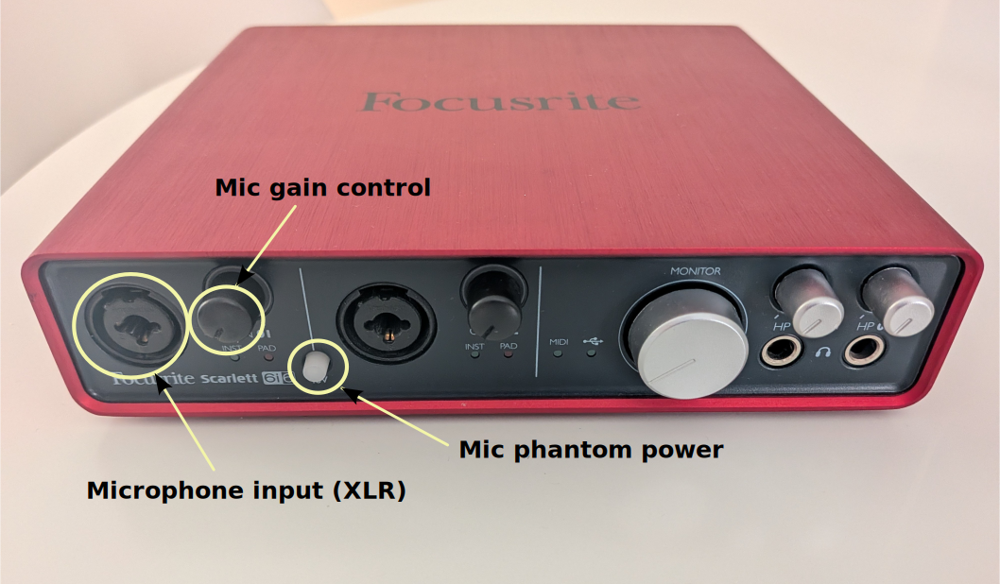

# Cómo medir respuestas impulsivas para DRC con NatAmbio

Para aplicar ecualización por convolución de filtros FIR, lo que se conoce como Digital Room Correction (DRC), se requiere de unas medidas impulsivas de la respuesta de la sala a cada altavoz a ecualizar. Esto es independiente del convolver finalmente aplicado, sea NatAmbio o cualquier otro, y del proceso de obtención del filtro FIR DRC (en mi caso siempre uso [DRC-FIR](http://drc-fir.sourceforge.net)).

Por otro lado, junto con NatAmbio, se presenta una [propuesta de medida de impulsivas de sala basada en tomar númerosas tomas en diferentes puntos de una zona de escucha y, mediante aplicación de PCA](pca4drc/pca4drc_es.md), caracterizar las medidas a una única impulsiva que será el objetivo a invertir.

Esta guía explica, de modo básico, cómo medir las respuestas impulsivas de un sistema NatAmbio en
la sala de escucha y, a partir de ellas, obtener por PCA un impulso de referencia
con el que generar los filtros FIR de corrección de sala (DRC). Esta guia va a analizar el caso de las medidas simples tradicionales, y también el caso más avanzado de medida multipunto y caracterización mediante PCA4DRC. Incluyendo el caso de medidas de un solo dipolo y dos dipolos, así como la incorporación de un subwoofer.

Para todas las opciones, se presente una automatización con el script [`measure_pca4drc.sh`](../tools/python_pca4drc/measure_pca4drc.sh),
que encadena las herramientas del toolkit
[`tools/python_pca4drc/`](../tools/python_pca4drc/README.md).

Como ya se ha comentado, el fundamento del método (medición multipunto + PCA) se desarrolla en el artículo
[Aplicación del PCA a medidas acústicas impulsivas de altavoces](pca4drc/pca4drc_es.md).
Por otro lado, en la automatización propuesta, la generación de los filtros DRC propiamente dichos la realiza
[DRC-FIR](https://drc-fir.sourceforge.net/) de Denis Sbragion (programa externo).

## Concepto de medida multipunto

En lugar de medir la respuesta impulsiva en un único punto de escucha —cuya
representatividad podria ser discutible—, se toman **varias medidas** repartidas
por la región de escucha (por defecto en la automatización se define **16 posiciones**) y se aplica un
**Análisis de Componentes Principales (PCA)** al conjunto. La **componente
principal** (`PCA_0`) condensa la información acústica común a toda la región y
atenúa los fenómenos menos correlados (p. ej. las primeras reflexiones, que
dependen de la geometría exacta de cada punto). Esa componente principal es la que
se usa como impulso de referencia para generar el filtro DRC.

## Micrófonos de medida

Para medir correctamente las mencionadas impulsivas se requiere de un micrófono omnidireccional. Existen dos tipos de micrófono que se pueden usar:

- Los clásicos que necesitan conectarse a un previo de micrófono que lo alimente a 48 V y ajuste correctamente la ganancia a los niveles habituales de este tipo de micrófonos. Por ejemplo, el mío es un muy básico [Behringer ECM 8000](https://www.behringer.com/en/products/0506-AAA). En este campo la gama es amplia y los precios y calidades son muy variados.
- Micrófonos que ya llevan la funcionalidad de previo integrada y se conectan directamente por USB al ordenador de medición. Es muy popular el modelo [Umik-2 de MiniDSP](https://www.minidsp.com/products/acoustic-measurement/umik-2)

Si se quiere medir con alta precisión es imprescindible que con el micrófono se proporcione su curva individual de calibración, con la que se puede corregir la medida obtenida para obtener valores con menos error.

Los micrófonos omnidireccionales clásicos requieren de un previo que suele formar parte de los interfaces audio profesional [como los que se recomiendan para NatAmbio](hw_setup_es.md). Por lo tanto, el propio interfaz audio ya presenta la capacidad de medir junto con el micrófono que se conecte. Estos interfaces tienen interruptor HW o SW para alimentación phamtom y controles físicos de ganancia en entrada, y su conexión siempre es XLR.

## Antes de medir
 
> **Aviso importante**: en todo momento durante el proceso de medida hay que cuidar que los niveles de reproducción de las señales de barrido tonal estén controlados para evitar accidentes. Para ello es muy conveniente hacer una calibración previa: si el sistema tiene controles de volumen globales o por dipolo, comenzar con un nivel bajo e ir subiéndolo hasta el punto en que se alcanza un nivel correcto. Esto se consigue conjugando los niveles hardware de reproducción y grabación con los niveles software del programa de medida.

Antes de medir hay que preparar todo el entorno físico y software:

- Localizar en GNU/Linux el interfaz audio a emplear y arrancar con el jackd.
- Preparar el micrófono, colocado en su pie de micrófono y conectado por XLR a la toma del previo de microfónica de la interfaz audio de NatAmbio.
- Arrancar jackd aplicada a la tarjeta de sonido.
- Identificar en jackd los nombres de la entrada desde micrófono y las salidas a cada altavoz.

A continuación se muestra un ejemplo para la interfaz audio Focusrite Scarlett 6i6:



Habitualmente, las entradas de micrófono de interfaces externos audio se corresponden con las primeras en la lista de elementos "capture" de jackd.

### Localizar la interfaz audio

Si la interfaz es USB, que es lo más habitual, es fácil localizarla con:

```
$cat /proc/asound/cards
 0 [PCH            ]: HDA-Intel - HDA Intel PCH
                      HDA Intel PCH at 0x6001120000 irq 144
 2 [USB            ]: USB-Audio - Scarlett 6i6 USB
                      Focusrite Scarlett 6i6 USB at usb-0000:00:14.0-5.4, high speed
```

```
$aplay -l
**** List of PLAYBACK Hardware Devices ****
card 0: PCH [HDA Intel PCH], device 0: ALC3266 Analog [ALC3266 Analog]
  Subdevices: 1/1
  Subdevice #0: subdevice #0
card 0: PCH [HDA Intel PCH], device 3: HDMI 0 [HDMI 0]
  Subdevices: 1/1
  Subdevice #0: subdevice #0
card 0: PCH [HDA Intel PCH], device 7: HDMI 1 [HDMI 1]
  Subdevices: 1/1
  Subdevice #0: subdevice #0
card 0: PCH [HDA Intel PCH], device 8: HDMI 2 [HDMI 2]
  Subdevices: 1/1
  Subdevice #0: subdevice #0
card 1: USB [Scarlett 6i6 USB], device 0: USB Audio [USB Audio]
  Subdevices: 1/1
  Subdevice #0: subdevice #0

```

Identificada la interfaz, se puede arrancar jackd de la siguiente manera:

``` 
/usr/bin/jackd -R -P70 -dalsa -dhw:USB -r<SAMPLERATE> -p<BUFFERSIZE> -n3
```

Otra posibilidad es emplear la aplicación gráfica **[qjackctl](https://qjackctl.sourceforge.io/)**.


## Caso de un solo dipolo, sin subwoofer, una única medida por canal

En el caso más simple, un sistema estéreo básico, que se quiere convertir en un NatAmbio de un solo dipolo y se quiere aplicar filtros DRC a partir de una medida por canal, el proceso es el siguiente:

- Ubicar el micrófono en el punto de escucha. Suele haber debate entre orientarlo al eje central hacía los altavoces y en vertical hacía el techo, es cuestión personal del medidor.
- Iniciar el proceso de calibración. Durante este proceso se podrán ajustar los controles físicos de las ganancias del previo de micrófono.

### Elegir los canales: salida del sweep y toma de micrófono

Cada medida la realiza `ecasound` con dos conexiones JACK simultáneas: una
**reproduce** el sweep hacia natambio y otra **graba** la señal del micrófono.

- **Salida (sweep → natambio):** el script envía el sweep a los puertos de
  entrada de natambio (`natambio:front_input_left`, `natambio:front_input_right`,
  ...), uno por vía. Estos nombres los fija natambio, así que normalmente **no
  hay que tocar nada**.
- **Entrada (micrófono → WAV):** es un único puerto, común a todas las vías,
  definido por la variable `IN_MEAS`. Por defecto es `system:capture_1`, la
  primera toma de captura de la tarjeta, que suele ser donde está conectado el
  previo de micrófono.

Si tu micrófono está en otra toma de captura, tienes dos formas de indicarlo:

```sh
# 1) Fijarla directamente por su nombre JACK:
IN_MEAS=system:capture_2 ./measure_pca4drc.sh

# 2) Elegirla por menú interactivo:
SELECT_INPUT=1 ./measure_pca4drc.sh
```

Con `SELECT_INPUT=1`, tras arrancar natambio el script lista los puertos JACK de
captura disponibles (lo que devuelve `jack_lsp -o`, p. ej. `system:capture_1`,
`system:capture_2`, ...) y te deja asignar uno como toma de micrófono por número
(0 = mantener el actual). Funciona tanto en la medición como en el modo
calibración, y se ignora en modo no interactivo (`AUTO=1`).

> Para localizar tus tomas de captura puedes consultar antes los puertos con
> `jack_lsp -o` (orígenes JACK; las entradas físicas de la tarjeta aparecen como
> `system:capture_*`), o usar **qjackctl**.

### calibración

Antes de tomar ninguna medida buena conviene fijar unas ganancias de
reproducción (`GAIN_OUT`) y de captura (`GAIN_IN`) que sirvan **a la vez** para
las dos vías del dipolo (front izquierdo y derecho), sin clipping, con nivel
suficiente y buena relación señal/ruido. Para esto el script
[`measure_pca4drc.sh`](../tools/python_pca4drc/measure_pca4drc.sh) dispone de un
**modo calibración** (`CALIBRATE=1`) que se limita a reproducir el sweep y grabar
para ajustar niveles: no extrae impulsos, ni hace PCA, ni DRC (desactiva esas
fases para no exigir sus dependencias).

Para un sistema de **un solo dipolo, sin subwoofer**, el modo se selecciona con:

- `FULL_NATAMBIO=false` → sólo dos vías, *front left* y *front right* (un dipolo).
- `SUBWOOFER=false` → sistema sin subwoofer (es el valor por defecto, puede omitirse).
- `CALIBRATE=1` → modo calibración de ganancias.

```sh
cd <directorio_de_trabajo>
FULL_NATAMBIO=false CALIBRATE=1 ./measure_pca4drc.sh
```

Si quieres partir de unas ganancias iniciales distintas de las de por defecto
(`GAIN_OUT=0` dB, `GAIN_IN=10` dB), las antepones igualmente a la llamada:

```sh
FULL_NATAMBIO=false CALIBRATE=1 GAIN_OUT=-3 GAIN_IN=12 ./measure_pca4drc.sh
```

Qué hace el modo calibración, paso a paso:

1. Genera el sweep y su inversa (Fase 0), salvo que se salte con `DO_SWEEP=0`
   reutilizando un par ya existente.
2. Arranca `natambio` con la configuración `half_natambio_measurements_normal.xml`
   (medio sistema = un dipolo, sin subwoofer) y muestra el **informe de enrutado**
   (qué salida de natambio va a cada salida física de la tarjeta). Confirma con
   Enter que la asignación es correcta.
3. Reproduce el sweep por **cada vía** (front L y front R) a las ganancias
   actuales, graba la captura del micrófono y la analiza con `check_capture.py`,
   avisando de **clipping**, **nivel bajo** (`MIN_LEVEL`, −40 dBFS por defecto) o
   **SNR baja** (`MIN_SNR`, 20 dB).
4. Tras probar las dos vías, si alguna no cumple, puedes escribir **dos números
   nuevos** `GAIN_OUT GAIN_IN` (p. ej. `-3 12`) y reintentar; y/o retocar la
   ganancia física del previo de micrófono. Cuando ambas vías dan niveles
   correctos, pulsa Enter para aceptar.
5. Al terminar, natambio se detiene y el script imprime las **ganancias
   recomendadas**, listas para usarlas en la medición real, por ejemplo:

   ```sh
   GAIN_OUT=-3 GAIN_IN=12 FULL_NATAMBIO=false ./measure_pca4drc.sh
   ```

> Durante la calibración ajusta primero la ganancia **física** del previo de
> micrófono y deja el ajuste fino para `GAIN_OUT`/`GAIN_IN`. Y vigila en todo
> momento el nivel de reproducción para evitar accidentes (ver el aviso de
> [Antes de medir](#antes-de-medir)).

### Calibración de niveles en el proceso de medida

Antes de medir hay que asegurar que los niveles de salida y de entrada 


## pendiente de revisar

El script repite todo el proceso para cada **vía** (altavoz) del sistema:

- **NatAmbio completo** (`FULL_NATAMBIO=true`, por defecto): cuatro vías —
  `front_left`, `front_right`, `rear_left`, `rear_right`.
- **Sistema de dos altavoces** (`FULL_NATAMBIO=false`): sólo `front_left` y
  `front_right`.

## Requisitos previos

- Un **servidor JACK** en marcha a la frecuencia de captura (48000 Hz).
- **`ecasound`** (reproducción del sweep y grabación de la respuesta).
- **`natambio`** compilado/instalado: durante la medición se arranca con una
  configuración específica para enrutar el sweep a cada vía.
- **`drc`** (DRC-FIR de Sbragion) en el `PATH`, para la fase de corrección.
- Las dependencias Python del toolkit: `pip install -r tools/python_pca4drc/requirements.txt`
  (`numpy`, `scipy`, `soundfile`).
- Un **micrófono de medición** con su previo, conectado a la entrada de la tarjeta
  (`IN_MEAS`, por defecto `system:capture_1`).

## Las cinco fases

El script ejecuta cinco fases encadenadas. Cada una puede activarse o saltarse de
forma independiente con su interruptor `DO_*` (ver más abajo).

### Fase 0 — Generación del sweep (`sweepgen.py`)

Genera el barrido logarítmico de excitación (`SWEEP`, por defecto `sweep_48k.wav`)
y su filtro inverso (`INVERSE`, `inverse_48k.wav`), que luego se usa para
deconvolucionar. Los parámetros del barrido se controlan con `SWEEP_RATE`
(48000 Hz, **debe** coincidir con la captura), `SWEEP_LENGTH` (6 s), `SWEEP_HZSTART`
/ `SWEEP_HZEND` (20–20000 Hz), `SWEEP_AMPLITUDE` (0.5), etc.

Si ya dispones de un par sweep/inversa, salta esta fase con `DO_SWEEP=0`.

### Fase 1 — Medición (`ecasound`)

Por cada vía y por cada posición de micrófono reproduce el sweep y graba la
respuesta:

1. Arranca **natambio** con la configuración correspondiente según `FULL_NATAMBIO`
   (full/half) y `SUBWOOFER` (subwoofer/normal):
   `{full,half}_natambio_measurements_{subwoofer,normal}.xml`. Su salida se
   redirige a `NATAMBIO_LOG` (`/tmp/natambio_measure.log`) y se comprueba que
   registra sus puertos JACK; si no, aborta.
2. Imprime un **informe de configuración** (modo, vías a medir, enrutado real de
   las salidas de natambio a las salidas físicas `system:playback_*`) y pide
   **confirmación** antes de empezar.
3. `ecasound` envía el sweep a la entrada de natambio (`natambio:front_input_left`,
   …) y graba la captura del micrófono, con `GAIN_OUT` dB a la salida y `GAIN_IN`
   dB a la entrada, durante `REC_SECONDS` (10 s).
4. Tras cada captura, `check_capture.py` valida el WAV y avisa de **clipping**,
   **nivel bajo** (`MIN_LEVEL`, −40 dBFS) o **SNR baja** (`MIN_SNR`, 20 dB). Si los
   niveles no son válidos, no avanza: pide reajustar la ganancia del previo de
   micrófono y repetir la medida (salvo en modo `AUTO=1`).

Al terminar, natambio se detiene automáticamente.

> Las medidas no deben tomarse en puntos coincidentes entre campañas, sino en
> posiciones distintas dentro de la misma región de escucha (un área de radio
> reducido alrededor del punto de escucha), manteniendo la sala en las mismas
> condiciones.

### Fase 2 — Impulsos (`fft_convolve.py`)

Deconvoluciona cada sweep grabado con el sweep inverso para obtener la respuesta
impulsiva de cada posición.

### Fase 3 — PCA (`pca4drc.py`)

Por cada vía, calcula la descomposición PCA del conjunto de impulsos y guarda las
componentes en `i_<via>/pca4drc/` (`PCA_0.wav` = componente principal, `PCA_1.wav`,
…), de longitud `OUTPUT_LEN` (131072 muestras). A continuación las convierte a
`.raw` (float 32-bit LE) con `wav2raw.py` para alimentar a DRC. El parámetro
`PCA_NORMALIZE` (por defecto `true`) normaliza las componentes al pico de la
principal.

### Fase 4 — DRC (`drc` de Sbragion)

Por cada vía ejecuta `drc` con `config.drc` (junto al script), usando la
componente principal `pca4drc/PCA_0.raw` como impulso de entrada. Genera los
filtros de corrección `rps.raw` / `rms.raw` y los convierte a WAV con
`raw2wav.py`. Activable con `DO_DRC` (1 por defecto); si una vía falla, avisa y
continúa con las demás.

## Estructura de directorios generada

Ejecutando el script en un directorio de trabajo, se crean (para NatAmbio
completo):

```
m_front_left/   m_front_right/   m_rear_left/   m_rear_right/    # sweeps grabados (Fase 1)
i_front_left/   i_front_right/   i_rear_left/   i_rear_right/    # impulsos (Fase 2)
    └── pca4drc/    PCA_0.wav, PCA_1.wav, …  +  PCA_0.raw, …     # componentes PCA (Fase 3)
    └── rps.raw, rms.raw  (+ sus .wav)                          # filtros DRC (Fase 4)
```

## Uso y configuración

Todas las variables tienen un valor por defecto, pero pueden **sobrescribirse al
vuelo** anteponiéndolas a la llamada (sin editar el script):

```sh
./measure_pca4drc.sh                       # las cinco fases, interactivo (4 vías, normal)
FULL_NATAMBIO=false ./measure_pca4drc.sh   # sistema de 2 altavoces (sólo front L/R)
SUBWOOFER=true ./measure_pca4drc.sh        # arranca natambio con la config de subwoofer
NUM_POS=8 ./measure_pca4drc.sh             # 8 posiciones de micrófono en vez de 16
AUTO=1 ./measure_pca4drc.sh                # sin pausas interactivas
DO_SWEEP=0 ./measure_pca4drc.sh            # usar un sweep/inversa ya existentes
DO_MEASURE=0 ./measure_pca4drc.sh          # re-procesar lo ya medido (saltar la medición)
DO_DRC=0 ./measure_pca4drc.sh             # todo menos la corrección DRC
DO_MEASURE=0 DO_IMPULSES=0 DO_PCA=0 ./measure_pca4drc.sh  # sólo DRC sobre PCA_0.raw ya generados
```

Los interruptores de fase `DO_SWEEP` / `DO_MEASURE` / `DO_IMPULSES` / `DO_PCA` /
`DO_DRC` valen `1` (activada) o `0` (saltada) y son independientes, de modo que
pueden combinarse para ejecutar sólo las fases que interesen.

Variables más habituales:

| Variable | Por defecto | Significado |
|---|---|---|
| `FULL_NATAMBIO` | `true` | `true` = 4 vías (front+rear); `false` = 2 (front) |
| `SUBWOOFER` | `false` | Config de natambio con/sin subwoofer |
| `NUM_POS` | `16` | Número de posiciones de micrófono |
| `IN_MEAS` | `system:capture_1` | Puerto JACK de captura del micrófono |
| `SELECT_INPUT` | `0` | `1` = elegir `IN_MEAS` por menú interactivo antes de medir |
| `GAIN_OUT` / `GAIN_IN` | `0.0` / `10.0` dB | Ganancia de reproducción / captura |
| `REC_SECONDS` | `10` | Duración de cada captura (s) |
| `MIN_LEVEL` / `MIN_SNR` | `-40` dBFS / `20` dB | Umbrales de validación de la captura |
| `OUTPUT_LEN` | `131072` | Longitud de las componentes PCA (muestras) |
| `PCA_NORMALIZE` | `true` | Normalizar las componentes al pico de la principal |
| `DRC_CONFIG` | `config.drc` | Configuración de DRC-FIR |
| `AUTO` | `0` | `1` = sin pausas interactivas |

La lista completa de variables está documentada en
[`tools/python_pca4drc/README.md`](../tools/python_pca4drc/README.md). Si los
scripts `.py` no están junto al `.sh`, exporta `TOOLS_DIR` apuntando a ellos.

## Flujo de trabajo recomendado

1. **Prepara la sala y el sistema**: JACK en marcha a 48 kHz, micrófono colocado
   en la primera posición, niveles de previo razonables.
2. **Primera ejecución completa** e interactiva: `./measure_pca4drc.sh`. Revisa el
   informe de configuración (enrutado de vías) antes de confirmar.
3. **Ajusta la ganancia** si `check_capture.py` avisa de nivel/SNR, y repite la
   posición.
4. Una vez medidas todas las posiciones y vías, las fases 2–4 generan impulsos,
   PCA y filtros DRC sin más intervención.
5. Para **re-procesar** sin volver a medir (p. ej. probando otra curva objetivo o
   parámetros de PCA), repite con `DO_SWEEP=0 DO_MEASURE=0`.
