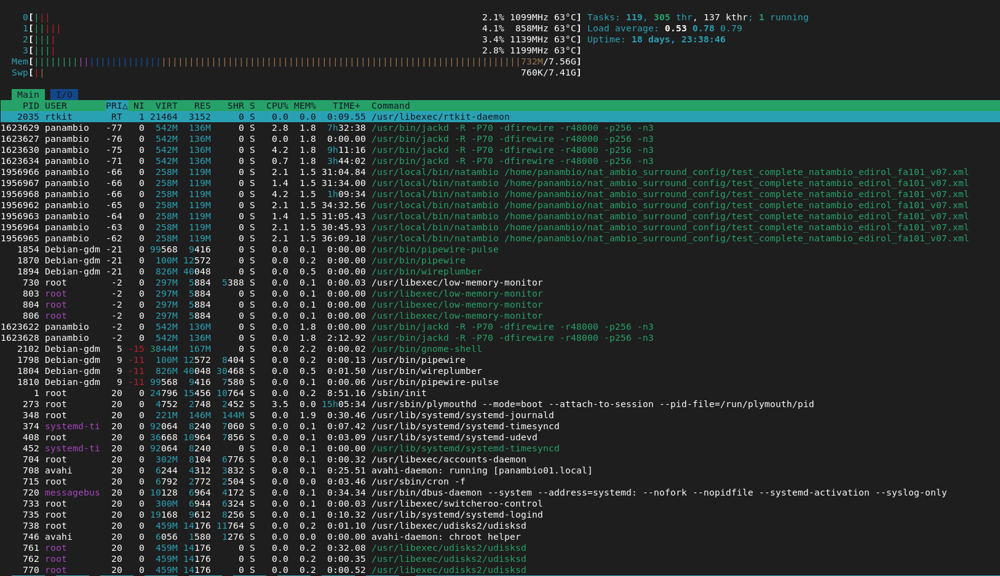
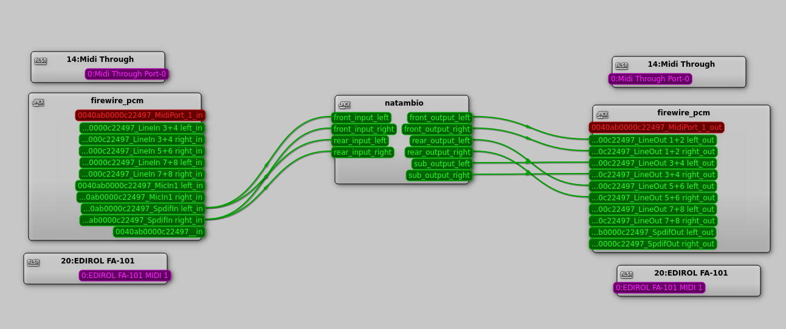
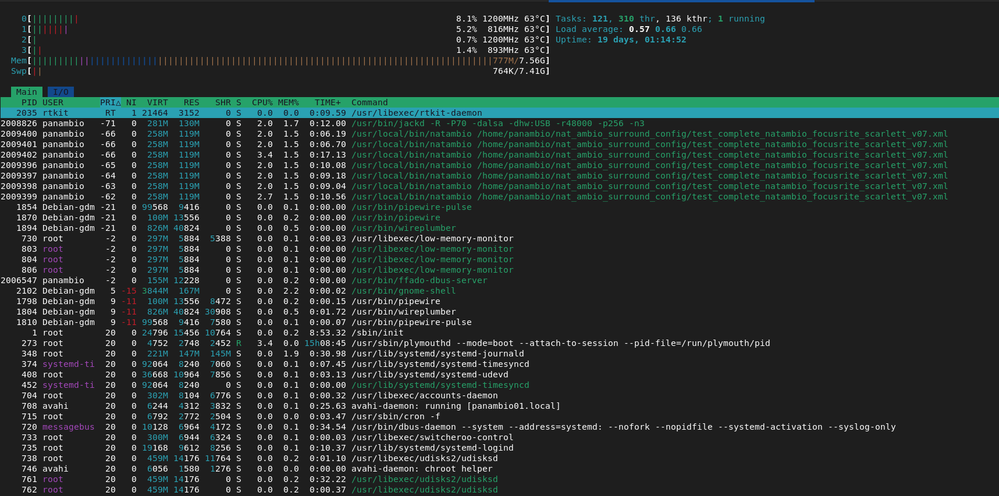
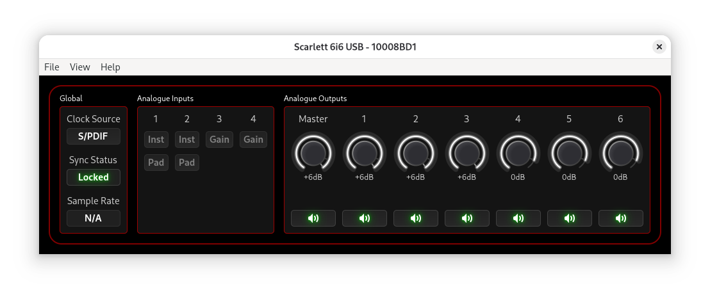
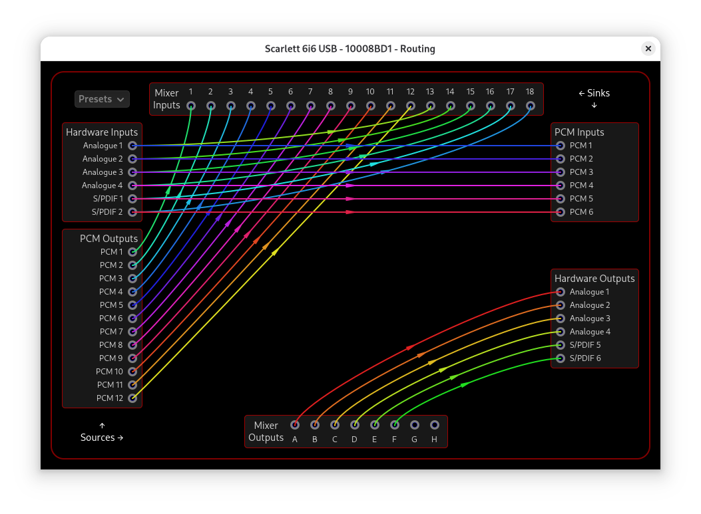
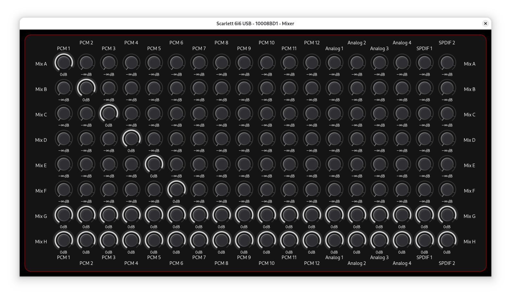
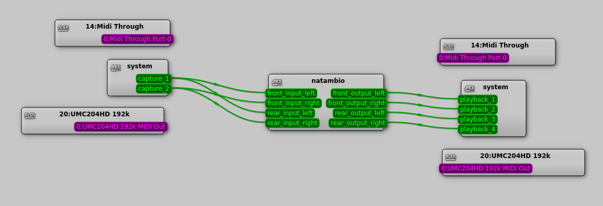
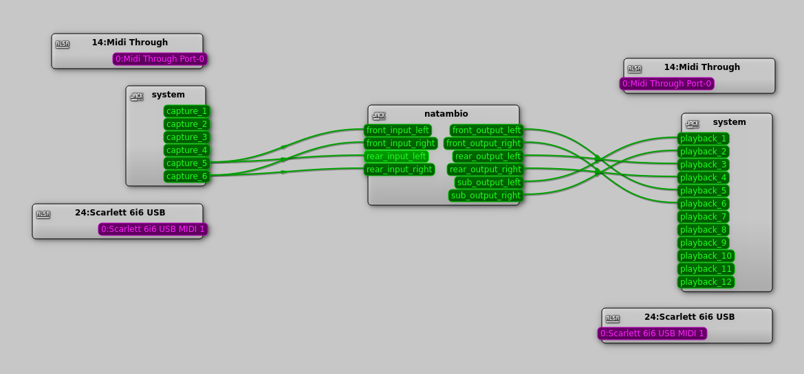

# How to build a NatAmbio system to run the NatAmbio software

Once the concept has been developed, the ideas and the algorithm explained, and the system's tools and main software presented, the question every future user will ask arises: how do you build a complete NatAmbio system?

NatAmbio has a brain —the DSP PC that hosts the software and all the control— and lungs —the audio interface, in charge of carrying the stereo signal to the brain for processing and then returning the result to the preamplifier, amplifier and loudspeakers. We will describe both elements and explain how they connect to the rest of the sound system.

## A PC for DSP/NatAmbio

First you need a PC running the GNU/Linux operating system (recommendation: Debian distribution). Since it will be immersed in a sound system, one of its requirements is that it be silent —that it run without noise. There are many systems with low-noise fans, but surely the best option is a passively cooled PC. There the noise is zero. Traditionally, passively cooled equipment was associated with low-power processors. However, today's situation is very different and there are solutions capable of running NatAmbio with ample resource headroom.

As a practical reference, my home system is built using a silent PC with an [Asrock N100DC-ITX](https://www.asrock.com/mb/Intel/N100DC-ITX/index.la.asp) motherboard, working on a dual stereo dipole plus subwoofer sound system managed by NatAmbio. The configuration includes one NAE, two XTC filters, a low/high-pass crossover filter and four DRC filters, adding up to ten convolution processes of 16384 samples. Total CPU load is around 5% with jackd running at 256 samples per period. The processor has four cores and NatAmbio takes advantage of its multithreaded nature to distribute the load efficiently.



The load example shown uses the Edirol FA-101 audio interface.

Another possible motherboard, which I have owned and which works —although it is less powerful than the previous one— is the [Mini ITX Atom N2800MT E PD11TI-2](https://resources.mini-box.com/online/MBD-I-DN2800MT-PD11TI-MITAC/MBD-I-DN2800MT-PD11TI-MITAC-specs.pdf). There are many other passively cooled boards that are candidates to host a NatAmbio system, as well as compact PCs, also fanless, with all components already integrated.

One advantage of this type of solution for NatAmbio is that they are quite inexpensive.

Of course, at least my home NatAmbio system has no screen, mouse or keyboard. It runs autonomously with NatAmbio and jackd running as services under systemd. Management and update tasks I do connected over an ssh session. For that, my PC is connected by ethernet to the home network.

## A sound interface for NatAmbio

NatAmbio's sound interface is the entry and exit door for sound in the PC. A quality interface ensures a quality audio system. By quality we mean very low distortion, flat frequency response, very low background noise, and sufficient input and output levels.

Personally, my sound interfaces are FireWire ones. Although FireWire is today an obsolete technology, that very obsolescence has created an extraordinarily attractive second-hand market for NatAmbio. Many very high quality professional interfaces can be found at reduced prices and continue to work perfectly under GNU/Linux through FFADO. For a very reasonable cost NatAmbio can be equipped with an excellent audio interface.

I have acquired, and tested, several sound interfaces compatible with the FireWire audio library for GNU/Linux, [FFADO](https://ffado.org/), and, correctly configured, they run stably without dropouts (xrun) for days. Right now I have two Echo Audiofire4, which I have even connected in a daisy chain without problems, an Edirol FA-66 and an Edirol FA-101. All four work perfectly. The Echo interfaces have software controls manageable through ffado-dbus-service. The Edirol interfaces have their controls on the card itself.

To have a FireWire interface in the PC, I have installed a PCIe-to-FireWire card on the motherboard, which is currently easy to find at low cost.

The most practical current option is to have a USB audio interface. I have tested the correct operation of NatAmbio with a very simple card of reasonable quality from Behringer, the UMC204HD, and with a high quality card, the Focusrite Scarlett 6i6. In the case of the Scarlett card it is essential to install [alsa-scarlett-gui](https://github.com/geoffreybennett/alsa-scarlett-gui) to be able to activate it and configure all its routing and level controls. The Focusrite Scarlett interface is very stable for days with jackd, as is the UMC204HD interface.

Recommendation: whenever possible, use an SPDIF input, whether optical or coaxial. By keeping the signal in the digital domain all the way to the PC, you avoid introducing additional analog noise on the input path. Likewise, an SPDIF output to a modern external DAC allows excellent conversion quality at a relatively contained cost (SMSL, Topping, etc.).

| Interface | Type | Inputs/Outputs | Advantages | Drawbacks | Recommended profile |
|---|---|---|---|---|---|
| Behringer UMC204HD | USB | 2 In / 4 Out | Very inexpensive, works out of the box | Slight background noise | First low-cost NatAmbio system |
| Focusrite Scarlett 6i6 | USB | 6 Out + SPDIF | Very stable, good quality, ideal for NatAmbio | Requires alsa-scarlett-gui | Recommended modern system |
| Edirol FA-101 | FireWire | Many I/O | Excellent quality, cheap second-hand | Requires FireWire (obsolete) | Linux user with FireWire hardware |
| Echo Audiofire4 | FireWire | Compact and very configurable, cheap second-hand | Professional quality, DBUS controls | Requires FireWire (obsolete) | Advanced user wanting maximum flexibility |

### FireWire interfaces: basic usage guide

Users of FFADO-compatible FireWire interfaces can access the advanced configuration of their devices through DBUS.

A short practical guide with real examples of device detection, control exploration and parameter modification can be found at:

[DBUS guide for FFADO devices](dbus_for_ffado.txt)

When FFADO is used as the JACK library, the port names are specific to the interface. The following capture shows a real instance of NatAmbio running on an Edirol FA-101, with a stereo SPDIF input and six outputs for the front dipole, rear dipole and subwoofer:



Although its inputs and outputs are also associated with the classic JACK aliases, system:capture_X for the inputs and system:playback_X for the outputs.

The Edirol FA-101 interface presents its controls on the card itself, unlike the Echo Audiofire4, which has many controls over DBUS. A brief list of some of them can be found in [Short guide of DBUS commands for FFADO devices](dbus_for_ffado.txt)

### USB interfaces: more modern and simpler

It is very easy to locate the USB sound card on our GNU/Linux:

```
$cat /proc/asound/cards
 0 [PCH            ]: HDA-Intel - HDA Intel PCH
                      HDA Intel PCH at 0x6001120000 irq 144
 2 [USB            ]: USB-Audio - Scarlett 6i6 USB
                      Focusrite Scarlett 6i6 USB at usb-0000:00:14.0-5.4, high speed
```

When jackd uses ALSA over a USB interface, the load distribution among threads is different from that observed with FFADO over FireWire. However, the total CPU consumption is practically equivalent.



In any case, the processing load is equivalent to the one mentioned in the first section, where the audio device was the Edirol FA-101.

Screenshots of how a Focusrite Scarlett card is configured with alsa-scarlett-gui are included, to serve as a guide for other users:

Global card configuration. In my case the Scarlett is synchronized to the external SPDIF clock.


Internal routing configuration. You can see how the SPDIF inputs are routed to ALSA's internal PCMs.



Scarlett's internal mixer. This matrix allows independent mixes to be created between physical inputs, PCM and hardware outputs.


To finish documenting this section, the case of using the Behringer UMC204HD USB card is shown.



In this case, four analog outputs are available, two for each NatAmbio dipole. Here a subwoofer with NatAmbio's own management could not be added, but with the subwoofer's own management in pass-through from outputs playback_1 and playback_2 it is perfectly viable.

As for processing performance, all the interfaces discussed here operate with jackd without any xrun for days, and the processing load of all of them is similar. The differences, inevitable, lie in their connectivity and in the internal quality of their electronics. But, in any case, even the most modest UMC204 is of adequate quality to form a domestic NatAmbio system.

# Connecting the equipment to NatAmbio's brain

Based on the example of jackd connections with the Focusrite Scarlett 6i6 interface, we analyze how to carry out all the wiring.



Being a stereo system, the input signal will be two channels, left and right. Anyone with more than one source will need a preamplifier to switch between them, or to connect and disconnect cables, or to have a card with several line inputs. In my home installation, the only sound source is the television, connected by bluetooth to a simple receiver but with SPDIF output (coaxial and optical); that is why the input is channels capture_5 and capture_6, which correspond to the coaxial SPDIF input of the Scarlett 6i6.
These two inputs are in turn split into four inputs to NatAmbio, two for NAE alpha mode, which will process the sound for the front stereo dipole, and another two for NAE beta mode, which will process the sound for the ambient stereo dipole.
The Scarlett outputs are connected as follows:

- Outputs playback_5 and playback_6 are the Scarlett's SPDIF outputs, which connect to an SMSL M300 DAC, which has an excellent SNR. And from the DAC's analog XLR outputs I connect the inputs of my front monitors, a pair of Genelec 8020A.
- Analog outputs playback_1 and playback_2 are those connected to the subwoofer, an Edifier T5s. Both outputs of the subwoofer-filtered signal can be routed to a single playback channel without any problem.
- Analog outputs playback_3 and playback_4 are those connected to the ambient rear dipole, made up of a Fosi Audio V1.0G amplifier of 50 W per channel and Roxel RBS 300 loudspeakers, which have adequate quality for simple ambient speakers and a very competitive price.

From my experience my recommendation is:

- Choose a pair of front loudspeakers of proven quality. Obviously everyone has their subjective preferences, but it is better to invest more in the front loudspeakers than to aim for both dipoles to have matched quality.
- Choose a subwoofer if you consider that the frequency response of the front pair falls short. My case is the typical one of front monitors of proven quality, with very good focus and dispersion, but small, so the support of a subwoofer is worthwhile.
- Choose very simple ambient loudspeakers, but whose system (whether the active speaker itself or the connected amplifier) lets you adjust the volume easily. This way it is very easy to control the level of rear ambience you want to receive, even changing it depending on the recordings being listened to.

## A final piece of advice

One final comment: ultimately NatAmbio is a very flexible and, certainly, quite complex system. It is full of possible adjustments. All this generates a feeling of permanent change, discovery, work and search. You can spend weeks, even months, in what seems like an endless process of adjustments.

From my experience I recommend that, starting from an operational setup with a sound that is satisfactory, you simply dedicate time to enjoying the music. When NatAmbio disappears from our mental noise and all attention returns to the music, the goal has been achieved. At that moment we are no longer listening to an audio system: we are simply enjoying our favorite recordings.
