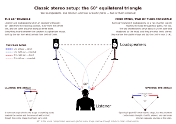
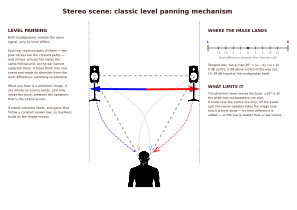
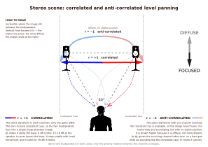
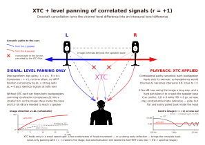
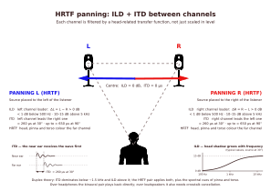
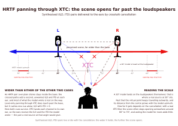
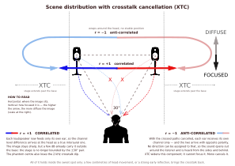

# Localización de fuentes virtuales en estéreo. Una propuesta de mapa.

## Estéreo es una simulación

Estéreo es un sistema para ofrecer la simulación de una escena sonora frente al oyente. El tan logrado sistema de localización del estéreo es tan real como podría ser el de movimiento en cine. Ambos funcionan "engañando" los sentidos humanos para generar la sensación deseada: movimiento a partir de una rápida secuencia de fotos fijas en cine, ubicación a partir de unicamente dos focos de sonido en estéreo.

Dado que el estéreo juega con dos canales, y con la relación que tienen entre sí las señales de ambos canales, generar un mapa de la ubicación estéreo que traduzca, de modo aproximado, las características de ambas señales a posiciones virtuales en el espacio sonoro puede resultar de gran utilidad.

Este es el objetivo de la presente nota técnica, describir un mapa de como se distribuye la información audio en ubicaciones, el cual permita entender cómo funciona la virtualización estéreo y cómo poder manipularla dentro de sus posibilidades. También se acotará cuales son las posibilidades disponibles.

Finalmente, el mapa de localización virtual en estéreo es producto de una manipulación matemático/física buscando una sensación de realismo que no es otra cosa que la potenciación de ciertos mecanismos perceptuales. Que estas manipulaciones puedan parecer artificios es apenas relevante frente al disfrute de escucha musical que nos ofrecen. 

## El sistemas estéreo clásico

El sistema clásico estéreo es el triángulo equilatero con vértices los altavoces y el oyente. En el eje entre altavoces, orientados ambos hacía el vértice del oyente, se representa la escena sonora virtualizada. 

Dado que posteriormente en el desarrollo de esta nota técnica van a a ser objeto de análisis y discusión, es ahora el momento de introducir ambos conceptos. 

* **Anchura de escena** La apertura de escena estéreo clásica tiene dos condicionantes: si los altavoces se juntan, la amplitud de escena disminuye. Si los altavoces se separan, la localización virtual central tiende a percibirse más difuminada. Los 60° son una solución de compromiso de amplitud de escena.

* **Diafonía interaural** Desde sus orígenes la esteorofonía cuenta con una característica inherente, la diafonía interaural. Por ella se entiende el hecho físico de que ambos oidos perciben ambos altavoces a la vez; el ipsilateral se percibe de modo directo y el contralateral detras de la sombra de cara y torso. Sus consecuencias, tan reales como habitualmente ignoradas, son: 
    * Contaminación del efecto binaural, disminución del foco en la percepción del canal virtual central, 
    * Coloración por "filtro peine" entre canales.

## El mecanismo clásico de localización: level panning

El mecánismo básico de localización estéreo, el que genera el mapa más simple, es el "level panning". Diferencias de nivel entre canales para una misma señal (canales con correlacion +1) mueven la fuente virtual a lo largo del eje entre los altavoces. Cuando el nivel entre ambos canales es idéntico, la fuente virtual ocupa el centro del eje delante del oyente.

Es un mecanismo muy sencillo y que funciona razonablemente bien, pero en las grabaciones reales hay otro fenómeno adicional a tener en cuenta.

## El segundo eje del mapa estéreo: la (anti)correlación

En las grabaciones reales hay señales que, además de diferenciarse entre canales por el nivel relativo, se diferencian por lo que en ciertos entornos se denomina su "fase" (fase/inversión). Técnicamente son señales que están completamente anticorreladas (correlacion -1). Desde el punto de vista perceptual, estas señales se situan en el mapa de localización en un eje nuevo, que aparece provocado por ellas: el eje de foco. Las señales correladas (correlación 1) se perciben con mucho foco, las anticorreladas con muy poco foco. El experimento que lo comprueba es bien sencillo, basta con tomar una señal mono, duplicarla a dos canales y entregar uno de ellos invertido. Y conmutarlo de correlado a anticorrelado. La percepción varía en un eje distinto al de los altavoces.

Sobre las señales anticorreladas también se puede aplicar el efecto level panning, dando lugar al mapa mostrado en la figura superior. Cuando uno de los canales tiene nivel cero (o suficientemente bajo) no distinguimos los puntos de señal correlada vs anticorrelada en el plano, la línea del level panning anticorrelado realmente se percibe como "curva", desapareciendo su efecto difuso en los extremos del eje de altavoces.

## La ubicación virtual en una grabación

En una grabación comercial cualquiera, de modo natural, se presentan simultáneamente de ambos mecanismos de localización. La localización virtual final de cualquier fuente sonora grabada se formará por una combinación de componentes correlada y anticorrelada, con level panning que pueden ser distintos entre sí. Con estos mecanismos es con los que percibimos las sensaciones subjetivas tan apreciadas en el disfrute musical: foco, aire, ambiente, eco, centro... La grabación situará cada fuente virtual en un punto del espacio plano encerrado entre foco total central, desenfoque máximo central y extremos donde están los altavoces. Este es el plano en el que se mueve la magia estéreo.

Y existe una última limitación absolutamente inevitable pues no es más que una característica humana: las fuentes sonoras graves, cuanto más bajo es su rango de frecuencias, menos localizables son. Los mecanismos humanos de localización, basados en diferencias de tiempo y nivel de llegada de la señal a cada oido, funcionan muy mal a bajas frecuencias. Es tan conocido popularmente que es el mecanismo perceptual que posibilita la función del subwoofer.

## La introducción de la cancelación de diafonía (XTC)

¿Qué ocurre cuando se introduce un cancelador de diafonía como el propuesto en NatAmbio? Pues como se puede experimentar sin más que incorporar y ajustar NatAmbio en un sistema estéreo, la escena sonora se abre en un ángulo que va bastante más allá de la referencia de 60°.

Comencemos con lo que le ocurre a una señal correlada (correlación +1) a la que se le aplica level panning:

Los extremos izquierdo y derecho de la escena se abren en una fracción significativa (dependiente del buen ajuste y de cuantos dB de cancelación de hayan podido lograr) de la escena sonora disponible antes de incorporarse XTC. Además, estos extremos se dan a mayores diferencias de nivel relativo entre canales. XTC actua como un agente que estira esta escena permitiendo un panning más fuerte que en el caso de la estereofonía tradicional.
Asimismo, el foco central virtual gana precisión. Esto es porque desaparece el filtro peine propio de la diafonía interaural. Esto da lugar a dos sensaciones divertidas:

* Cuando se mide el espectro de los filtros XTC se dice que colorean la señal al ser filtros peine, lo cual es completamente cierto. Curiosamente no se tiene en cuenta que su naturaleza de filtro peine es necesaria porque están diseñados para cancelar ese otro filtro peine que nadie mide, pero que existe, el propio de la diafonía interaural.
* Al aplicar XTC se percibe un cambio tonal en este foco central virtual. Se suele identificar que XTC colorea al asumir que la señal estéreo clásica, con diafonía interaural incorporada, es la referencia correcta, lo cual no tiene sentido lógico. Otra cuestión distinta es sí el ajuste de XTC no tiene en cuenta su dependencia con la frecuencia, o no se ha ajustado correctamente, y entonces colorea la señal a estar sobre-aplicado en algunas bandas de frecuencia, más o menos amplias.

## El modelo HRTF, el estéreo y XTC

Hasta ahora hemos recorrido el eje de localización izquierda/derecha modificando únicamente el nivel relativo entre canales. Pero el sistema auditivo humano no utiliza solamente diferencias de nivel para localizar fuentes reales: también emplea diferencias temporales entre ambos oídos. Antes de estudiar qué ocurre con las señales anticorreladas, resulta útil comprobar qué sucede cuando incorporamos esta segunda pista direccional al mapa estéreo, y especialmente qué cambia al activar XTC.

EEl modelo binaural más básico de localización de fuentes sonoras reales se basa principalmente en dos mecanismos:

* **Interaural Level Difference (ILD)** La diferencia de nivel de recepción de la señal acústica (aquí solo hay una, no dos) entre el oido ipsilateral y el contralateral. Cuanto mayor es el ángulo de incidencia sonora, mayor es la diferencia, aunque hay que tener en cuenta que este efecto disminuye con la frecuencia hasta ser muy pequeño en señales graves.

* **Interaural Time Difference (ITD)** La diferencia de tiempo de llegada de la señal a cada oido. Igualmente al caso de ILD, mayo ángulo de incidencia, mayor retraso entre oido ipsilateral y contralateral. Este mecanismo si que tiene alog más de sensibilidad ante señales graves que el caso de ILD.

Un posible experimento a realizar sobre un sistema estéreo sin y con XTC es el de escuchar la ubicación de una señal mono paneada artificialmente incluyendo tanto un nivel ILD como un retraso ITD entre canales. ¿Este modelo perceptual de señales reales que sentido tiene en el mapa de localización estereofónica?

Pues bien, en el caso de un sistema estéreo clásico, sin XTC, el modelo no escapa al mapa que ya hemos descrito. No hay posibilidad de ampliar la escena sonora más allá de los altavoces. El resultado es que a partir de la señal con ILD e ITD típicos para azimut 30°, no hay desplazamiento de localización virtual. El resto de ángulos de azimut frontal hasta 90° colapsa en ese mismo punto.

Cuando se aplica sobre un sistema estéreo con XTC, la escena se amplia radicalmente:

En un sistema con XTC activo, este modelo basado en ILD e ITD dispone de un mayor margen de recorrido sobre el eje izquierda/derecha. Dependiendo de la capacidad efectiva de cancelación conseguida, el último tramo del azimut modelado puede terminar colapsando cerca de los puntos extremos de apertura alcanzables.

Es importante señalar que, con XTC activo, este modelo alcanza una amplitud de escena claramente mayor que la obtenida mediante level panning por sí solo.

Este resultado experimental introduce una idea importante: en un sistema XTC, una determinada posición sobre el eje izquierda/derecha no corresponde necesariamente a una única combinación de niveles entre canales. Diferentes relaciones entre ambas señales pueden conducir a regiones similares del mapa perceptual. Si una posibilidad es introducir retardos relativos entre canales, ¿puede ser otra la anticorrelación?

## XTC y la cartografía de señales estéreo anticorreladas

El experimento anterior muestra que, con XTC activo, el eje de localización izquierda/derecha puede recorrerse de formas distintas al simple *level panning*. La combinación de diferencias de nivel y tiempo entre canales permite alcanzar posiciones virtuales situadas bastante más allá de la base formada por los altavoces. La pregunta que queda abierta es qué ocurre cuando la relación entre canales se modifica de otra forma completamente distinta: mediante la anticorrelación.

La respuesta resulta especialmente interesante. Una señal anticorrelada no se limita a perder foco respecto de su equivalente correlada. Con XTC activo, y modificando además el nivel relativo entre canales, puede recorrer una región muy amplia del eje izquierda/derecha. En las pruebas realizadas, la máxima apertura perceptual no aparece necesariamente en el extremo del *level panning*, sino en determinadas combinaciones de desequilibrio entre canales y anticorrelación.

Sin embargo, este recorrido tiene un límite peculiar. Conforme el *panning* se hace extremo, uno de los canales aporta cada vez menos señal y disminuye con ello la posibilidad perceptual de comparar ambos canales. El carácter anticorrelado pierde entonces relevancia: en el límite, cuando sólo queda un canal, ya no existe ninguna relación intercanal que pueda ser percibida como correlada o anticorrelada. Por ello, las trayectorias correlada y anticorrelada vuelven a encontrarse en los extremos.

El resultado permite completar el mapa perceptual del sistema estéreo con XTC:

Este mapa contiene dos dimensiones perceptuales diferentes. Horizontalmente representa la localización izquierda/derecha de la imagen sonora. Verticalmente representa su grado de foco: desde una fuente estable y claramente localizable hasta una percepción progresivamente difusa, sin una posición única bien definida.

A efectos de esta cartografía, llamaremos **ambiente** a la información que ocupa principalmente esta región difusa del mapa: información que contribuye a la sensación espacial de la escena sin constituir una fuente virtual con posición claramente definida. No se pretende con ello establecer una definición general de ambiente acústico, sino disponer de una definición perceptual útil dentro de este modelo.

En este punto conviene recalcar que el *level panning* aplicado a señales anticorreladas da lugar, dentro de un sistema con XTC activo, a dos efectos perceptuales distintos:

* **Lateralidad extrema.** En las señales de prueba utilizadas, algunas de las posiciones virtuales de mayor apertura aparecen al combinar anticorrelación con un cierto desequilibrio de nivel entre canales. A medida que la fuente se aproxima a los extremos, la pérdida de foco asociada a la anticorrelación disminuye progresivamente, porque también disminuye la información disponible para establecer una relación entre ambos canales. El centro continúa siendo la región donde la diferencia perceptual entre correlación y anticorrelación es máxima; en los extremos, ambas trayectorias convergen.

* **Ambiente.** En la región de menor desequilibrio entre canales, la anticorrelación da lugar a la percepción más difusa del mapa. Es en esta zona donde aparecen las sensaciones que habitualmente describimos mediante términos como "aire", "aura", "espacio" o "ambiente": información audible que contribuye a la escena sin adoptar una posición virtual claramente definida.

La forma adquirida por estas trayectorias es muy distinta de la del estéreo convencional. La cancelación de diafonía modifica de forma sustancial la relación entre nivel relativo, correlación y posición percibida, permitiendo que regiones que antes quedaban comprimidas en torno a los altavoces pasen a ocupar una parte mucho mayor del espacio perceptual disponible.

Utilizando señales de prueba, descritas más adelante en esta nota técnica, se ha podido apreciar las siguientes características perceptuales:

* La distribución del *level panning* a lo largo de la elipse que encierra el sistema no es lineal. Según la señal se va acercando a los puntos señalados por las flechas, bien sea por el camino correlado como por el camino anticorrelado, el mismo incremento en nivel diferencial produce menor desplazamiento. Lógicamente *level panning* de 25 dB, 30 dB, 40 dB... apenas supone cambio en la ubicación de la fuente sonora virtual.

* El codo de la elipse se produce en la semicurva anticorrelada, y se ha podido apreciar que el extremo más lejano se da a aproximadamente 6 dB de *level panning*. Esta nota técnica no recoge explicación motivada de por qué esta situación ocurre, puesto que no se dispone de ella, y además está pendiente confirmar este extremo con nuevas pruebas adicionales. En cualquier caso, el giro de la localización tiene que darse en algún punto de la escala de *level panning* aunque pudiera ser que no fuera a 6 dB. Como corolario de esta conclusión es fácil deducir que se pueden separar las componentes de *lateralidad extrema* y de *ambiente* atendiendo al *level panning* en cada momento. Un umbral que las separe podría estar entorno a los 4 dB o 5 dB de nivel. Sería un umbral subjetivo del oyente, según sea su modo de entender que percibe como lateral y que percibe comom ambiental.

Las señales con grados intermedios de correlación existen naturalmente en cualquier grabación, pero no requieren un nuevo eje del mapa. Desde el punto de vista cartográfico pueden entenderse como estados intermedios o combinaciones dentro del espacio delimitado por los casos extremos de correlación +1 y −1. Son precisamente estos extremos los que resultan útiles para establecer las fronteras perceptuales del mapa.

Tenemos así el territorio sobre el que, más adelante, actuará NAE. Si podemos componer señales localizables sobre todo este plano combinando dos parejas de señales —una con correlación +1 y otra con correlación −1— y aplicando a cada una un level panning diferente, surge de forma natural la pregunta inversa: ¿es posible descomponer cualquier grabación en esas dos componentes?

