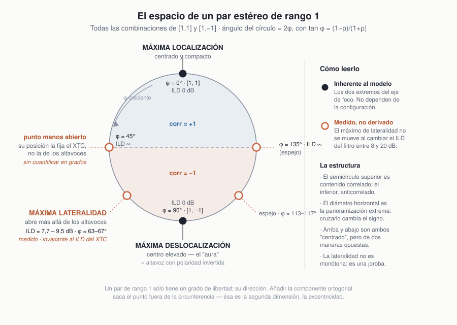

# Annex — NatAmbio in Context

### Companion to *NatAmbio Ambient Extractor (NAE)*: relationship with the primary-ambient extraction literature

*Also available in: [Español](nae_anexo_es.md)*

**Author:** Raúl Fernández Ortega
**Status:** working draft

---

## Purpose of this annex

The main article describes the NAE algorithm in a self-contained way. This annex situates it with
respect to a body of literature —primary-ambient extraction (PAE)— that addresses a formally
identical problem, the separation of a stereo signal into a primary and an ambient component, and
arrives at a definition of "ambience" that is the **opposite** of the one NatAmbio uses.

That contrast is not incidental: it explains why a reader coming from spatial audio processing
finds some of this project's definitions strange. The annex exists to answer that strangeness
precisely, and to identify what is known, what is adaptation, and what is proper to this work.

> **On the provenance of these ideas.** NatAmbio comes out of the Ambiophonics / PanAmbio line
> (Glasgal, Miller) and the practice of crosstalk cancellation. The PAE literature was encountered
> **after** the algorithm had been developed and implemented, and is discussed here as context and
> as a cross-check, not as a foundation. What must be cited is cited, but that was the order in
> which things happened.

> **On quotations.** Verbatim quotations from the literature are reproduced **in their original
> language**, so that a translation of my own cannot be mistaken for the author's text.

> **Companion document.** The [annex to the XTC filter article](../xtc/xtc_filters_annex_en.md)
> does the same job for crosstalk cancellation. The two are complementary halves of a single
> argument, and refer to each other where appropriate.

---

## A.1 · What this is, and what the thesis is

NatAmbio is a domestic playback system. It is not a format, nor a codec, nor a laboratory
prototype. It was developed in a private home, in an ordinary multi-purpose living room, with
inexpensive hardware, and its aim is concrete and modest:

> **That commercial stereo recordings —from any era, the ones you already own— should sound better
> than they do on a conventional stereo chain.**

Everything that follows is subordinate to that. Where a design decision appears arbitrary from a
theoretical standpoint, the explanation is almost always that it solved a concrete listening
problem in a concrete living room.

### The thesis

None of the pieces of NatAmbio is new. Crosstalk cancellation was patented in 1966. Sum/difference
processing dates from 1931. PCA applied to stereo signals has been in the literature for twenty
years. The dual-dipole architecture is Robin Miller's.

> **What is new, if anything is, is the ensemble:** a known decomposition, subjected to a specific
> constraint —not to invent spatial information— and placed inside a specific playback
> architecture which is what gives it meaning.

---

## A.2 · Where it comes from: crosstalk is real

Years ago I implemented a very basic version of RACE (*Recursive Ambiophonic Crosstalk
Elimination*) in order to try Ambiophonics at home. The result was the experimental discovery of
something I had read many times without its leaving a mark:

> **Interaural crosstalk seems transparent, and it is not. It greatly reduces the potential of
> stereo.**

On a conventional stereo chain each ear receives both loudspeakers. What reaches the eardrum is
not the corresponding channel: it is a mixture of both, filtered by the head and dependent on
frequency. Its documented effects are incorrect localization cues —with the worst case precisely
for a centered image—, severe comb filtering of the direct field with the well-known spectral dip
around 2 kHz, and a scene confined between the loudspeakers [Vickers].

That this can be corrected has been demonstrated for half a century [Damaske, 1971], has been
measured [Bock and Keele, 1986], and has been verified on digital filters, including the case
where the design geometry does not match the listening geometry [Takeuchi, Kirkeby and Nelson,
2007].

None of this is a contribution of NatAmbio: it is the ground it stands on. **The reason the whole
system exists is that crosstalk is a real problem, and that correcting it releases something the
recordings already contain.**

> The development of this point —the full chronology, why the technology is absent from commercial
> audio today despite being cheap, and the detail of the references— is in section A.3 of the
> [XTC annex](../xtc/xtc_filters_annex_en.md).

---

## A.3 · The architecture: PanAmbio

NatAmbio adopts the **PanAmbio** architecture proposed by Robin Miller: two Ambiophonics stereo
dipoles, one frontal and one rear, each with its own crosstalk cancellation.

A *stereo dipole* (or **ambiopole**) is a pair of closely spaced loudspeakers, typically spanning
between 10° and 30°. Thanks to crosstalk cancellation, a single ambiopole can deploy an image of
nearly 180°; two ambiopoles cover 360°. To this is added **DRC** (Digital Room Correction)
equalization of both dipoles and, where used, of the subwoofer, for tonal balance.

### Why few loudspeakers, and not many

This is the architectural divergence from which almost all the others follow:

> In a multi-loudspeaker system, **adding loudspeakers improves matters**: each one contributes an
> independent direction and the resulting field is more enveloping.
>
> In a system based on crosstalk cancellation, **adding loudspeakers makes matters worse**: each
> additional loudspeaker introduces acoustic paths to both ears that the cancellation filter does
> not model and therefore cannot correct.

An XTC system buys precision and width at the cost of a compromise: the transmission paths must be
known and controlled, and a listening position must be accepted. A multi-loudspeaker system buys
robustness at the cost of giving up fine control over what reaches each eardrum.

Neither option is better in the abstract. But they are opposites, and **almost all the disagreement
between NatAmbio and the PAE literature is explained by this single difference**, as will be seen
in A.9.

---

## A.4 · The problem this poses

PanAmbio needs four channels: the frontal pair and the ambient pair. Practically all recorded music
has two.

Hence the brief that gives rise to NAE:

> **To generate PanAmbio-compatible signals from standard stereo recordings, without artificial
> manipulation of either localization or ambience.**

That second part is a design constraint, and it is the element that supports everything that
follows. Concretely it means:

- No reverberation is added.
- No artificial decorrelation is applied.
- No channel is synthesized.
- All reproduced spatial information comes exclusively from the original stereo signal.

Put another way: **the system may redistribute the spatial information already present in the
recording, but it may not create new information.** From a monophonic recording —two identical
channels— NatAmbio obtains no ambience, and reproduces with full focus at the center of the scene.
That is not a limitation to be apologized for: it is the proof that the system does what it says.

---

## A.5 · NAE: what it does

### A.5.1 The algorithm

NAE (*NatAmbio Ambient Extractor*) is a sliding-window PCA over the stereo covariance,
**full-band** and in the **time domain**, designed to run in real time at very low computational
cost.

For each processing block:

```math
\begin{aligned}
M &= L + R \\
S &= \beta\,(L - R)
\end{aligned}
```

The $2\times 2$ covariance of $(M, S)$ is accumulated over a sliding window of `covsteps` blocks
and eigendecomposed, giving $\mathbf{u}_1$ and $\mathbf{u}_2$, orthogonal by construction. The
components are

```math
c_1 = \mathbf{u}_1^{\mathsf{T}}\begin{bmatrix} M \\ S \end{bmatrix}, \quad
c_2 = \mathbf{u}_2^{\mathsf{T}}\begin{bmatrix} M \\ S \end{bmatrix}
\qquad
C_1 = c_1\,\mathbf{u}_1, \quad C_2 = c_2\,\mathbf{u}_2
```

which are transformed back to L/R with overlap over `covsteps` successive analyses, and the output
is

```math
\text{output} = \alpha\,C_1 + \beta_{\text{amb}}\,C_2
```

$C_1$ and $C_2$ emerge as **complete stereo pairs**, each with its own panning, and are routed to
the dipoles with adjustable gains.

### A.5.2 On the use of the M/S plane

This document uses M/S coordinates throughout, and the figures in the main article show the scatter
clouds and the components in that plane. It is worth stating at the outset:

> **The decomposition is basis-independent.** M/S is an orthogonal transformation of L/R, so that
> PCA computed in one plane or the other yields exactly the same subspaces and, on reconstruction,
> exactly the same signals.
>
> M/S is used for two reasons: because it places the quantity of interest —how much lateral content
> the recording has— on an axis, which makes the scatter clouds readable at a glance; and because
> the parameter $\beta$ and the XTC filter are both **diagonal** in that basis. In general, M/S
> diagonalizes exactly those operations that treat the two channels symmetrically.

An example of why this mattered in practice: in the M/S plane, a recording with high inter-channel
correlation such as *So What* (Miles Davis, *Kind of Blue*) produces a cloud flattened against the
M axis; a heavily lateralized recording such as *I Am In Love* (Shelly Manne & His Men, *At the
Black Hawk 3*) produces a cloud that opens out toward S. The difference is read off directly. In
the L/R plane the same information appears as "how far the cloud departs from the diagonal", which
requires mental rotation.

It is a choice of representation, not of mathematics.

---

## A.6 · What the decomposition necessarily produces

Here are the properties of NAE's output that appear startling from within the PAE framework. All
of them follow from two facts, and from no hypothesis about recordings.

### A.6.1 One correlated component and one anti-correlated, always

**Fact 1 — each component is rank 1.** On reprojection, both channels of a component are scalar
multiples of the *same* signal:

```math
l = a\,c, \qquad r = b\,c
\qquad \Longrightarrow \qquad
\mathrm{corr}(l, r) = \mathrm{sgn}(a\,b) = \pm 1
```

No intermediate values are possible. It is not improbable: it is impossible.

**Fact 2 — the components are orthogonal.** With
$\mathbf{u}_1 = (\cos\theta,\ \sin\theta)$ and $\mathbf{u}_2 = (-\sin\theta,\ \cos\theta)$:

```math
\mathrm{sgn}(u_{1l}\,u_{1r}) = \mathrm{sgn}(\cos\theta\,\sin\theta), \qquad
\mathrm{sgn}(u_{2l}\,u_{2r}) = \mathrm{sgn}(-\sin\theta\,\cos\theta)
```

**Always opposite.** One component comes out with correlation $+1$ and the other with $-1$, in any
recording and for any $\theta$.

### A.6.2 The panning of C₂ is the exact mirror of that of C₁

With the same eigenvectors, writing $\rho = r/l$ for each component's balance:

```math
\rho_1 = \cot\theta, \qquad \rho_2 = -\tan\theta
\qquad \Longrightarrow \qquad
\rho_1 \cdot \rho_2 = -1
```

In decibels: if $C_1$ is panned X dB to one side, **$C_2$ is panned exactly X dB to the other**,
with inverted polarity. And consequently, the more lateralized the primary component is, the more
lateralized —in the opposite direction— the ambient one will be.

It is worth stressing that this **is not a finding about how recordings are made**: it is an
algebraic identity that follows from imposing orthogonality. Any orthogonal rank-1 decomposition in
a two-channel plane produces it.

### A.6.3 This is already in the literature

Both properties have been derived and published. He, Tan and Gan (2014), in their analysis of
PCA-based PAE, obtain exactly the same result:

> *Between the two channels, the primary components are amplitude panned by a factor of k, whereas
> the ambient components are negatively correlated and panned to the opposite direction of the
> primary components, as indicated by the scaling factor −1/k. Clearly, the assumption of the
> uncorrelated ambient components in the stereo signal model does not hold considering the ambient
> components extracted using PCA. This drawback is inevitable in PCA since the ambient components
> in two channels are obtained from the same basis vector.*
>
> — He, Tan and Gan (2014), §IV.A

That is: the output structure of NAE is a known property of PCA applied to stereo signals. What
NatAmbio contributes is not the property, but **what is done with it**.

### A.6.4 A note on the implementation

In the actual implementation the correlation of $C_2$ is not exactly $-1$, but very close to it.
The reason is not numerical rounding: each output sample receives several successive
reconstructions —one per analysis of the sliding window— and the eigenvector drifts slightly
between them. The deviation from $-1$ **measures the non-stationarity of the spatial image** within
the analysis window. Total reconstruction remains exact, because $C_1 + C_2 = (M, S)$ holds for any
orthonormal basis; the overlap smooths the split between components, not the sum.

---

## A.7 · The perceptual space of the components



Since $C_1$ and $C_2$ are both rank 1, each has **a single degree of freedom**: its direction.
Decomposing $(1, \rho)$ in the basis $\{(1,1), (1,-1)\}$, with weights $(1+\rho)/2$ and
$(1-\rho)/2$, that direction reduces to an angle:

```math
\tan\varphi = \frac{1 - \rho}{1 + \rho}
```

So the set of all possible pairs is not a plane: it is a **circle**. And the project's test-signal
tools (`tools/testing_XTC`, algorithm 1) traverse it end to end starting from a mono signal.

| $\varphi$ | signal | observed percept |
|---|---|---|
| **0°** | $[1,\,1]$, ILD 0 dB | **maximum localization** — centered and compact |
| 45° | ILD ∞, correlated | localized, barely opens beyond the loudspeaker |
| ≈63–67° | ILD 7.7–9.5 dB, anti-correlated | **maximum laterality** — opens beyond the loudspeakers |
| **90°** | $[1,\,-1]$, ILD 0 dB | **maximum delocalization** — elevated center |
| ≈113–117°, 135° | mirrors | |

The values for the laterality maximum were measured with the project's test-signal generator. A
note on units is in order: that generator produces $`\text{out} = \text{mono}\cdot(1-g)`$ on the
active channel, so that the parameter it displays —the over-cancellation in dB— **is not** the
inter-channel level difference. The relation is

```math
\text{ILD} = -20\log_{10}\left|1 - 10^{\,D/20}\right|
```

and in particular an over-cancellation of +6 dB corresponds to pure Side with zero level
difference, which is exactly the lower pole of the circle.

Three structural facts:

1. The upper semicircle is correlated content and the lower one anti-correlated; the horizontal
   diameter —extreme panning— is where the sign changes.
2. Both poles are "centered", in opposite ways: one is the maximum of focus and the other the
   minimum.
3. Laterality is **not monotonic**: it is a hump with maxima on either side of $[1,-1]$. Neither
   the correlated extreme nor the anti-correlated one opens the scene; what opens it is what lies
   in between.

The lower pole is, moreover, the only percept in the system that requires no demonstration: it is
that of the **loudspeaker with inverted polarity**, which everyone has heard. The difference should
be spelled out in the same sentence, because they are not the same situation: in the inverted
loudspeaker **the whole** signal is in antiphase; in NatAmbio only an orthogonal component is,
coexisting with an in-phase and generally dominant primary.

### Results of the sweep

The observations that follow were obtained by traversing the circle with the project's sweep
generator on the complete system, with levels matched by perceived loudness and reference material
used over months.

**What does not depend on the filter.** The point at which the image goes from opening to closing
stays in the same position when the **two** main parameters of the canceller are varied:

| parameter | values tested | does the turning point shift? |
|---|---|---|
| Filter ILD | 8, 14, 20 dB | **no** |
| Filter ITD | 120, 180, 250 µs | **no** |

**What does depend on the filter.**

- *How far* the scene opens. At ITD 250 µs it opens noticeably less, which is consistent with the
  band in which the antisymmetric mode is boosted being narrower.
- Tonal color, consistent with the shift of the comb, whose period $1/D$ goes from about 8.3 kHz to
  about 4.0 kHz between the extremes tested.
- **The position of the extreme-panning point**, which turns out not to be at the loudspeaker. With
  a program $(0, 1)$ the canceller drives **both** loudspeakers —one of them emits the cancellation
  signal— so that the image appears where the signals arriving at the eardrums place it, and not
  where the cabinet is. It shifts roughly in proportion to the total aperture the system achieves.

This last observation is probably the most direct evidence, and the easiest to check, that
cancellation is operating: without it, extreme panning means "at the loudspeaker"; with it, the
position detaches from the physical geometry.

**Uneven travel.** The largest increment of perceived position does not occur in the middle of the
range but on leaving the extreme-panned end, at inter-channel level differences of the order of 24
to 14 dB.

**Clues that fit, without a complete explanation.** Stated as clues:

1. Above the canceller's band edge, the magnitude ratio between the two modes averages 0 dB; above
   about 1.5 kHz lateralization is governed by level difference; and with anti-correlated material
   a 180° phase difference constitutes an unusable temporal cue at low frequencies. The three
   together would place the position judgment in a band where the filter is neutral, which would
   explain the observed invariance.
2. Level-based lateralization saturates around 15–20 dB. That threshold falls within the range in
   which the largest increment of position is observed.

Neither has been verified. The first admits direct falsification: band-limiting the test signal
below 1 kHz, the turning point should become dependent on the filter.

**Resolution of the measurement.** The sweep steps are 0.5 dB, equivalent to about 4° of $\varphi$
in the vicinity of the turning point. What has been established is therefore that it **does not
shift by more than one or two steps**, not that it is strictly invariant.

> **On the reproducibility of these observations.** All were obtained with tools included in the
> public repository —the sweep generator in `tools/testing_XTC`, also available as a LADSPA module,
> and the filter generators in `tools/xtc_filters`— on a system built from ordinary hardware. No
> external instrumentation was used, nor any setup that cannot be replicated.
>
> No complete explanation is yet available for why the turning points fall where they do. The
> results are published in this state precisely so that they can be checked: anyone who builds an
> equivalent system can repeat the measurements, test the hypotheses stated, propose different
> ones, or obtain results that do not agree. Any of those three would be as informative as a
> confirmation.

### The second dimension

All of the above happens **on** the circle. Reproducing $\alpha\,C_1 + \beta\,C_2$ takes the point
off it: the covariance ellipse ceases to be a line and opens out. That is the second dimension
—**eccentricity**— and it is what the balance between components moves.

The complete space is therefore a disc: the **angle** says which interaural relationship is
presented, and is fixed by the recording; the **radius** says how determined that relationship is,
and is fixed by the adjustment.

### Two distinct routes to the non-localizable

From this follows the distinction that structures the whole comparison of A.9:

| route | position | correlation | character |
|---|---|---|---|
| **Antiphase** | on the circle, $\varphi \to 90°$ | $-1$ | determined relationship, but not mappable to a direction |
| **Decorrelation** | toward the center of the disc | $0$ | genuinely different signals at each ear |

NatAmbio uses the first. The PAE literature pursues the second.

### Experimental check: reproducing the PAE definition of ambience

A variant of NatAmbio was implemented in which the gains of $C_1$ and $C_2$, instead of being set
by hand, **adjust themselves frame by frame so that the output L/R correlation is 0**. The
condition is simple:

```math
\alpha^{2}\lambda_1 = \beta^{2}\lambda_2
```

that is, equal reproduced power in both components, which turns the covariance ellipse into a
circle. The result is, by construction, the definition of ambience used by the PAE literature,
realized on the system itself.

Heard through the XTC, with *I Am In Love* as material and levels matched by perceived loudness:

- The **trumpet** is perceived clearly localized at the left loudspeaker and the **drums** at the
  right, neither of them opening beyond the cabinet.
- The rest of the material sits diffusely in the center.
- The scene does not unfold: where the usual setting takes the image from some 40° to more than
  120°, here it does not happen.

The three observations correspond precisely to three regions of the circle. Whitening is a
frame-level, full-band operation: it removes the **aggregate bias** of the image, not the panning
of each source. Trumpet and drums remain at $\varphi = 45°$ and $135°$, the corner the model labels
as *localized but barely opens*, and the residue goes to the center of the disc.

**And the reason has a mechanism.** The XTC modifies the ratio between the two eigenmodes. When
both modes carry the **same waveform** —which is what $\mathrm{corr} = \pm 1$ means— changing
that ratio changes the position of the image. When they carry **independent** waveforms
—$\mathrm{corr} = 0$— changing the ratio only rebalances a diffuse field: there is no image
to move.

A qualification is in order: the canceller does act on a signal of zero correlation, since it
scales both modes. What it does not do is **produce an image**, because it has not been handed any
interaural relationship to reproduce.

> So the conclusion is not that the PAE definition of ambience is wrong. It is that **in this
> architecture it is inert**: it does not project to any virtual point in the scene because it does
> not contain the quantity on which the playback system operates.

This check also bounds, qualitatively, one of the two open points of the circle: with extreme
panning and correlated content, the source **does not open** — it stays at the loudspeaker.

### The definition of ambience, and its domain of validity

With this, the definition NatAmbio uses can be stated precisely:

> **Ambience** is here the orthogonal component whose reproduction is predominantly
> **non-localizable**.

*Non-localizable* rather than *diffuse* is said deliberately. "Diffuse" is a property of a sound
field —energy arriving equally from all directions, low coherence between points— and $C_2$ is not
that: it is maximally coherent, only with the sign reversed. "Non-localizable" is a property of a
percept, and $C_2$ is that.

The definition also has a domain of validity that the geometry itself delimits, because $C_2$ sits
at $\varphi_2 = 45° + \theta$:

- **Centered primary image** ($\theta = 45°$) → $\varphi_2 = 90°$, pure Side. The definition is
  **exact**.
- **Lateralized image** ($\theta$ small) → $\varphi_2$ descends toward 45° and **$C_2$ becomes
  localizable**. The definition degrades monotonically.

That is precisely the failure mode of the *I Am In Love* case, and the reason the beta mode exists.

There is also a structural limit worth putting on record: if the primary image is centered, $C_2$
is pure Side and has no Mid component to scale, so no width operation can move it off the pole.
Taking it to the laterality maximum would require **adding** Mid content to it, which would be
synthesis, and the premise of A.4 forbids that.

---

## A.8 · The beta mode

### A.8.1 What problem it solves

PCA does not know what an instrument is. In a recording with extreme panning —*I Am In Love* is the
case study of the main article— part of the foreground musical content may end up in the secondary
component. In the frontal dipole this is not serious, because $C_1$ and $C_2$ are reproduced
together and coexist perceptually. In the **rear dipole, where $C_1$ is absent**, it is: an
identifiable instrument behind the listener breaks the illusion.

The beta mode exists for that, and **only makes sense in the rear or heavily lateral dipole of a
PanAmbio.** Outside that architecture it means nothing.

### A.8.2 What it does

```math
\beta = 0.55 + 0.45\,\bigl|\mathrm{corr}(L, R)\bigr|
\qquad\text{measured over a long window}
```

```math
S = \beta\,(L - R) \qquad\text{applied \textbf{before} computing the covariance}
```

The more lateralized the recording (low correlation), the more the weight of the Side component is
reduced. And the reduction **is not undone** when reconstructing in L/R.

Two distinct effects follow, and they should not be conflated:

1. **It rotates the principal axis toward M.** By rescaling S in the covariance matrix, the
   estimate is biased so that more lateral content is classified as primary and does not reach
   $C_2$.
2. **It attenuates S at the output.** What does reach $C_2$ comes out scaled by $\beta$.

The first changes *what* is separated; the second, *how much* is emitted. They are not redundant.

### A.8.3 Seen from outside

Scaling S by $\beta$ is equivalent, in L/R coordinates, to applying the following matrix to the
input:

```math
\mathbf{W}_{\beta} = \frac{1}{2}\begin{bmatrix} 1+\beta & 1-\beta \\ 1-\beta & 1+\beta \end{bmatrix}
```

which is the familiar **stereo width control**: $\beta = 1$ is the identity, $\beta = 0$ is mono.
It can be verified that
$`\mathbf{T}\,\mathbf{W}_{\beta} = \mathrm{diag}(1,\beta)\,\mathbf{T}`$, with $\mathbf{T}$
the M/S transform.

So beta, described precisely, is an **adaptive stereo width control, governed by the measured
inter-channel correlation, applied before the analysis and not reverted in the reconstruction**.
The operation is standard; what is unusual is *where* it is applied: before the decomposition, not
after. That is where the idea lies.

### A.8.4 What is not explained

Beta is **pure empiricism**. It arose from listening and adjusting, not from an optimization
criterion. To this day the following remain unjustified:

- Why the coefficients are 0.55 and 0.45, that is, why the useful range of $\beta$ turned out to be
  $[0.55,\ 1]$.
- Why the correlation measurement window is 20 blocks.
- Why the **absolute value** of the correlation is used. With $|\mathrm{corr}|$, a strongly
  *anti*-correlated recording receives little S reduction, just like a strongly correlated one. If
  the intended criterion was "the more lateral, the less S", the absolute value makes it blind to
  the sign. It may be right, or it may be a residue of the development process; it has not been
  settled.

These gaps are left written as gaps.

There is, however, one empirical result that does deserve recording, because it is of a different
nature from a preference. **Before beta**, the rear dipole's level control had to be readjusted
from record to record; **afterwards**, a single setting holds across the whole collection. A
control that demands continuous correction is compensating by hand for a dependency the algorithm
does not know about; a control that stays put indicates that the dependency is now inside it. It is
a **behavioral** datum, not a perceptual one —it is measured by whether the control is touched or
not—, longitudinal, and falsifiable: a single record that forced a readjustment would break it.

---

## A.9 · Where this sits with respect to the PAE literature

### A.9.1 The established model

The primary-ambient extraction literature models the stereo signal as

```math
x_0 = p_0 + a_0, \qquad x_1 = p_1 + a_1
```

with four assumptions [Goodwin and Jot 2007; Faller 2006; He, Tan and Gan 2014]:

| | assumption |
|---|---|
| 1 | The primary component is **correlated** across channels: $p_1 = k\,p_0$ |
| 2 | The ambient components are **uncorrelated** with each other: $a_0 \perp a_1$ |
| 3 | Primary and ambient are **orthogonal**: $p \perp a$ |
| 4 | The ambient energies are **balanced**: $\|a_0\| \approx \|a_1\|$ |

Assumption 2 is the operational definition of "ambience" within that framework: ambience is what is
**not** correlated, because what is not correlated cannot be localized.

### A.9.2 Why that definition is the right one *for them*

The destination of that literature is upmixing: distributing a stereo signal across five or more
loudspeakers. And there decorrelation is not an aesthetic preference, it is the only tool that
works:

> **Decorrelation is robust against unknown transmission paths.** Uncorrelated sources add in
> energy, so that the resulting correlation at the eardrums is determined by levels and not by
> phases. It works with any room, any listening position and any crosstalk.
>
> **Anti-correlation is an interference effect.** It depends on the phases arriving as one expects,
> and therefore requires knowing and controlling the transmission paths.

A multi-loudspeaker system neither knows its transmission paths nor intends to control them. That
is why $\mathrm{corr} = 0$ is, for that architecture, the correct answer.

There is also a second, independent reason: **upmixing expands the channel count**. Going from 2 to
5 obliges one to produce material that is not in the recording, and decorrelation is precisely the
mechanism for doing so. It is the creation of information, and in that context it is legitimate.

### A.9.3 Why NatAmbio ends at −1

For two reasons of very different weight.

**First, and sufficient: the design constraint.** NatAmbio cannot decorrelate, because to
decorrelate is to synthesize information that is not in the recording (A.4). This does not depend
on any argument about the playback system: it follows from the premise. And NatAmbio does not
expand channels: it decomposes two into two orthogonal components and redistributes them.

With artificial decorrelation ruled out, and the decomposition being orthogonal and rank 1,
correlation $-1$ is not a choice. It is the only possible outcome (A.6.1).

**Second, and complementary: the architecture.** A symmetric crosstalk canceller and the acoustic
plant it inverts share the eigenvectors $(1,1)$ and $(1,-1)$, with reciprocal eigenvalues
$1 \pm G$. Any component therefore traverses the system as a symmetric part and an antisymmetric
part scaled independently, and **the sign of the inter-channel correlation determines which of the
two eigenvalues governs its passage.**

> The development of this point —the *shuffler* structure, why the canceller's design is a scalar
> problem, and why the whole regularization issue lives in a single eigenvalue— is in section A.9
> of the [XTC annex](../xtc/xtc_filters_annex_en.md), and is not repeated here.

### A.9.4 The defect ↔ specification inversion

It is instructive to read the assessment the literature itself makes of PCA-based PAE. He, Tan and
Gan (2014) summarize its strengths and weaknesses as follows:

**Strengths of PCA**
- No distortion in the extracted primary component.
- **No primary leakage in the extracted ambient component** (LSR = 0).
- Primary and ambient components are mutually uncorrelated.

**Weakness of PCA**
- The ambient component is severely panned and anti-correlated.

Read against NatAmbio's requirements, **the three strengths are the specification and the sole
weakness is the design feature**.

The second strength deserves separate attention, because it answers the objection most often raised
against NAE —that foreground instruments leak into the ambient channel—: among the linear
estimators studied, **PCA is the one with zero primary leakage** in the ambient component. Not
small: zero, and demonstrated in the very work that criticizes it for the other property.

And their own recommendation for the minimum-leakage estimator —which for the ambient component is
identical to PCA— names the use case: applications in which **different** rendering or playback
techniques are employed for the primary and the ambient component. A frontal dipole and a rear
dipole with different processing are exactly that.

### A.9.5 Formal comparison

Under the PAE model with $k > 0$ and equal ambient energies, the reconstructible inter-channel
correlation is

```math
\mathrm{corr}(x_0, x_1) = \frac{k\,P_p}{\sqrt{(P_p + P_a)\,(k^{2}P_p + P_a)}}
```

Under NAE's orthogonal decomposition, with powers $P_1 \ge P_2$ and principal angle $\theta$,

```math
\mathrm{corr}(x_0, x_1) =
\frac{(P_1 - P_2)\,\sin\theta\,\cos\theta}
{\sqrt{\bigl(P_1\cos^{2}\theta + P_2\sin^{2}\theta\bigr)\bigl(P_1\sin^{2}\theta + P_2\cos^{2}\theta\bigr)}}
```

And compliance with the four assumptions:

| assumption | NAE |
|---|---|
| 1. Correlated primary | **Satisfied exactly** (rank 1 by construction) |
| 2. Uncorrelated ambient | **Violated maximally, deliberately** ($\pm 1$) |
| 3. Primary ⊥ ambient | **Satisfied exactly** ($c_1 \perp c_2$ by PCA) |
| 4. Balanced energies | **Violated** — and that violation *is* the mirror panning (A.6.2) |

NAE satisfies exactly the two assumptions that define the quality of the separation, and violates
the two that define "ambience" according to a criterion devised for a different playback
architecture.

### A.9.6 What the literature does and NatAmbio cannot

None of the estimators studied achieves $\mathrm{corr} = 0$ in the extracted ambience. The
literature's own conclusion is that post-processing techniques —decorrelation and rescaling— are
needed to achieve it.

That post-processing is precisely what NatAmbio's design constraint forbids. The divergence is
therefore not an oversight on either side: it is a consequence of different premises, and both are
coherent with their own destination.

### A.9.7 The same axis, twice over

It is worth noting that this is not the only tradition from which NatAmbio departs for the same
reason. Ambiophonics —from which the whole architecture derives— generates the ambience path by
convolving the direct sound with the impulse response of a real hall, taken from a library of
auditoria. That is explicit synthesis, just like decorrelation, only from a different source.

| approach | origin of the ambience |
|---|---|
| Ambiophonics | **creates** it by convolution with the impulse response of a real hall |
| PAE literature | **creates** it by artificial decorrelation |
| **NatAmbio** | **does not create it**: extracts what is already there and projects it |

The design constraint is therefore the **single distinguishing axis of the project**, and it
operates in both directions. The contrast with Ambiophonics is developed in section A.10 of the
[XTC annex](../xtc/xtc_filters_annex_en.md).

### A.9.8 The conclusion

Subjected to direct testing (A.7), the PAE definition of ambience reproduced on this system does
not unfold a scene: the panned sources stay at their loudspeakers and the rest blurs into the
center. Not because the definition is badly framed —for a multi-loudspeaker array it is the correct
one— but because it describes a signal that lacks the quantity on which a crosstalk-cancelled chain
acts.

> **The definition of ambience as decorrelated content is not wrong. It is inert in this
> architecture.**

And its converse is NAE's reason for being: in a chain that delivers interaural relationships, the
component that cannot be localized is not the one that lacks a relationship, but the one that has a
relationship the ear cannot map to a direction.

---

## A.10 · What we do not know

The open points are listed here deliberately.

**Pending measurement**

- NAE has not been run through the synthetic measurement bench of He, Tan and Gan (speech plus
  uncorrelated noise, fixed panning factor, swept power ratio). Doing so would place NAE in their
  Table I with their own metrics —ESR, DSR, ISR, LSR, ICC, ICLD— and make the comparison
  quantitative rather than structural. It is the principal gap in this document.
- Full-band analysis has not been compared with subband analysis on the same material. The
  prediction is that subband analysis would produce an ambient correlation clearly below 1 in
  magnitude, through averaging across bands with different eigenvector orientations; this has not
  been verified.
- What the beta mode buys and costs in terms of those metrics has not been quantified.

**Pending bounding on the perceptual circle (A.7)**

- **Inherent to the model:** the poles. $[1,1]$ at 0 dB is maximum localization and $[1,-1]$ at
  0 dB is maximum delocalization. They are the extremes of the focus axis.
- **Measured:** the laterality maximum occurs at an inter-channel level difference of **7.7 to
  9.5 dB**, and **does not shift** when either the filter's ILD (8–20 dB) or its ITD (120–250 µs)
  is varied. What changes with those parameters is how far it opens and the tonal color, not where
  the maximum lies.

  The invariance admits a reading favorable to the system: under approximately ideal cancellation
  the ear signals are the program, so that the percept is determined by the program's level
  difference and phase and not by the filter's internal parameters. That the turning point does not
  follow the filter is an indication that the filter **delivers** the program rather than imposing
  its own signature on it.

- **To be bounded:**
  1. How far, in degrees, the extreme-panning point opens. It is known that **its position is not
     that of the loudspeaker and depends on the canceller's setting**, but it has not been
     quantified. There is also an apparently discordant observation: with the isolated test signal
     the point shifts clearly, whereas in the whitening experiment the heavily panned sources were
     perceived stuck to their loudspeakers. The plausible reconciliation is that in the second case
     the cue was diluted among decorrelated material that does not get placed, but both
     observations are left written separately rather than forced into agreement.
  2. Why the travel is uneven, with the largest increment of position on leaving the extreme-panned
     end. Saturation of level-based lateralization fits numerically, but has not been verified.
  3. Whether the observed maximum is a true extremum of lateral extent or, in part, the point at
     which the image is **simultaneously lateral and definite enough to be placed**: near the pole,
     delocalization prevents laterality from being judged.

It is worth noting that the anti-correlated branch has a useful experimental peculiarity:
correlation stays constant at $-1$ along the whole range, so that what varies is **only the ILD at
fixed interaural coherence**. That is an unusual isolation condition.

**Pending explanation**

- The beta coefficients and their time window (A.8.4).
- The use of the absolute value of the correlation in beta (A.8.4).
- Where the perceptual limits of the circle come from. The model allows the percepts to be
  **described** as a construction on the linear combination of $[1,1]$ and $[1,-1]$, and places
  each one at a coordinate; it does not explain why the maxima fall where they do. The project's
  working rule is maintained here: perception governs the result, and the mathematical scaffolding
  arrives afterwards, or not at all.

**Outside the scope of this document**

- The perceptual evaluation is single-subject and not blind. It is not presented as anything else.
- No alternative PAE method has been implemented or evaluated, so this document contains no
  comparative claim about their practical performance.
- The detail of how the crosstalk canceller behaves toward correlated and anti-correlated content
  belongs to the XTC documentation.

---

## A.11 · The answer to the big questions

Much of what NatAmbio does can be reasoned about. Another part cannot: it was adjusted by
listening, and its ultimate justification is that it works in the system where it was developed.

That is why the project does not publish only a model. It publishes the real-time implementation,
the LADSPA module for offline processing, the XTC filter generators, the test-signal tools and the
measurement scripts. And that is why the proposed hardware is deliberately cheap and simple:
ordinary loudspeakers, a multichannel interface and a modest computer.

> The final answer to the underlying questions —whether this sounds better, whether the
> anti-correlated component is perceived as ambience, whether the beta mode does what it intends—
> is not in this document. **It is in listening to it.** The purpose of publishing it is so that
> other people can verify in their own rooms and with their own ears what has so far been verified
> in only one.

---

## A.12 · References

> The bibliography of crosstalk cancellation —origin, formulation, regularization and experimental
> validation— is in section A.13 of the [XTC annex](../xtc/xtc_filters_annex_en.md). Collected here
> are the line this project comes from, the PAE literature, and the perception of interaural
> coherence.

### The line this work comes from

1. **Miller, R. III** (2002). "Compatible PanAmbiophonic 4.1 and PerAmbiophonic 6.1 Surround
   Sound for Advanced Television — Beyond ITU 5.1". *SMPTE 144th Technical Conference*, Pasadena.
2. **Miller, R. III** (2002). "Contrasting ITU 5.1 and PanAmbiophonic 4.1 Surround Sound Recording
   Using OCT and Sphere Microphones". *AES 112th Convention*, Munich, preprint 5577.
3. **Glasgal, R. & Miller, R.** "Surround Ambiophonic Recording and Reproduction". *AES 24th
   International Conference on Multichannel Audio*.
4. **Glasgal, R.** (2001). "The Ambiophone — Derivation of a Recording Methodology Optimized for
   Ambiophonic Reproduction". *AES 19th International Conference*, Schloss Elmau.
5. **Glasgal, R.** (2007). "360° Localization via 4.x RACE Processing". *AES 123rd Convention*.
6. **Glasgal, R.** "Recursive Ambiophonic Crosstalk Elimination (RACE)". Ambiophonics Institute.

### Context: primary-ambient extraction

7. **Avendaño, C. & Jot, J.-M.** (2004). "A Frequency-Domain Approach to Multichannel Upmix".
   *JAES* 52(7/8), pp. 740–749.
8. **Goodwin, M. M. & Jot, J.-M.** (2007). "Primary-Ambient Signal Decomposition and Vector-Based
   Localization for Spatial Audio Coding and Enhancement". *ICASSP 2007*, pp. 9–12.
9. **Merimaa, J., Goodwin, M. M. & Jot, J.-M.** (2007). "Correlation-Based Ambience Extraction
   from Stereo Recordings". *AES 123rd Convention*, paper 7282.
10. **Faller, C.** (2006). "Multiple-Loudspeaker Playback of Stereo Signals". *JAES* 54(11),
    pp. 1051–1064.
11. **He, J., Tan, E.-L. & Gan, W.-S.** (2014). "Linear Estimation Based Primary-Ambient Extraction
    for Stereo Audio Signals". *IEEE/ACM TASLP* 22(2), pp. 505–517.
12. **He, J., Tan, E.-L. & Gan, W.-S.** (2015). "Time-Shifting Based Primary-Ambient Extraction for
    Spatial Audio Reproduction". *IEEE/ACM TASLP* 23(10), pp. 1576–1588.
13. **He, J.** (2017). *Spatial Audio Reproduction with Primary Ambient Extraction*. SpringerBriefs,
    Springer.
14. **Ibrahim, K. M. & Allam, M.** (2016). "Primary-Ambient Extraction in Audio Signals Using
    Adaptive Weighting and Principal Component Analysis". *SMC*.
15. **Briand, M., Virette, D. & Martin, N.** (2006). "Parametric Coding of Stereo Audio Based on
    Principal Component Analysis". *DAFx-06*, Montreal.

### Perception of interaural coherence

16. **Blauert, J. & Lindemann, W.** (1986). "Spatial Mapping of Intracranial Auditory Events for
    Various Degrees of Interaural Coherence". *JASA* 79(3), pp. 806–813.
17. **Blauert, J.** (1997). *Spatial Hearing: The Psychophysics of Human Sound Localization*.
    MIT Press.
18. **Whitmer, W. M., Seeber, B. U. & Akeroyd, M. A.** "Measuring the Apparent Width of Auditory
    Sources in Normal and Impaired Hearing".
19. **Barron, M. & Marshall, A. H.** (1981). "Spatial Impression Due to Early Lateral Reflections
    in Concert Halls". *J. Sound and Vibration* 77(2).

> **Note on the references.** The bibliographic details in this list come in part from secondary
> sources and should be verified against the AES E-Library and IEEE Xplore before this document is
> considered definitive.
