# NatAmbio Ambient Extractor (NAE): Algoritmo de extracción de las trazas ambientales de una grabación estéreo

**Autor:** Raúl Fernández Ortega  
**Fecha:** junio de 2026

> **Resumen —** *NatAmbio es un sistema de reproducción espacial de tipo PanAmbio, basado en dos dipolos estéreo —uno frontal y otro ambiental—, cuyo funcionamiento requiere cuatro canales: el sonido principal estéreo y dos pistas adicionales de sonido ambiente. Dado que la práctica totalidad de la música se ha grabado en formato estéreo de dos canales, NatAmbio incorpora su propio procesamiento DSP para extraer dichas componentes a partir de la propia grabación. En este artículo se presenta NatAmbio Ambient Extractor (NAE), un algoritmo de extracción ambiental desarrollado de forma empírica —mediante escucha crítica, análisis de correlaciones estéreo y representación mid/side (M/S)— y orientado a operar en tiempo real con un coste computacional muy reducido. Se define operativamente la componente ambiental como aquella de menor nivel relativo y con sus canales fuertemente anticorrelados, frente a una componente principal de canales correlacionados. El algoritmo transforma la señal L/R al dominio M/S y aplica PCA sobre una matriz de covarianza 2×2, obteniendo dos pares estéreo decorrelados entre sí: uno principal, con correlación +1, y otro ambiental, con correlación −1, sin recurrir a decorrelación artificial. Para grabaciones de baja correlación (muy lateralizadas), donde la orientación de los ejes PCA se vuelve inestable, se introduce una segunda aproximación que adapta el peso de la componente side mediante un parámetro β gobernado por la propia correlación L/R. Se describen los detalles de implementación en NatAmbio —ventana PCA deslizante sobre JACK, suavizado temporal y los modos α y β— y su integración con la cancelación de diafonía (XTC) en configuraciones de uno y dos dipolos. El resultado es una reproducción compatible con la escena musical original, con mayor apertura frontal y un campo ambiental envolvente de nivel ajustable, obtenida a partir de grabaciones estéreo convencionales y mediante procesamiento en tiempo real.*

## Introducción

Para poder disponer de un sistema tipo PanAmbio, dos dipolos estéreo, dispuesto uno en el frontal y otro para sonido ambiente, se necesitan grabaciones multicanal que ofrezcan no solo el sonido principal estéreo, sino también dos pistas adicionales, que corresponderían con el sonido ambiental (o envolvente). Este tipo de grabaciones es singularmente escasa, quizás apenas unos pocos ejemplos de demostración. Es cierto que se puede hacer una reconstrucción a partir de las grabaciones multicanal comerciales del tipo 5.1 y similares. Pero la inmensa mayoría de la música grabada lo ha sido y lo sigue siendo en formato estéreo.

NatAmbio, como sistema, nace con la intención de no ser solo una implementación de PanAmbio, sino además, ser su propio software DSP con capacidad para extraer las cuatro pistas necesarias a partir de las señales ambientales que puedan estar incluidas en la grabación estéreo. 

Existe abundante literatura técnica dedicada a la extracción de información espacial a partir de grabaciones estéreo, incluyendo técnicas de extracción ambiental y separación de fuentes. En este artículo se va a presentar un algoritmo particular de extracción ambiental que se ha desarrollado para ajustarse de modo óptimo con el concepto NatAmbio, cuyos objetivos son:

- Extraer sonido ambiente de grabaciones musicales estéreo, sin entrar en el desarrollo de entornos de sonido más envolvente, tipo cine en casa.
- Poder realizar esta extracción en tiempo real, con un algoritmo que sea sencillo en coste de procesamiento, pero que consiga el objetivo del punto anterior sin limitaciones significativas.

NatAmbio Ambient Extraction (NAE) es un algoritmo desarrollado sobre y para un entorno doméstico, empleando como señales de prueba grabaciones comerciales estándar fácilmente disponibles. NAE no surge de una búsqueda teórica de nuevas transformaciones espaciales, sino del uso específico de técnicas DSP muy conocidas, y del posterior análisis de los resultados al aplicarse sobre las citadas grabaciones de referencia utilizadas habitualmente en entornos aficionados. El desarrollo del algoritmo se realizó mediante un proceso iterativo de escucha crítica, análisis visual de correlaciones estéreo, representación mid/side (M/S) y evolución temporal de componentes PCA. Varias decisiones de diseño surgieron inicialmente de observaciones empíricas repetidas y del estudio de patrones recurrentes, y fueron posteriormente formalizadas en términos estadísticos. Al ser un trabajo empírico, no se origina en un desarrollo matemático formal, por lo que la explicación del algoritmo que aquí se recoge también presenta esta misma naturaleza empírica.

## Definición de señal ambiental

En primer lugar es necesario definir qué es una señal ambiental, o la componente ambiental de una señal estéreo, en términos perceptivos y estadísticos. Este concepto se puede prestar a múltiples definiciones, dependiendo del contexto sobre el que se aplica. La definición presentada en este documento está orientada a su aplicación en NatAmbio, sin otra pretensión de formar parte de un modelo más general.  

El fenómeno de la localización en estéreo está controlado por dos mecanismos:

1. La diferencia de nivel entre canales. Es lo que se conoce como panning estéreo. Dos canales de señal idéntica, únicamente diferenciada por su nivel relativo, son percibidos, cuando se escucha a través de un sistema estéreo, como una única señal orientada hacia el lado con el nivel más elevado. De forma que, cuando ambos niveles están igualados, esta señal se percibe enfocada en el centro entre los altavoces.

2. La correlación entre ambos canales. Este mecanismo complementa al anterior de una manera más compleja: la correlación entre canales no genera por sí sola una posición estéreo continua, sino que determina el grado de coherencia entre ambos canales. Con correlación próxima a 1, ambos canales contienen esencialmente la misma señal y la localización queda gobernada por la diferencia de nivel. Al reducirse la correlación, los canales dejan de comportarse como una única fuente fantasma y pasan progresivamente a percibirse como señales diferenciadas reproducidas por cada altavoz. En el caso límite de correlación nula, el resultado perceptivo corresponde a dos señales mono independientes, una asociada a cada altavoz. Solo cuando la correlación toma valores negativos aparece una componente que ya no se interpreta como una suma de fuentes mono localizables, sino como una contribución espacial desubicada o ambiental.

Conforme sube la correlación negativa, la percepción de deslocalización de fuentes virtuales aumenta. En el extremo, si además en el proceso se reduce la diferencia de nivel entre ambos canales, entonces se alcanza la condición de máxima deslocalización:

$$ l^2/r^2 = 1$$
$$ corr(l,r) = -1 $$

En este sentido, desde NAE, se puede definir la componente ambiental de una grabación estéreo como aquella con una fuerte anticorrelación mutua entre canales, siempre y cuando su nivel relativo sobre el total de la grabación sea significativamente bajo.

Por lo tanto, para NAE, el criterio de extracción de señal ambiental será aquella componente de menor nivel que la otra, que será la principal, con sus canales anticorrelados entre sí. Esta definición no pretende describir todos los posibles fenómenos espaciales presentes en una grabación, sino establecer un criterio operativo que permita diseñar un algoritmo de extracción.

Por último queda la componente principal. La señal original se puede reconstruir por suma de una componente ambiental y una componente principal. Ambas componentes se definen como polos opuestos de una representación perceptivo-estadística de la señal estéreo: 
 
$$ corr(l_{main}, r_{main}) \approx 1$$
$$ corr(l_{amb}, r_{amb}) \approx -1$$

NAE tratará de trasladar la máxima correlación a un polo, el principal, y la máxima anticorrelación al otro polo, el ambiental. En este sentido:

1. La localización de la componente principal tenderá a funcionar mediante el mecanismo básico estereo de diferencias de nivel. Como ya se ha citado, la componente ambiental tiende a estar desubicada.

2. La extracción de la componente ambiental puede interpretarse como una búsqueda de la máxima anticorrelación compatible con la reconstrucción exacta de la señal original. La componente principal aparece entonces como el complemento necesario para mantener la citada reconstrucción.

$$ S = C_{main} + C_{amb} $$

La intención de estas definiciones es dotar de sentido al núcleo del desarrollo de NAE, sin pretender establecer ningún modelo ni teoría más general sobre el estéreo. Es evidente que cualquier grabación presenta contenido ambiental que no corresponde con la definición aquí establecida. Un caso límite es el de cualquier grabación monofónica que incluya contenido ambiental. Por este motivo es necesario volver a aclarar que en el contexto de NatAmbio se ha definido como señal ambiental aquella que es útil para ser recreada y percibirse como ambiental (deslocalizada) en un sistema PanAmbio.
 
## Propiedades de mid/side (M/S) vs. izquierda/derecha (L/R)

Durante las primeras fases del desarrollo de este algoritmo se exploraron distintas formas de representar la información estéreo. El objetivo no era únicamente encontrar una transformación matemática válida, sino reorganizar la información contenida en la señal estéreo de forma que determinadas estructuras espaciales resultasen más evidentes tanto en el análisis visual como en la escucha crítica de grabaciones comerciales utilizadas como señales de prueba.

En este sentido, la elección de la representación $M/S$ no surgió inicialmente de una deducción matemática formal, sino de modo natural a partir de la definición de señal ambiental desarrollada en la sección anterior. La representación $L/R$ resulta natural para reproducción estéreo, pero no es especialmente descriptiva desde el punto de vista espacial. En cambio, la representación $M/S$ proporciona una separación sencilla entre la información común a ambos canales y la información diferencial entre ellos. Si se piensa en términos de información común e información diferencial frente a correlación y anticorrelación:

$$ mid = l + r; \qquad mid \rightarrow principal $$
$$ side = l -r;  \qquad side \rightarrow ambiental$$

Desde un punto de vista perceptivo, la componente mid está asociada a aquello que ambos canales comparten, mientras que la componente side representa las diferencias laterales presentes en la grabación. En primera aproximación, $M/S$ se acerca mejor a la buscada descomposición en $C_{main}$ y $C_{amb}$ que la forma canónica estéreo $L/R$. 

Durante el estudio que dio lugar a NAE, al representar las muestras en el plano $M/S$ se observó que muchas grabaciones musicales presentaban estructuras geométricas claramente definidas. Esto sugirió la posibilidad de aplicar PCA sobre dicho espacio para identificar automáticamente las direcciones dominantes de energía presentes en la grabación. Desde un punto de vista geométrico, PCA permite identificar los ejes principales de distribución de la energía estéreo dentro del plano $M/S$. Como posteriormente se desarrolla, esta interpretación resultó especialmente útil para estudiar grabaciones con distintas características espaciales y analizar la relación entre contenido central, contenido lateral y sonido ambiente. En este contexto, PCA no se utiliza como una técnica genérica de reducción de dimensión, sino como una herramienta para identificar automáticamente las direcciones dominantes asociadas a la representación principal/ambiental definida anteriormente.

Por este motivo, aunque PCA podría aplicarse directamente sobre $L/R$, la representación $M/S$ produce una geometría mucho más interpretable para el objetivo de extracción ambiental, ya que permite visualizar directamente la relación entre información central (mid) e información lateral (side).

## Principal Component Analysis (PCA) dentro de NAE

El siguiente paso tras la transformación $L/R$ $\rightarrow$ $M/S$ es la aplicación de PCA sobre estas componentes $M/S$, tomando muestras de tamaño N dentro de la grabación estudiada. Dado que únicamente es necesario diagonalizar una matriz de covarianza 2×2, el coste computacional resulta extremadamente bajo y compatible con procesamiento en tiempo real. El resultado dará lugar a una componente principal y una componente secundaria, y un autovector que es el que permite realizar la rotación de todos los N puntos $M/S$ de la muestra procesada a unos ejes en los cuales los puntos obtenidos presentarán correlación cero entre sí.

La gráfica presentada a continuación permite entender cómo PCA actúa sobre cada punto de una muestra dada en el espacio $M/S$, y cómo, a partir de un punto $(m,s)$ se generarán dos puntos $(mC_1, sC_1)$ y $(mC_2, sC_2)$ con propiedades muy especiales entre ellos que posteriormente se desarrollarán.

  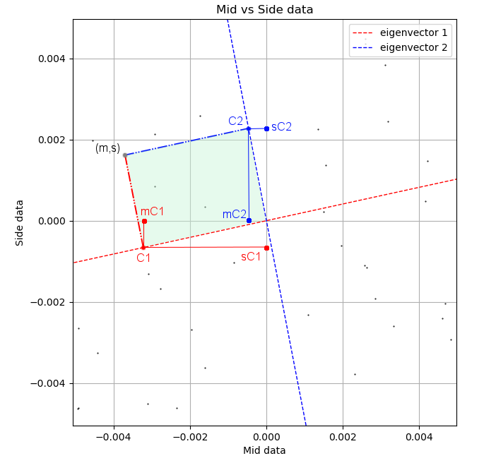

 <strong>Figura 1.</strong> Visualización espacial de la descomposición PCA en el plano M/S
 

Por ser resultado de transformaciones lineales, básicamente rotaciones, es factible recuperar de nuevo las señales $l$ y $r$ a partir de $(mC_1, sC_1)$ y $(mC_2, sC_2)$, al ser una propiedad inherente a PCA. 

Dado que el algoritmo se está aplicando sobre grabaciones musicales, el estudio de resultados sigue un proceso de validación empírica. Como ejemplo de una grabación comercial bien conocida, se ha tomado un corte de So What, del album Kind Of Blue de Miles Davis. Esta grabación es muy popular y existe disponible numerosa información técnica acerca del proceso de grabación, por lo que es fácilmente reconocible que presenta una significativa componente ambiental, [debida a la especial naturaleza del estudio donde se grabó y las técnicas de microfonía empleadas](https://es.scribd.com/document/694914875/Kind-of-Blue-Miles-Davis-and-the-Making-of-a-Masterpiece-Ashley-Kahn-Jimmy-Cobb-Z-Library).

## Relación entre correlación estéreo y estabilidad de la descomposición PCA

En las siguientes gráficas se representa, en cinco puntos cualesquiera del corte seleccionado So What de Kind Of Blue, a la izquierda la propia señal $M/S$, y a la derecha su representación en los ejes $M/S$, así como los ejes de rotación marcados por los autovectores de la tranformación PCA de la muestra correspondiente a la nube de puntos representada.

  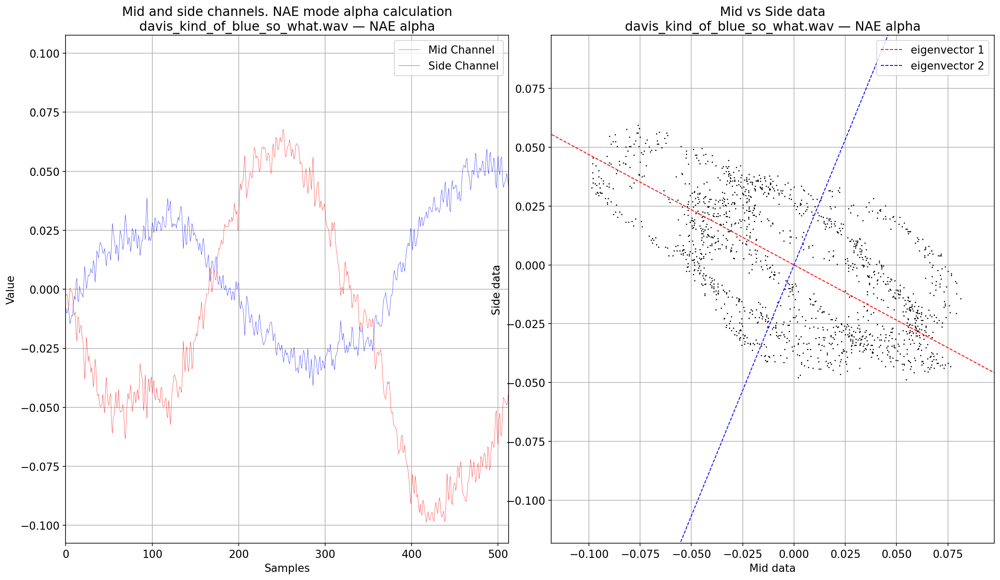

  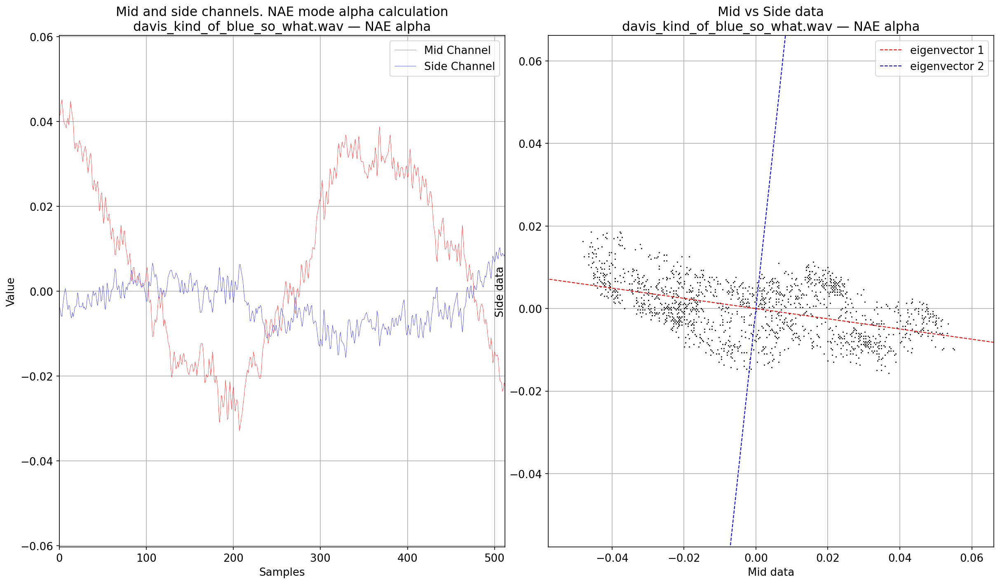

  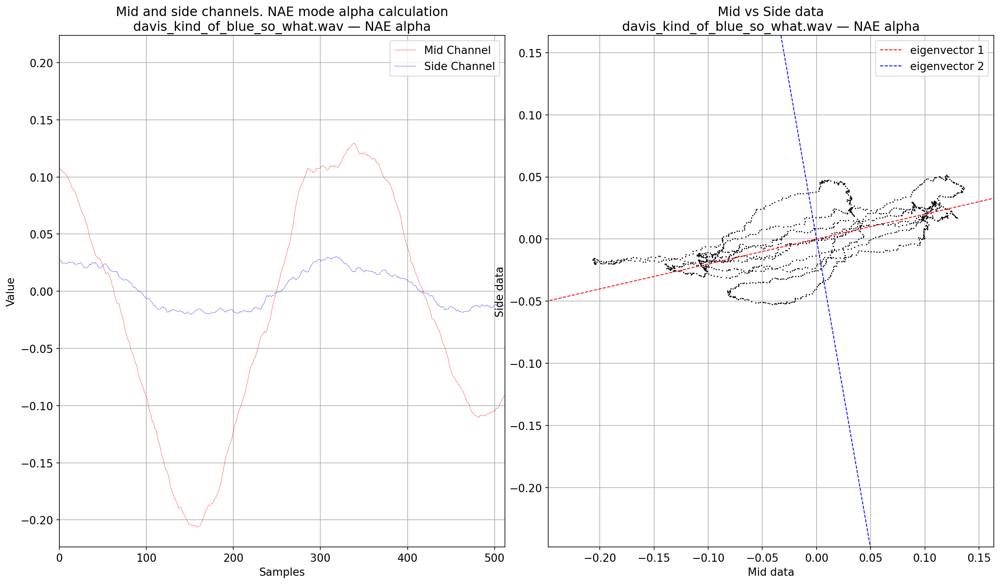

  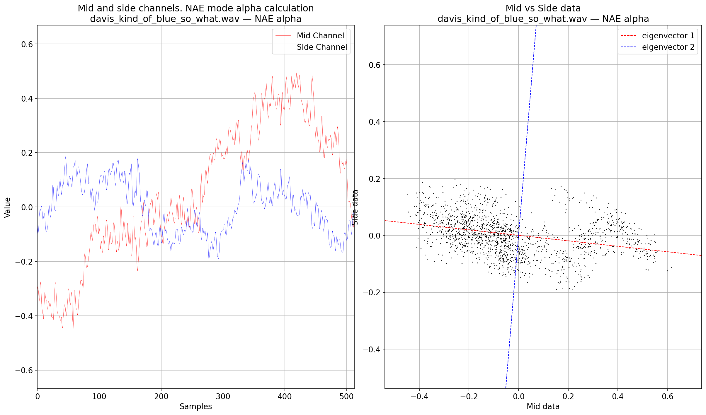

  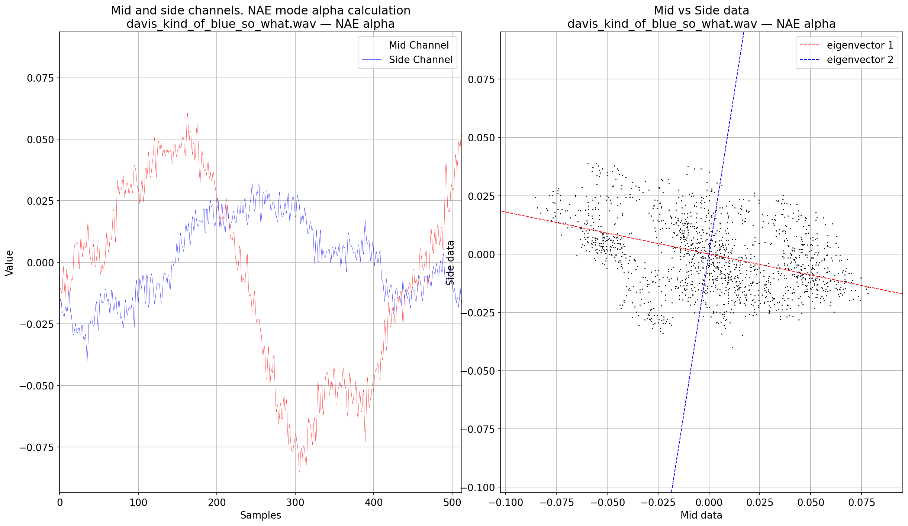

 <strong>Figuras 2 a 6.</strong> Visualización temporal y espacial de los puntos M/S para muestras seleccionadas de So What. Se incluyen los ejes de la transformación PCA sobre el plano M/S
 

Como puede verse, hay una estructura interna en la relación mid vs side, y los ejes PCA marcan una rotación en la cual la primera componente tiende a proyectar más señal mid que side, y viceversa para la segunda componente. Que en el caso de esta grabación la señal mid sea generalmente mayor que su señal side correspondiente indica que la señal mid es realmente la principal, donde estarán más localizados los instrumentos musicales.

La evolución de la correlación entre señal $L/R$ también es indicativa del peso de la componente PCA principal en la grabación:

  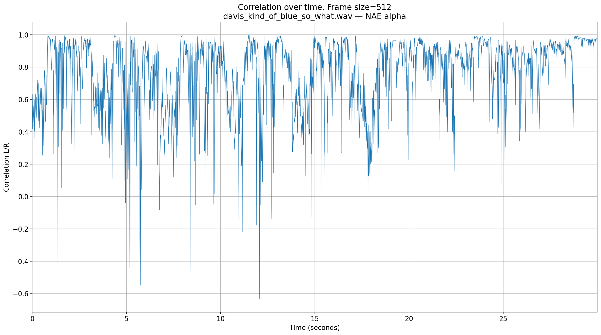

 <strong>Figura 7.</strong> Gráfica de la evolución temporal de la correlación l/r para la muestra analizada de So What
 

En el histograma de correlaciones se puede constatar que la correlación es muy alta en la mayoría de las muestras:

  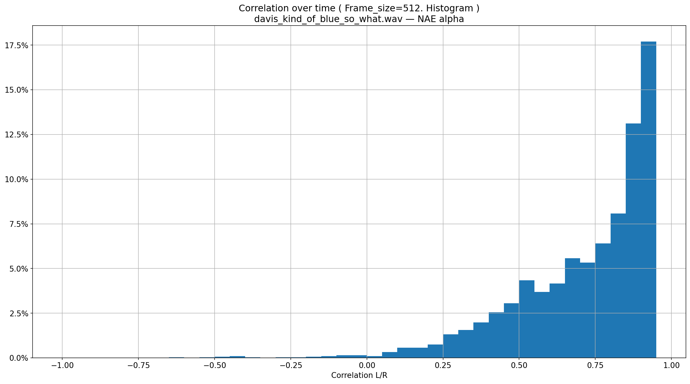

 <strong>Figura 8.</strong> Histograma de la correlación l/r para la muestra analizada de So What
 

Asimismo, la rotación de los ejes PCA sobre los ejes $M/S$ está muy controlada, yendo rara vez más allá de los ±20°.

  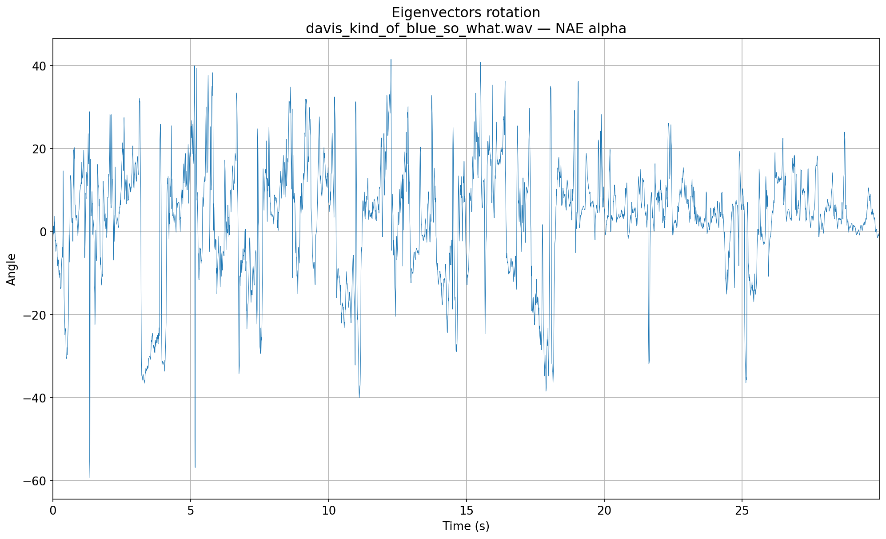

 <strong>Figura 9.</strong> Evolución temporal de las rotaciones de ejes PCA sobre el plano M/S
 

Existe una relación directa entre todas estas representaciones gráficas en la que merece la pena detenerse. La figura de evolución temporal de la correlación $L/R$ muestra que la grabación analizada presenta una correlación predominantemente elevada durante la mayor parte de su duración. Aunque aparecen descensos puntuales asociados a determinados eventos musicales, la distribución estadística de la correlación se concentra claramente en valores próximos a 1.

Este comportamiento puede observarse con mayor claridad en el histograma de correlación. La mayoría de las ventanas analizadas presentan correlaciones positivas elevadas, indicando que ambos canales contienen una cantidad importante de información común. Desde un punto de vista perceptivo, esto suele corresponder a grabaciones en las que la escena sonora mantiene un centro estéreo bien definido y donde la información lateral representa una fracción relativamente pequeña de la energía total.

Cuando la señal se representa en el plano $M/S$, esta elevada correlación se traduce geométricamente en una nube de puntos claramente alargada. La energía de la señal se distribuye principalmente a lo largo de una dirección dominante, mientras que la dispersión perpendicular a dicha dirección resulta significativamente menor.

En estas condiciones, la aplicación de PCA produce una descomposición especialmente estable. El primer autovector queda bien definido por la geometría de la nube de puntos y concentra la mayor parte de la varianza observada. El segundo autovector, ortogonal al primero, captura únicamente las variaciones secundarias presentes en la grabación.

Esta situación puede apreciarse en la gráfica de rotación temporal de los autovectores. Aunque existen fluctuaciones locales, la orientación principal permanece relativamente estable a lo largo del tiempo, reflejando la consistencia estadística de la grabación analizada.

Desde el punto de vista de NAE, esta estabilidad resulta especialmente relevante. Cuando existe una dirección dominante claramente identificable, la componente principal $C_1$ concentra la mayor parte de la energía correlacionada de la grabación, mientras que la componente secundaria $C_2$ recoge variaciones espaciales de menor magnitud. 

Es importante señalar que PCA no identifica explícitamente fuentes sonoras ni distingue entre sonido directo y ambiente. Sin embargo, cuando la correlación estéreo permanece elevada durante intervalos prolongados, la geometría del espacio $M/S$ favorece la aparición de una componente principal claramente dominante y una componente secundaria energéticamente reducida. Esta circunstancia constituye una de las razones por las que la primera aproximación de NAE produce resultados especialmente satisfactorios en grabaciones como So What de Miles Davis.

La observación de esta relación entre correlación estéreo, geometría $M/S$ y estabilidad de la descomposición PCA fue uno de los elementos que motivó el desarrollo posterior del algoritmo. Del mismo modo, el análisis de grabaciones con correlaciones persistentemente más bajas permitió identificar las limitaciones de esta primera aproximación y condujo al desarrollo de la segunda aproximación descrita en los apartados siguientes.

## Recuperación de la presentación L/R

Una vez se ha transformado $(m,s)$ a $(C_1, C_2)$ donde $C_1$ es la componente principal y $C_2$ es la secundaria, y ambos puntos se han proyectado sobre los ejes de referencia mid y side, encontramos 4 puntos: $mC_1$ y $sC_1$ (mid y side de $C_1$) y $mC_2$ y $sC_2$ (mid y side de $C_2$).

A partir de $mC_1$, $sC_1$, $mC_2$ y $sC_2$, el último paso necesario es volver a la representación $L/R$, solo que ahora se dispone de cuatro componentes, dos para izquierda, principal y secundario, y dos para derecha, también principal y secundario.

Para la componente principal, $C_1$, los canales izquierdo y derecho se obtienen mediante transposición desde $M/S$:

$$ l_{c1} =  \frac {mC_1 + sC_1}{2} $$
$$ r_{c1} =  \frac {mC_1 - sC_1}{2} $$

Igualmente para la componente ambiental, solo que en este caso se toman los canales $M/S$ propios de $C_2$:

$$ l_{c2} =  \frac {mC_2 + sC_2}{2} $$
$$ r_{c2} =  \frac {mC_2 - sC_2}{2} $$

Se ha duplicado la información estéreo pasando a un doble estéreo completamente decorrelado entre sí. A continuación, por su especial interés, se desarrollan las propiedades de estas dos parejas estereofónicas.

## Propiedades de la señales resultantes: obtención de la señal ambiental

Y es que $l_{c1}$ y $r_{c1}$ presentan correlación 1 entre sí, $l_{c2}$ y $r_{c2}$ presentan correlación -1 y, emparejadas, tanto $l_{c1}$ y $l_{c2}$, como $r_{c1}$ y $r_{c2}$ presentan correlación nula. Aunque esta última característica es justamente el resultado de la propia descomposición PCA, las dos anteriores merecen un desarrollo.

Hay una serie características de esta descomposición que resultan muy relevantes para el objetivo buscado de poder extraer el sonido ambiental de una grabación estéreo. Para comprobarlas, se parte de la proporcionalidad entre $mC_x$ y $sC_x$, para cualquiera de las componentes PCA (x = 1,2).

En primer lugar, $mC_x$ y $sC_x$ son proyecciones de la componente C_x sobre los ejes PCA (tal y como se puede ver en una gráfica anterior donde se mostraba un ejemplo de estas proyecciones)

$$ mC_x = v_{x1} C_x$$
$$ sC_x = v_{x2} C_x$$

Luego $mC_x$ y $sC_x$ son proporcionales:

$$ sC_x =  \frac {v_{x2}} {v_{x1}} mC_x  = k_x * mC_x $$

Por lo tanto, recomponer las señales $L/R$ desde $M/S$ nos encontramos con que $l_{cx}$ y $r_{cx}$ también son proporcionales:

$$ l_{cx} = \frac {mC_{x} + sC_{x}}{2}  = \frac {1 + k_x}{2} mC_x $$
$$ r_{cx} = \frac {mC_{x} - sC_{x}}{2}  = \frac {1 - k_x}{2} mC_x $$

Como el autovector de la componente $C_1$ generalmente se encuentra más cerca, en rotación, de la componente mid, podemos asumir que:

$$ |v_{11}| > |v_{12}| \rightarrow |k_1| < 1 $$

Luego para la componente principal:

$$ l_{c1} = \lambda \times r_{c1} \space siempre \space con \space \lambda > 0 $$
Por lo que la correlación entre $l_{c1}$ y $r_{c1}$ siempre será 1.

En cambio para $C_2$ el signo es justamente contrario, al estar más cerca de la componente side:

$$ |v_{22}| > |v_{21}| \rightarrow |k_2| > 1 $$

Luego:

$$ l_{c2} = \lambda \times r_{c2} \space siempre \space con \space \lambda < 0 $$

Por lo que la correlación entre $l_{c2}$ y $r_{c2}$ siempre será justamente -1. 

La extracción de una componente estéreo con correlación 1 y otra exactamente con correlación -1 no es el resultado de un procesado artificial de decorrelación, sino una consecuencia directa de la representación de ambas componentes PCA en el sistema de coordenadas $L/R$.

Estas propiedades del algoritmo, que son consecuencia natural de la descomposición $M/S$, desde el punto de vista perceptual son especialmente interesantes. Haber obtenido, por descomposición PCA, una componente secundaria anticorrelada la situa como candidata a componente ambiental definida al comienzo de este desarrollo. Asimismo, obtener una señal principal con correlación unidad, la situa como candidata a componente principal, de acuerdo con su definición previa.

Por lo tanto, se ha obtenido, por un procedimiento matemáticamente simple, dos pares de señales con características compatibles con las buscadas. Tras numerosas pruebas empíricas se ha comprobado que, con grabaciones con correlación alta, la componente secundaria suele coincidir muy bien con el ambiente. Y la componente principal incorpora la información (musical) principal en un primer plano, con un balance estéreo simple (panning por nivel sin ninguna contribución de fase). Y todo ello extraído de la propia información original y mediante procesos de transformación lineal sin parámetros arbitrarios previos.

Este modelo funciona muy bien sobre grabaciones como So What de Kind of Blue, con la característica principal de que las señales izquierda y derecha tienen una alta correlación, lo cual implica que la señal mid domina sobre la side y la pareja de señales obtenidas mediante PCA tendrán una relación muy marcada de dominancia de una sobre la otra.

Como puede comprobarse en el caso analizado, la componente $C_1$ presenta un nivel significativamente mayor que $C_2$ durante todo el intervalo analizado. Luego se cumple la segunda condición necesaria para asumir que $C_2$ es una señal ambiental tal cual define el paradigma NatAmbio.

  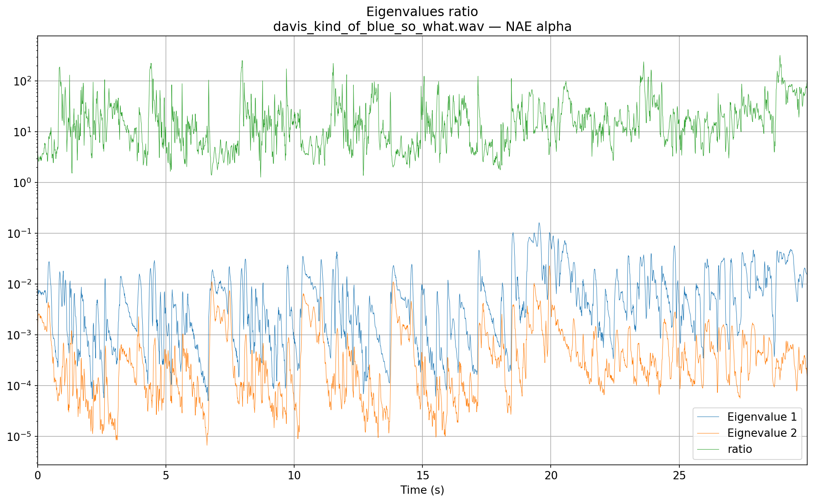
  

 <strong>Figura 10.</strong> Evolución temporal de los niveles de cada componente C1 y C2 y las diferencias de niveles entre ellos
 

Con respecto al panning relativo $L/R$ de cada una de las dos componentes, se da una especial característica que es conveniente destacar. Dado que para la componente $C_1$ su representación $L/R$ es:

$$ l_{c1} = \frac {mC_{1} + sC_{1}}{2}  = \frac {1 + k_1}{2} mC_1 $$
$$ r_{c1} = \frac {mC_{1} - sC_{1}}{2}  = \frac {1 - k_1}{2} mC_1 $$

El balance $L/R$ de $C_1$ y $C_2$ dependen de:
$$ \frac {l_{c1}}{r_{c1}} = \frac {{1 + k_1}}{1 - k_1}$$
$$ \frac {l_{c2}}{r_{c2}} = \frac {{1 + k_2}}{1 - k_2}$$
Dado que las componentes $C_1$ y $C_2$ son ortogonales entre sí (ver [figura 1](#figure_01)), se cumple que:

$$ {k_1} \cdot {k_2} = -1 \rightarrow k_2 = \frac {-1}{k_1}$$

Por lo que:

$$ \frac {l_{c2}}{r_{c2}} = \frac {{1 + k_2}}{1 - k_2} = \frac {{1 + \frac {-1}{k_1}}}{1 - \frac {-1}{k_1}} = \frac {k_1 - 1}{k_1 + 1} = - \frac {r_{c1}}{l_{c1}}$$

Calculando los niveles relativos $L/R$, resulta:

$$ \left| \frac {l_{c2}}{r_{c2}} \right| = \left| \frac {r_{c1}}{l_{c1}} \right|$$

Lo cual significa que las componentes $C_1$ y $C_2$ presentan balances $L/R$ inversos: cuando una componente queda paneada hacia un lado, la otra queda paneada en sentido opuesto. Visualmente puede apreciarse en la siguiente gráfica:

  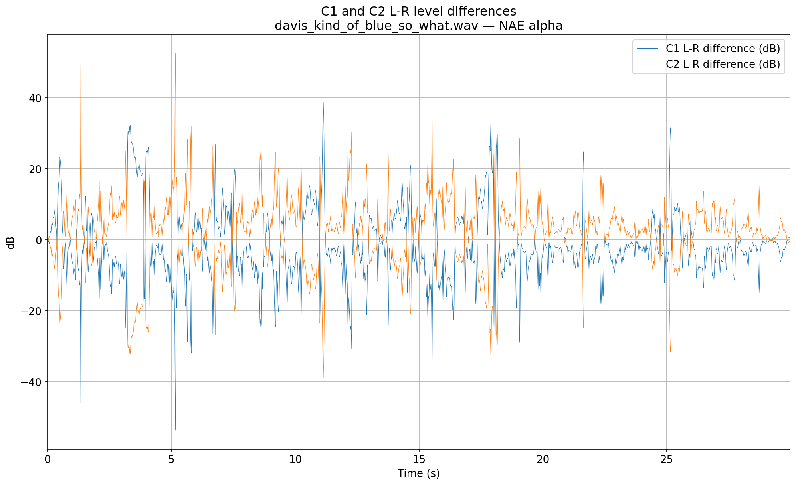
  

 <strong>Figura 11.</strong> Evolución temporal de la diferencia de nivel L−R (balance/panning) de cada componente C1 y C2 para la muestra analizada de So What
 

Son curvas con una fuerte simetría: cuando $C_1$ tiene panning en un sentido, $C_2$ tiene panning en el contrario. La combinación produce la sensación gráfica de que el ambiente generado (siempre según el paradigma NatAmbio) por una fuente musical lateralizada a un lado, está lateralizada al lado opuesto, y cuanto mayor es el panning principal, mayor es el panning opuesto ambiental. De modo intuitivo, parece que los mecanismos de localización de una grabación de alta correlación entre canales incluye el ya conocido panning de nivel, pero además incluye una señal decorrelada con la principal que ofrece un panning opuesto. Queda aquí recogido que esta propiedad resultante del algoritmo NAE es una posible candidata a un estudio específico que relacione panning, decorrelación/anticorrelación y reconstrucción de la percepción espacial a partir de una grabación estéreo.

## Limitaciones de la primera aproximación: grabaciones de baja correlación

Hasta ahora, el modelo presenta resultados coherentes por haberse aplicado sobre señales estéreo con muy alta correlación. Esto no es siempre así, se pueden encontrar numerosas grabaciones donde la correlación $L/R$ es muy baja. Esto sucede cuando las fuentes sonoras están muy fuertemente paneadas a uno u otro lado, algo que se ha dado y se sigue dando en numerosas grabaciones. Si hasta ahora hemos asociado componente ambiental con lateralidad, para estas grabaciones la asociación deja de funcionar de manera directa.

Como ya se ha comentado, este algoritmo se desarrolló con metodología de análisis empírico empleando las propias grabaciones comerciales como señales de prueba. Para el análisis de este nuevo caso, el desarrollo se ha efectuado sobre una grabación con muy alto panning instrumental, el tema I Am In Love del disco [At The Blackhawk 3 del grupo Shelly Manne and his Men](https://en.wikipedia.org/wiki/At_the_Black_Hawk_3). Este disco fue grabado en directo en un club de jazz, con lo cual se tiene la seguridad de que existe sonido ambiental natural, pero, como es habitual en las grabaciones de la compañía Contemporary Records, los instrumentos están muy localizados lateralmente y no hay presencia central significativa. Es un caso claro de grabación con baja correlación, que a continuación se analiza.

Comenzando con la evolución temporal de la correlación sobre una muestra de la citada grabación, puede comprobarse que se está ante un caso muy diferente a Kind Of Blue:

  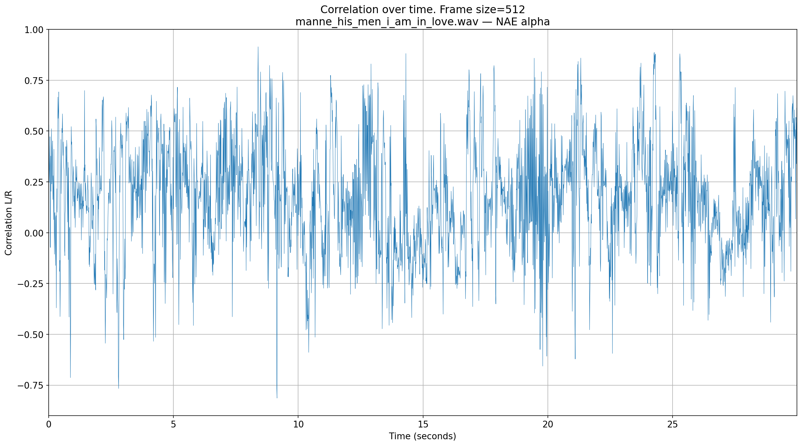
  

 <strong>Figura 12.</strong> Gráfica de la evolución temporal de la correlación L/R para la muestra analizada de I Am In Love
 

En el histograma de correlaciones se puede constatar que la correlación mucho más baja, con pico en torno a un valor tan bajo como 0.25:

  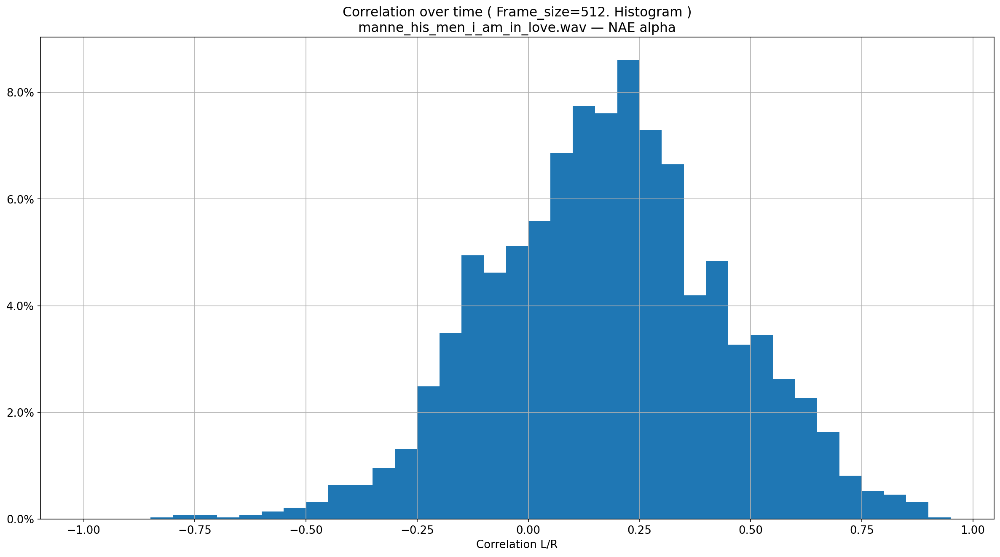
  

 <strong>Figura 13.</strong> Histograma de la correlación L/R para la muestra analizada de I Am In Love
 

Además, el histograma es mucho más ancho, y muchos puntos están en correlación negativa, lo cual indica numerosas transiciones a regiones estadísticamente diferentes, y a su vez anticipa las dificultades a las que se va a enfrentar PCA en indicar la dirección principal en el plano $M/S$.

Vuelve a aparecer, aunque con otro resultado, la fuerte relación entre la correlación $L/R$ y la rotación de autovectores de PCA sobre $M/S$: en este caso, baja correlación $L/R$ implica rotaciones de ejes PCA más agresivas. Un estimador permite valorar el otro, lo cual tendrá consecuencias relevantes en las siguientes secciones.

  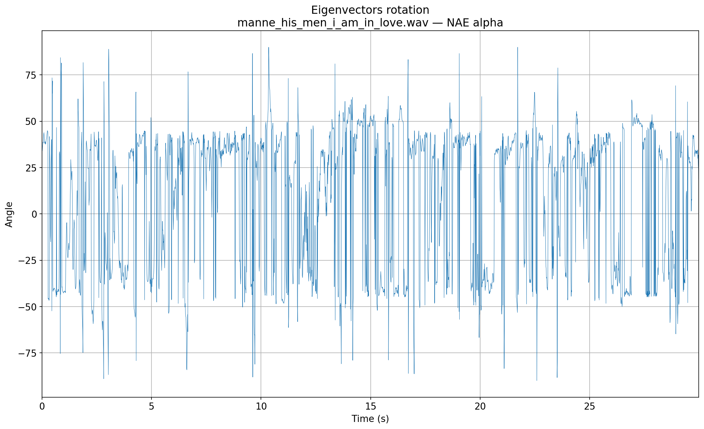
  

 <strong>Figura 14.</strong> Evolución temporal de las rotaciones de ejes PCA sobre el plano M/S para I Am In Love
 

Estas primeras gráficas indican que, cuando la correlación estéreo disminuye de forma sostenida, la orientación de los autovectores deja de reflejar una estructura espacial global de la grabación y pasa a estar determinada por eventos musicales locales. Encaja con la realidad de la grabación de alta lateralidad de las fuentes virtuales.

A continuación se presenta gráficamente la información $M/S$ y los ejes PCA de cinco momentos cualesquiera del proceso:

  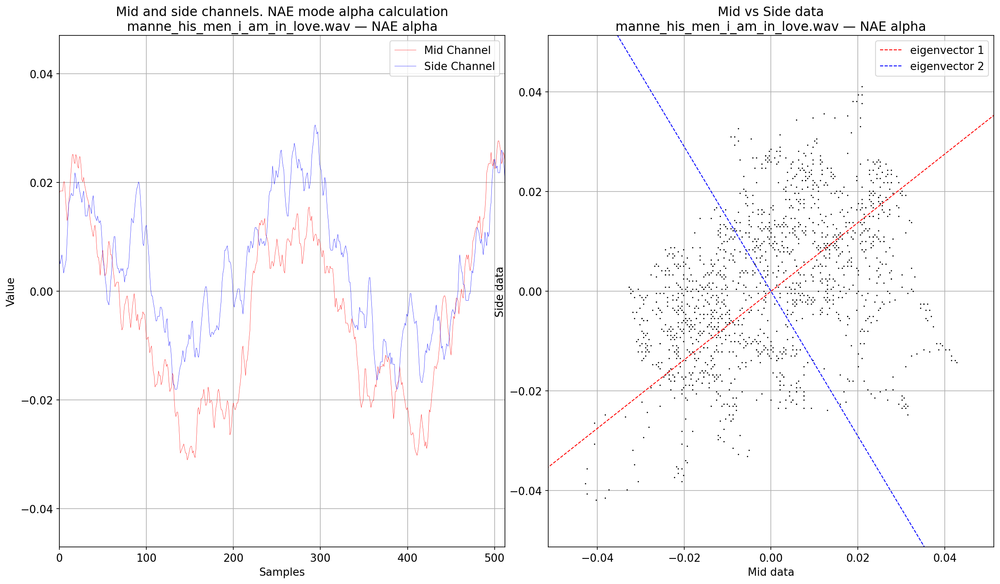

  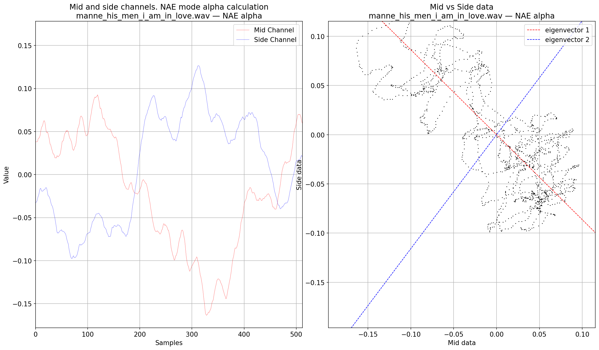

  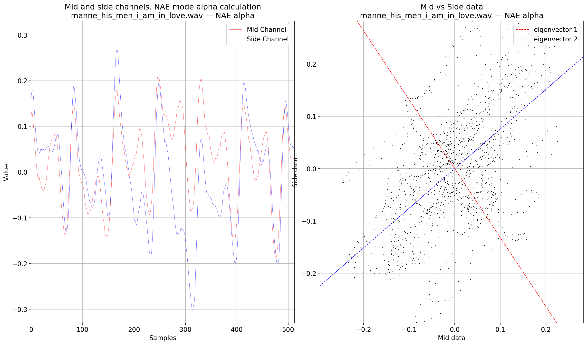

  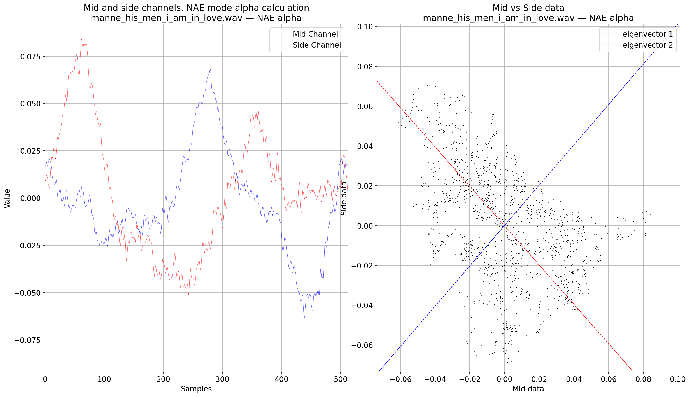

  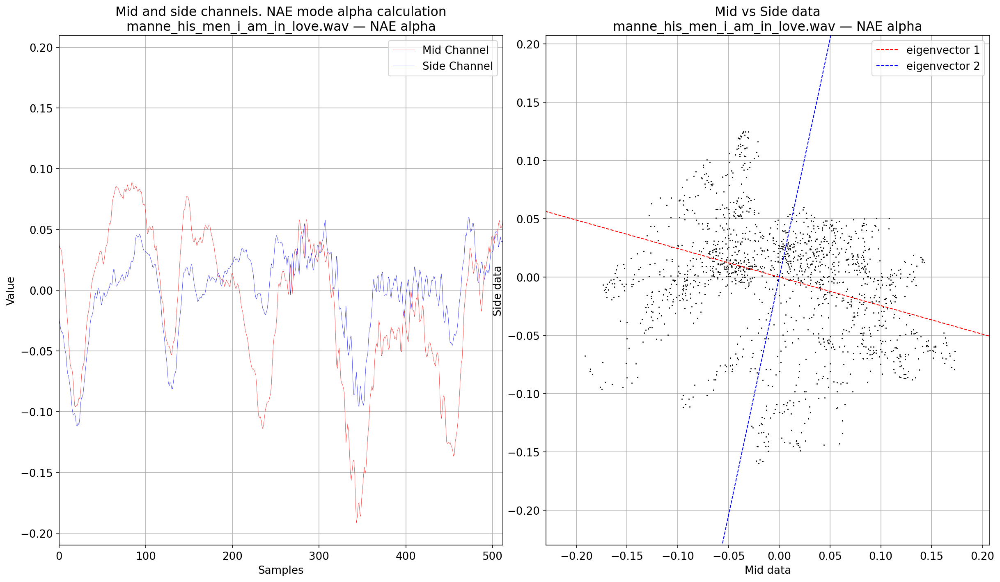

 <strong>Figuras 15 a 19.</strong> Visualización temporal y espacial de los puntos M/S para muestras seleccionadas de I Am In Love. Se incluyen los ejes de la transformación PCA sobre el plano M/S
 

Se puede apreciar que la información $M/S$ está muy dispersa, con muy alta rotación de la componente principal sobre el eje mid, lo cual dificultará que la primera aproximación al modelo NAE ofrezca una señal ambiental. En el caso de las gráficas tercera y cuarta incluso parecería que el eje principal no es tal. En esos casos, la varianza asociada a ambas componentes es muy similar. Esto se puede comprobar a partir de la gráfica comparativa de niveles entre $C_1$ y $C_2$ donde se aprecia que la diferencia es mucho menor que en el caso de So What. Son muchos los puntos donde $level(C_1) \approx level(C_2)$.

  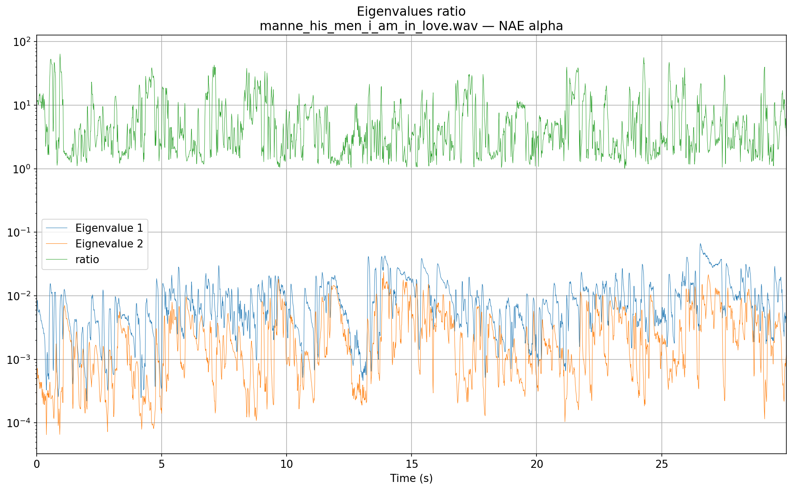
  

 <strong>Figura 20.</strong> Evolución temporal de los niveles de cada componente C1 y C2 y las diferencias de niveles entre ellos para la muestra de I Am In Love
 

El resultado es que, si para el caso de Kind Of Blue, la escucha directa de la señal ambiental obtenida ofrece una sensación subjetivamente verosímil, para la grabación de I Am in Love, la sensación subjetiva no es de percepción ambiental. En este último caso, se puede percibir como los instrumentos entran y salen de la componente denominada "ambiental". Realmente lo que resulta es que el algoritmo se orienta más a ser una separación de fuentes que un extractor ambiental. En un momento dado de la grabación, un solo de trompeta en el canal izquierdo "compite" con la batería en el derecho. El resultado es que, en ocasiones, la trompeta entra en el ambiente y en ocasiones es la batería la que aparece, sin más criterio que sus energías respectivas. Una percepción oscilante lejos del objetivo propuesto.

El análisis comparado de ambas grabaciones, Kind of Blue vs At The Blackhawk, muestra que la calidad perceptual de una primera aproximación al algoritmo NAE depende fuertemente de la estabilidad estadística de la señal estéreo. Cuando existe una dirección dominante claramente definida, PCA produce una separación perceptualmente satisfactoria. Sin embargo, en grabaciones con correlación moderada o baja mantenida en el tiempo, la descomposición comienza a identificar como componentes independientes elementos musicales legítimos asociados a posiciones laterales estables.

La primera aproximación de NAE puede interpretarse como una búsqueda de los polos principal/ambiental definidos anteriormente. Sin embargo, esta aproximación presupone implícitamente que existe una dirección dominante claramente identificable en el espacio $M/S$. Cuando la correlación estéreo disminuye, dicha hipótesis deja de cumplirse y PCA comienza a identificar como componentes independientes elementos musicales lateralizados. Esta observación motivó el desarrollo de una segunda aproximación, que se presentará a continuación. El objetivo ya no era modificar la geometría de la descomposición PCA, sino adaptar dinámicamente la cantidad de información transferida hacia la componente ambiental en función del estado estadístico global de la grabación, estimado a partir de la correlación estéreo $L/R$.

## Una segunda aproximación al algoritmo NAE

Asumiendo que el problema puede deberse a la baja correlación entre canales $L/R$, se puede hacer una transformación previa al paso a PCA que haga aumentar esta correlación:

$$ l^\prime = ( 1- \gamma)\space l + \gamma \space r$$
$$ r^\prime = ( 1- \gamma)\space r + \gamma \space l$$

De esta forma las señales M/S quedan:

$$ m = l + r $$
$$ s = ( 1 - 2 \gamma) (l -r) = \beta (l-r)$$
$$ siendo\space \beta = ( 1 - 2 \gamma), \qquad \gamma \in [0,\, 0.5] \;\Rightarrow\; \beta \in [0,\, 1]$$

De esta forma, con el factor $\beta$ se puede hacer disminuir la componente side en el peso $M/S$. La cuestión pendiente es decidir cuál será el mejor ajuste de $\beta$, que necesariamente tendrá que depender de la naturaleza de la propia grabación. Si en el caso de Kind of Blue no se necesita o será suficiente con un factor $\beta$ próximo a 1, en el caso de At The Blackhawk, parece lógico pensar que será conveniente introducir $\beta$ más reducido. En cualquier caso, es evidente que tiene que ser la propia grabación, con sus características de correlación, la que genere su propia $\beta$ variable con su evolución.
La parametrización propuesta para aplicar en el algoritmo NAE y generar $\beta$  parte de la observación, anteriormente comentada, de que hay una fuerte relación entre la correlacion $L/R$ y la rotación de ejes PCA. Si el objetivo es evitar esta rotación, un candidato a la parametrización de $\beta$ es la propia correlación $L/R$. La correlación no se utiliza únicamente como una medida perceptual de amplitud estéreo. En el contexto de NAE actúa además como un indicador indirecto de la estabilidad de la descomposición PCA. Correlaciones elevadas producen nubes $M/S$ más alargadas y autovectores más estables, mientras que correlaciones reducidas generan distribuciones más isotrópicas y orientaciones PCA más sensibles a pequeñas variaciones estadísticas.

De manera empírica, la propuesta incluida en NAE es:

$$ \rho_{lr} = corr(l, r)$$

$$ \beta = 0.55 + 0.45\space|\rho_{lr}| $$

Correlaciones próximas a 1 en valor absoluto darán lugar a $\beta \approx 1$, con lo que la componente side apenas variará su peso, y en cambio para correlaciones próximas a cero, $\beta$ $\approx$ 0.55, que de modo empírico se ha establecido como peso mínimo de la componente side en esta nueva transformación. El valor mínimo 0.55 no surge de una optimización matemática formal sino de la evaluación empírica de múltiples grabaciones de referencia. Valores inferiores producen un colapso excesivo de la imagen estéreo, mientras que valores superiores no estabilizan suficientemente la orientación PCA en grabaciones altamente lateralizadas. En cualquier caso, su naturaleza es arbitraria y, funcionalmente en NAE, cualquier tipo de relación creciente entre $corr(l/r)$ y $\beta$ es aceptable. Bien distinto será su resultado perceptual y su valoración subjetiva.

A continuación se muestran las gráficas de evolución de la correlación $l^\prime/r^\prime$, su histograma y las rotaciones de autovectores PCA para la aplicación de esta transformación sobre la misma muestra de I Am In Love:

  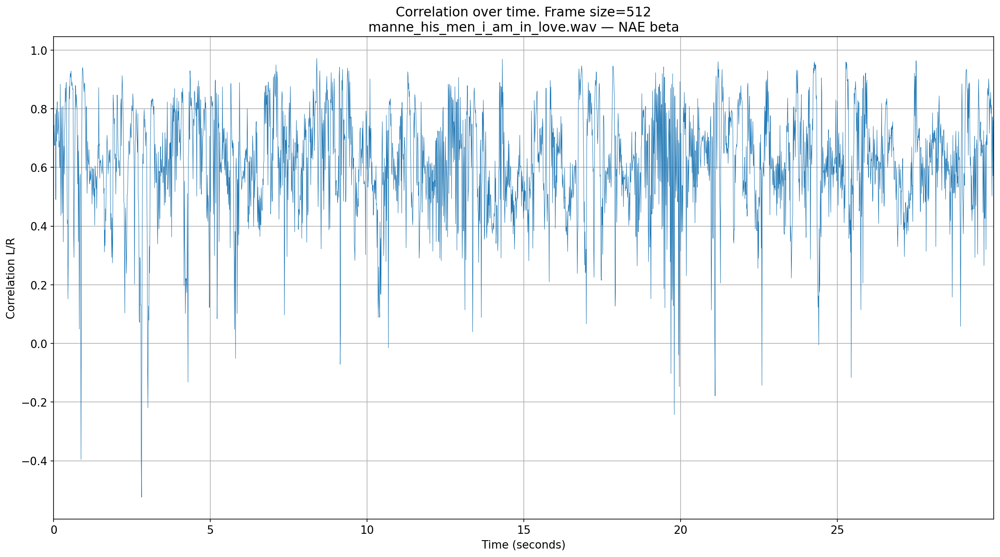
  

 <strong>Figura 21.</strong> Gráfica de la evolución temporal de la correlación L/R para la muestra analizada de I Am In Love tras aplicar la modelización beta
 

La evolución temporal de la correlación $l^\prime/r^\prime$ se acerca más a la unidad. En el histograma de correlaciones se puede constatar que la correlación sube a valores entre 0.60 y 0.75.

  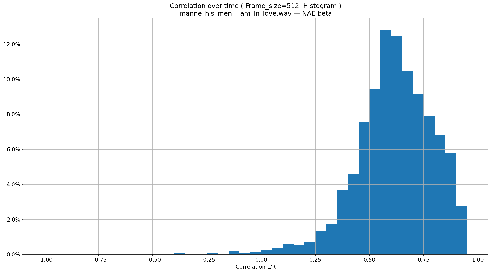
  

 <strong>Figura 22.</strong> Histograma de la correlación L/R para la muestra analizada de I Am In Love tras aplicar la modelización beta
 

Además, el histograma se estrecha, y muchos menos puntos están ahora en correlación negativa, lo cual indica que será más fácil para PCA marcar una nueva dirección principal, de modo más estable.

Se ha conseguido el efecto deseado: las rotaciones de ejes PCA ya están acotadas principalmente en un margen razonable de $20^{\circ}$.

  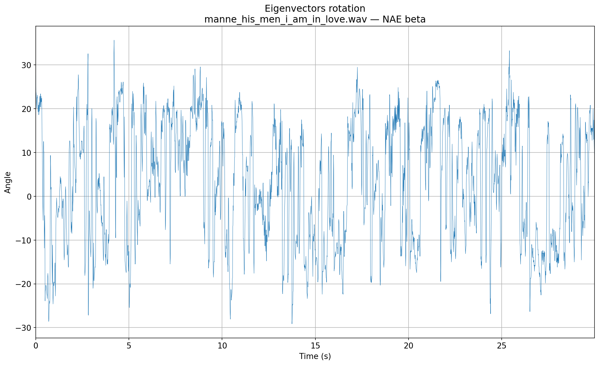
  

 <strong>Figura 23.</strong> Evolución temporal de las rotaciones de ejes PCA sobre el plano M/S para I Am In Love tras aplicar la modelización beta
 

A continuación, se muestran las nuevas representaciones de puntos $M/S$ y ejes PCA para las mismas 5 muestras de la situación previa a esta nueva transformación añadida:

  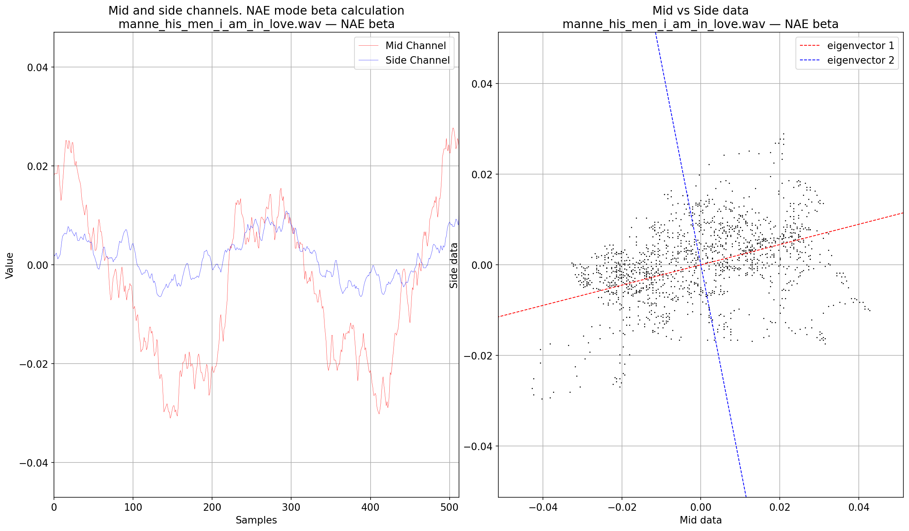

  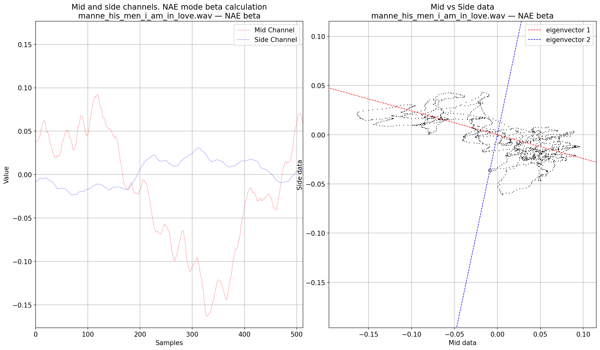

  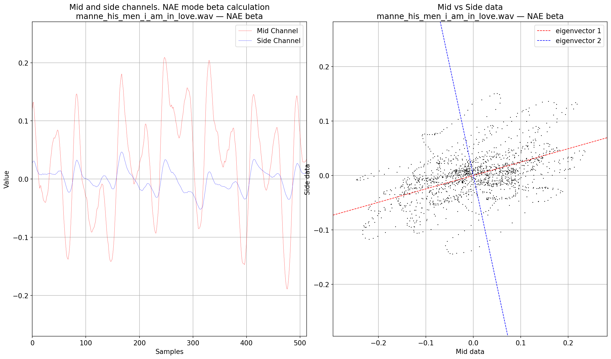

  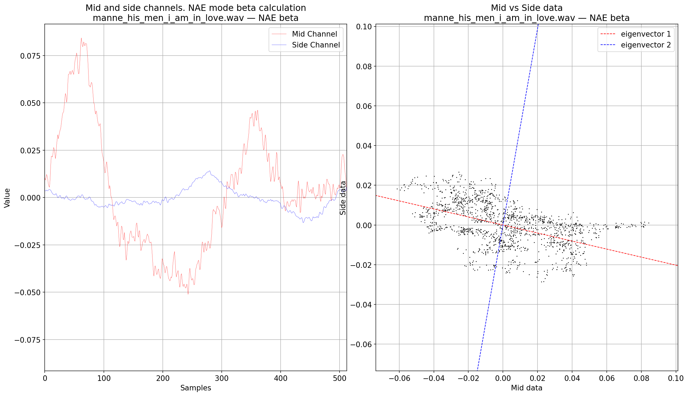

  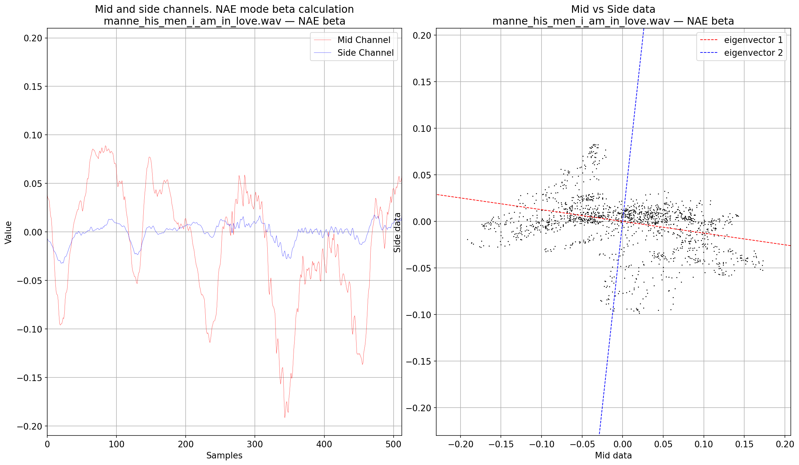

 <strong>Figuras 24 a 28.</strong> Visualización temporal y espacial de los puntos M/S para muestras seleccionadas de I Am In Love. Se incluyen los ejes de la transformación PCA sobre el plano M/S tras aplicar la modelización beta
 

Sin ser formas elípticas tan limpias como cuando se analizó Kind Of Blue, ahora sí que la componente principal marca una rotación más cercana al eje mid, portando bastante más energía que su contrapuesta segunda componente.

La evaluación empírica de la escucha de la señal denominada ambiental en un sistema estéreo mantiene, a mucho menor nivel, una cierta presencia de los instrumentos, con mucha más estabilidad, sin cambios tan bruscos por aparición y desaparición de estas fuentes tan laterales. Se aproxima de modo mucho más razonable a una señal ambiental que cumpla la definición que el sistema NAE necesita, uno de los objetivos principales de este desarrollo. Esto lo confirma el análisis de los nuevos niveles relativos entre $C_1$ y $C_2$:

  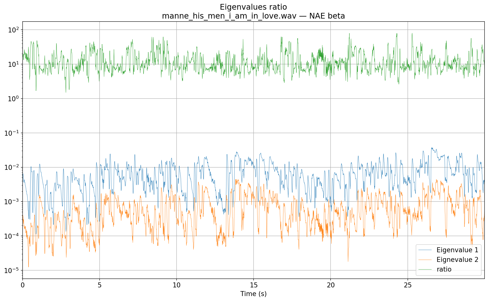
  

 <strong>Figura 29.</strong> Evolución temporal de los niveles de cada componente C1 y C2 y las diferencias de niveles entre ellos para la muestra de I Am In Love tras la aplicación de la modelización beta
 

Hay que tener en cuenta que esta segunda aproximación a NAE no pretende aumentar artificialmente la cantidad de sonido ambiente presente en la grabación. Su objetivo es reducir la tendencia de PCA a interpretar fuentes laterales dominantes como componentes independientes susceptibles de ser transferidas a la salida ambiental.

NatAmbio emplea ambas aproximaciones NAE en sus dos dipolos estéreo, con objetivos distintos pero de modo coordinado entre ambas. En las próximas secciones se describe el paso de la descripción de su algoritmo a la implementación final en un software de procesamiento en tiempo real que forma parte de la aplicación NatAmbio.

Por último, también con NAE en esta nueva modelización, se produce también el esperado efecto de panning opuesto entre señal principal y señal ambiental.

  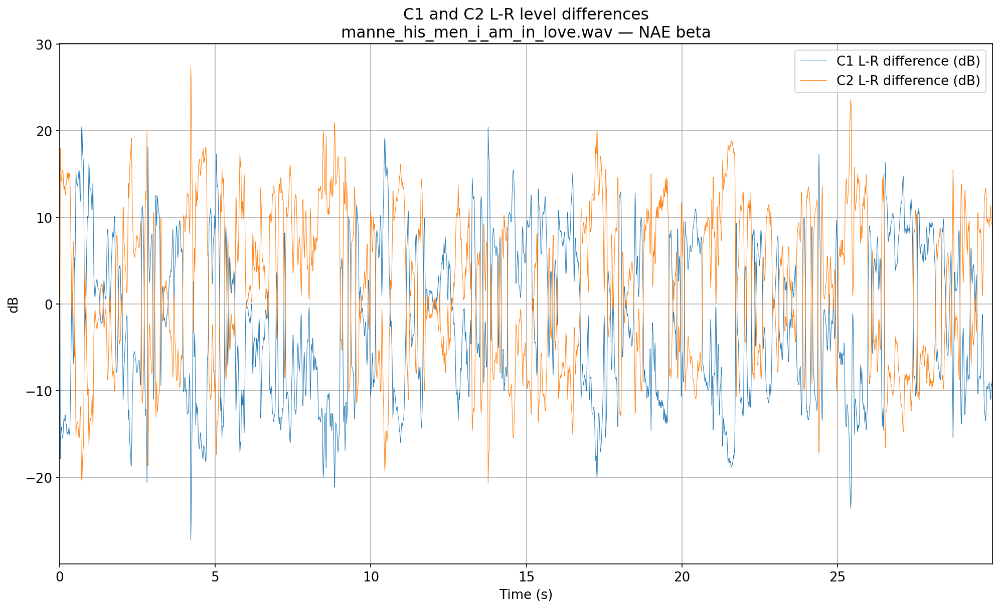
  

 <strong>Figura 30.</strong> Evolución temporal de la diferencia de nivel L−R (balance/panning) de cada componente C1 y C2 para I Am In Love tras la aplicación de la modelización beta
 

A efecto comparativos, en la gráfica de niveles relativos entre $C_1$ y $C_2$ tras la aplicación NAE sin modelo beta se puede apreciar el altísimo panning que esta grabación incluye.

  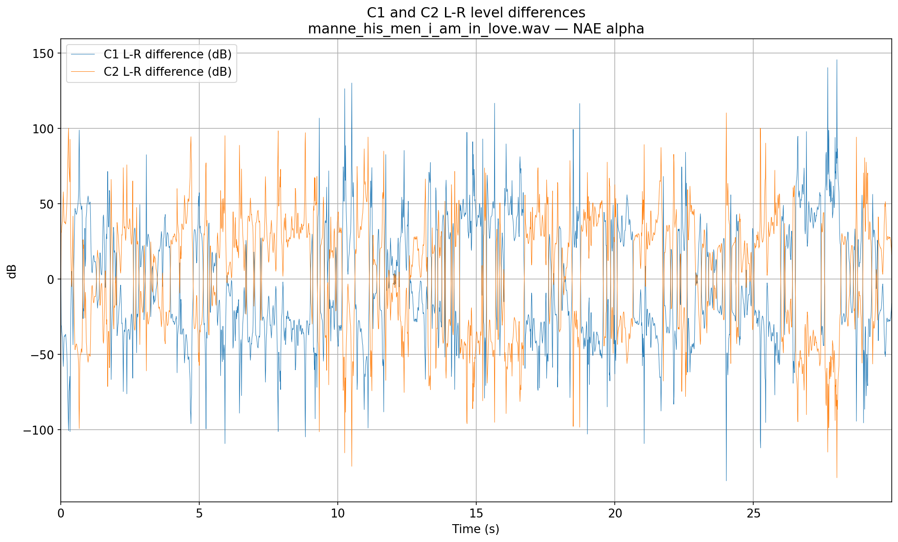
  

 <strong>Figura 31.</strong> Evolución temporal de la diferencia de nivel L−R (balance/panning) de cada componente C1 y C2 para I Am In Love sin aplicar modelo beta
 

## Implementación de NAE

Hasta este punto se han descrito los fundamentos conceptuales de NAE y las observaciones que condujeron a su formulación. En esta sección se presentan los detalles prácticos de implementación utilizados en NatAmbio, entre los cuales  están los tamaños de muestras para PCA, posibles mecanismos de suavizado temporal y el procedimiento de cálculo del parámetro β empleado en la segunda aproximación.

La primera decisión a adoptar es acerca del tamaño de muestra sobre el que se van a ir aplicando los sucesivos pasos PCA. El tamaño de muestra utilizado por PCA constituye un compromiso entre resolución temporal y estabilidad estadística. Ventanas pequeñas permiten seguir con rapidez las variaciones espaciales de la grabación, pero producen estimaciones más ruidosas de la matriz de covarianza. Ventanas grandes mejoran la estabilidad de los autovectores, aunque reducen la capacidad de adaptación a cambios rápidos del contenido estéreo.

En la implementación actual se emplea una ventana PCA equivalente a cinco bloques consecutivos de audio. Cuando NAE opera dentro de NatAmbio, lo hace tiempo real sobre [JACK Audio Connection Kit](https://jackaudio.org/). En este caso el tamaño de cada uno de dichos bloques coincide con el tamaño de muestras por ciclo configurado en el servidor de audio, recomendándose valores de 250 o 500 muestras como tamaños razonables para un proceso PCA que se ajuste a la variabilidad de las matrices de varianza de modo ni muy brusco ni demasiado suave. 
Por lo tanto, hay que tener en cuenta que cada muestra de audio participa en cinco análisis PCA consecutivos. Las cinco contribuciones obtenidas para cada punto se promedian posteriormente, produciendo un efecto equivalente a un suavizado temporal de la orientación PCA. La (re)normalización de niveles tras el promediado ha seguido un sencillo criterio de seguridad, al perderse en este caso la posibilidad de transformación inversa. Es decir, el propio promediado sobre varios cálculos de PCA, en modo ventana deslizante, impide que se cumpla la condición matemática de reconstrucción de la señal original a partir de las componentes obtenidas. Se pierde algo de fidelidad a la señal de entrada a cambio de lograr componentes cuya evolución temporal está suavizada.

En cualquier caso, dentro de NAE en NatAmbio, existe la posibilidad de reajustar arbitrariamente las ganancias para cada una de las componentes obtenidas. Por otro lado, no se observó ninguna ventaja perceptible al utilizar funciones de ponderación adicionales, por lo que la implementación final emplea una ventana deslizante rectangular.

El cálculo de la correlación $L/R$ empleado para determinar β utiliza una ventana temporal más extensa que la utilizada por PCA. Concretamente, se consideran veinte ventanas consecutivas. Esta decisión introduce una estimación más estable de la correlación global de la grabación, evitando variaciones excesivamente rápidas de $\beta$ que podrían trasladarse al procesamiento espacial.

Debido a los requisitos de funcionamiento en tiempo real, esta estimación utiliza principalmente información pasada de la señal, aceptando un pequeño compromiso entre simetría temporal y latencia.

Como se ha explicado, NAE tiene finalmente dos posibles implementaciones: una primera aproximación, sin adaptación específica de la señal de entrada, que, para NatAmbio, recibe el nombre de NAE modo $\alpha$; y una segunda aproximación, con adaptación especial de la señal de entrada utilizando el parámetro $\beta$, que en NatAmbio recibe el nombre de NAE modo $\beta$.

Conviene precisar la notación para evitar confusiones. Los nombres de modo $\alpha$ y $\beta$ identifican las dos implementaciones de NAE y no deben confundirse con los parámetros empleados en las ecuaciones: el coeficiente de mezcla $\gamma$ y el peso de la componente side $\beta = 1 - 2\gamma$. El modo $\alpha$ corresponde al caso sin mezcla previa ($\gamma = 0$, equivalente a $\beta = 1$), mientras que el modo $\beta$ aplica la adaptación dinámica de $\beta$ en función de la correlación $L/R$.

Esquema funcional de NAE, ambos modos, $\alpha$ y $\beta$:

  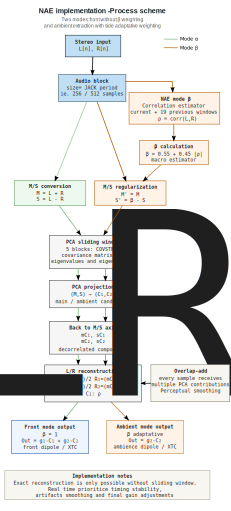
  

 <strong>Figura 32.</strong> Esquema de la implementación del algoritmo NAE, en sus modos alfa y beta
 

## Aplicación de NAE a NatAmbio de uno o dos dipolos estéreo

NAE no fue concebido como un algoritmo de separación de señales independiente, sino como la primera etapa de un sistema completo de reproducción espacial denominado NatAmbio. Por este motivo, la implementación software del algoritmo NAE está adaptada a esta utilización específica.

Dentro de NatAmbio, NAE y [XTC](../XTC/xtc_filters.md) desempeñan funciones complementarias. NAE reorganiza la información espacial presente en la grabación, separando componentes predominantemente frontales y componentes predominantemente ambientales. XTC actúa posteriormente sobre la reproducción física, reduciendo la diafonía acústica entre ambos oídos y mejorando la precisión espacial con la que dichas componentes son percibidas. En concreto, la componente ambiental extraída por NAE, sea en su implementación frontal o ambiental, es proyectada por XTC incrementando la citada sensación de deslocalización. La cancelación de diafonía actúa como un amplificador del efecto ambiental.

Por este motivo, el modo $\alpha$ de NAE se puede aplicar sobre un NatAmbio de un solo dipolo estéreo, el frontal. Sobre la señal descompuesta en componente principal y ambiental se pueden recomponer los canales estéreo enviados a este dipolo con ganancias modificadas: atenuando levemente, en torno a 1 dB, la componente principal y amplificando la componente ambiental alrededor de 4 dB, el efecto que potencia XTC es que se amplifica la sensación envolvente originalmente presente en la grabación, y además se amplía la escena musical en el caso de grabaciones con mucha lateralidad instrumental. Todo ello sin apenas modificar el panning natural ni el equilibrio tonal de la componente principal. Evidentemente, modificaciones más agresivas del peso relativo entre componente principal y componente ambiental producen escenas sonoras muy secas (sin ambiente) o demasiado resonantes (ambiente muy presente). En cualquier caso, está dentro de las posibilidades de NatAmbio el ajuste de estos pesos al gusto del oyente final del sistema. 

  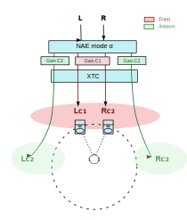
  

 <strong>Figura 33.</strong> Esquema de la aplicación de NAE a un sistema NatAmbio de un solo dipolo
 

Para el caso de NatAmbio completo, con dos dipolos, la propuesta para el dipolo frontal se mantiene, extracción de componentes por modo $\alpha$ y reequilibrio entre ellas al gusto del oyente. 

Con el dipolo ambiental, cuyo objetivo es ampliar la sensación envolvente, la aplicación de NAE es la correspondiente al modo $\beta$. Dada su ubicación trasera muy lateralizada, es muy importante que los canales $L/R$ enviados no tengan señales instrumentales muy laterales, porque van a ser percibidas detrás del oyente, provocando una indeseada sensación. En cambio, si los canales $L/R$ enviados proceden de la descomposición NAE en modo $\beta$, y solo se envía la propia componente ambiental anticorrelada, descartando la componente principal, se potencia el efecto ambiental. Dicho efecto perceptual, en este caso, se ha formado por la composición de dos componentes ambientales, la de NAE modo $\alpha$ actuando sobre el dipolo frontal y la de NAE modo $\beta$ actuando sobre el dipolo ambiental. La posibilidad de ajustar las ganancias relativas entre ambas componentes permite al oyente ajustar a su gusto la sensación envolvente.

Hay que tener en cuenta que sobre el dipolo ambiental también actúa su propio XTC, con lo que la componente ambiental del modo $\beta$, sonando a su través de modo exclusivo, sin componente principal alguna, genera una percepción que no es trasera, sino deslocalizada. El dipolo ambiental se puede disponer con sus altavoces en ángulo cerrado (en torno a $40^{\circ}$) y el efecto XTC hará su trabajo de trasladar la señal decorrelada de NAE modo $\beta$ al espacio deslocalizado.

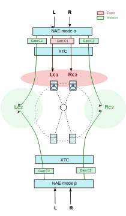

 <strong>Figura 34.</strong> Esquema de la aplicación de NAE a un sistema NatAmbio de dos dipolos
 

De esta forma se alcanza uno de los objetivos fundamentales de NatAmbio: generar una componente ambiental adicional extraída de la propia grabación, sin artificios externos, para alimentar un sistema de doble dipolo tipo PanAmbio y reproducirla de forma perceptualmente coherente con el resto de la escena sonora.

NAE constituye la primera etapa de la cadena de procesamiento de NatAmbio, seguida por XTC y finalizada mediante una ecualización tipo DRC. Las tres etapas —cuatro, si se considera también el efecto loudness que puede incorporar DRC— presentan una elevada sinergia y actúan de forma complementaria.

El resultado es una reproducción compatible con la escena musical original, pero con una mayor sensación de apertura frontal y un campo ambiental envolvente cuyo nivel puede ajustarse al gusto del oyente. Todo ello se obtiene a partir de grabaciones estéreo comerciales convencionales y mediante procesamiento en tiempo real.