# Characterization of Listening Regions for Digital Room Correction by Means of Principal Component Analysis

**Author:** Raúl Fernández Ortega  
**Date:** June 2026

> **Abstract —** *Convolution equalization for Digital Room Correction (DRC) usually relies on the impulse response measured at a single listening point, whose representativeness is a matter of debate. This article proposes a simple, low-cost multipoint measurement method, based on Principal Component Analysis (PCA), that allows the impulse response used to generate the equalization FIR filter to be characterized in a controlled way. Two complementary properties of the measurement dataset are introduced: **homogeneity**, the degree of statistical similarity between impulse responses, quantifiable through correlations, and **coherence**, the degree to which that collection responds to previously defined equalization objectives and therefore a property derived from the experimental design. After conditioning the impulse responses (peak centering and mean subtraction), the decomposition of their covariance matrix yields a principal component that condenses the group's common information and attenuates the influence of less correlated phenomena, such as the first reflections that depend on the exact measurement geometry. Application to a real domestic case (16 measurements) shows that the principal component concentrates close to 70 % of the total variance. Validation by means of a second independent campaign, carried out at different positions but coherent with the same experimental definition, suggests that the correction obtained acts on the acoustic characteristics shared by the listening region and not only on the specific positions measured. The procedure redefines the objective of FIR-filter equalization: to build an impulse response representative of previously defined listening conditions, rather than to find the exact impulse response of a specific position.*

## Introduction

Obtaining the impulse response of a sound system, particularly of each of the loudspeakers that make it up, is a very popular technique, widely used in one particular field: the generation of inverse-response FIR filters for convolution equalization (Digital Room Correction — DRC).

Typically, this measurement process consists of placing an acoustic measurement microphone at the point to be equalized (the listening point) and measuring a log-sweep from each of the loudspeakers. The recordings of this log-sweep are in turn convolved with an inverse filter of the log-sweep, which yields the sought-after impulse responses.

There is extensive literature on the representativeness, or suitability, of the single-point room impulse measurement [1, 2], as well as on possible multipoint measurement techniques, spatial averaging and listening-zone equalization [3, 4, 5, 6, 7].

This article proposes a very simple multipoint measurement method, based on PCA — a well-known algorithm — that makes it possible to characterize the final impulse response generated in a controlled way by the measurement process itself, as well as an estimator of the coherence of the final dataset of recordings.

## Obtaining the set of room impulse responses

The procedure begins by taking several log-sweep measurements that differ from one another. These differences may be due to a change in the microphone's location, or to variations in the environmental conditions of the surroundings: an open or closed curtain, an open or closed side door, etc. The condition that all measurement positions must satisfy is that they are presumed to be representative of the system to be equalized.

A first example: taking several measurements at different locations around the main listening point. The distances between these points are precisely a decision that characterizes the final collection. The interest may be centered around 20 cm from the listening point, or within a 1 m radius. The region of interest may include a range of microphone heights: in the listening plane, below the plane and above the plane. This is another acquisition decision that is understood to form part of the system's characterization.

Another possibility is that part of the group of recordings is obtained with an environmental element in one arrangement and another part is obtained in a different one. For example, half with the curtains closed, and the other half with the same curtains open. A television between the loudspeakers for one subset of measurements, and that same television out of the listening environment for another subset. The possibilities are very varied, and the definition of this listening space (geometric and environmental) is, basically, a design decision regarding the final equalization objective.

## Homogeneity and coherence of a set of room impulse responses

At this point it is necessary to define two characteristic properties of the aforementioned set of measurements obtained in the context of this process.

First there is the homogeneity of the measurements. Homogeneity describes the degree of similarity between the room impulse responses that make up the collection. It refers to how similar they are to one another. In general, the closer the different measurement points are to each other and the more invariant the environmental conditions, the higher the group homogeneity tends to be.

On the other hand, and much more important in the context of this article, is the experimental coherence of the measurements. When acquisition decisions were discussed in the previous section, these refer to which geometric and environmental conditions the measurement positions will be set under. Thus, coherence describes the degree to which that measurement set responds to the previously defined equalization objectives and to the decisions taken in this regard.

Therefore, the design and execution stages of the acquisition process are key to correctly achieving the target objectives in equalization. First one decides under which conditions equalization is wanted (a small area around the listening point, or a large area, or on a single vertical plane or varying that plane). Once the first decision is taken, one must determine which specific points and how many captures are to be obtained, ending the process with a group of impulse responses that attempts to represent the effects of the decisions adopted. This characteristic is what will be called the coherence of the measurement collection: congruence with the previously adopted decisions.

Therefore, homogeneity can be clearly quantified (correlations), but coherence is not an intrinsic statistical property of the set of impulse responses; rather, it is a property derived from the experimental design used to obtain them. Different measurement sets could be equally coherent with a certain logic of equalization decisions. The selection of the capture points can be carried out through geometric rules, specific algorithms or practical criteria. In all cases, these decisions form part of the experimental design itself and therefore condition the coherence of the set obtained.

Moreover, in this sense, a measurement set can be very homogeneous and yet not very coherent with the pursued objective. For example, if one wishes to equalize a wide listening region, a measurement group concentrated in a small zone will exhibit high homogeneity but low coherence with respect to the defined objective.

In summary, this process incorporates design decisions that depend on the objectives pursued by the technicians and users of the audio system to be equalized.

## Decorrelating the properties of the measurements: Principal Component Analysis (PCA)

Once the measurement stage is finished, the next step is the well-known convolution of all these recordings with the inverse filter of the original sweep, so as to obtain a series of room impulse responses of the system.

From these impulse responses, the analysis stage specific to the process described in this article begins. The aim is to transform these recordings into another equivalent series in which each measurement is decorrelated from the rest. This is what is known as Principal Component Analysis. The PCA technique not only generates a projection of the original group onto this new space of decorrelated axes, but also makes it possible to reduce this set to a smaller one (even to a single component) that retains the maximum of the originally available information.

That is, if one wishes to reduce a set of N impulse responses to a single measurement that maximizes the fraction of available information, the principal component resulting from PCA is the perfect candidate. If it is understood that it concentrates the largest fraction of the variance of the set, it can be concluded that it includes, in a significant fraction, those aspects of homogeneity of the original group that have been produced by the acquisition decisions themselves.

To proceed with applying PCA, the signals are first conditioned. From each of these impulse responses, a sample is taken in which the peak of each one is exactly centered. The purpose of this preliminary step is to facilitate as much as possible that PCA includes the loudspeaker's direct impulse in its principal component, by removing the geometric effect of the distance to the loudspeaker. Aligning the first impulse means misaligning the reflections, caused by the medium, that follow it. In this way it is optimized that, in addition to PCA capturing in its first component the maximum information of the loudspeaker's direct response, it removes a very significant fraction of the energy of the reflections, since they are less correlated with one another than the first impulse. A graphical analysis of a real case will be shown later, where these characteristics can be appreciated.

Finally, as standard conditioning prior to PCA, the mean is subtracted from each impulse response. On the N impulse responses thus prepared, the $N \times N$ covariance matrix between impulses is computed, whose decomposition provides N eigenvalues and their N associated eigenvectors. By projecting the impulse responses onto these eigenvectors, N new signals are obtained, decorrelated from one another, which we will call components. It will be the principal component, the one associated with the largest eigenvalue, that will be taken as the representative impulse response in the subsequent equalization process. Since the sign of the eigenvectors is arbitrary, it is advisable to check the phase (polarity) of the principal component and, if it turns out to be inverted, to correct its sign so that it is in the same phase as the measured impulse responses.

If the weight of the first eigenvalue is significantly greater than the rest, it indicates that the first impulse component measurements a large fraction of the overall information of the collection of impulses. That is, the first component measurements information common to the group of measured impulses, with a high specific weight over them.

In any case, a very high weight of the first eigenvalue does not make the PCA process more accurate or more valuable. If it is the operator's decision to exclude some phenomenon from the equalization process, since it affects the variance matrix, the weight of the first eigenvalue may be less representative of the collection. But this may be precisely what is desired. An example could be taking several measurements at the same point with curtains that open a random fraction of the total. In this way, the impulse response of the first component will not capture the effect of the open or closed curtain; its acoustic effect will be excluded from the final equalization. The homogeneity of the measurement group has decreased due to the change in the curtains, but it is a group consistent with the acquisition decision regarding the curtains.

With this series of recordings, under the conditions previously adopted, the operator is deciding which common part of the system's acoustic aspects will form part of the final equalization. PCA extracts the maximized information for a single representative component, the principal one, which will be the one that feeds the mechanism for generating the corresponding equalization FIR filter.

## Application to a practical case and analysis of results.

Once the process has been described, its application to a practical case common to any domestic environment is presented below: a family/social room and a standard music system.

The measurements have been taken at the listening point and around it within a radius of approximately 40 cm, at positions that do not follow any particular geometric arrangement. All the measurements have been made at the same height and with the microphone always turned to point to the center between the two loudspeakers. That is, and it is important to emphasize this, the measurements are not always on the acoustic axes between the loudspeakers and the listening point.

Below are the 16 impulse measurements taken from the loudspeaker of the aforementioned domestic audio system (Figures 1 to 8). These measurements have been conditioned to a size of 131072 samples, centering their peaks and applying to each one, in this practical case, a Blackman window centered on the peak. For visualization purposes only, not for the PCA, the impulse responses are shown normalized to a peak equal to unity:

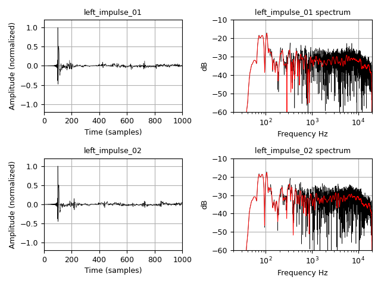

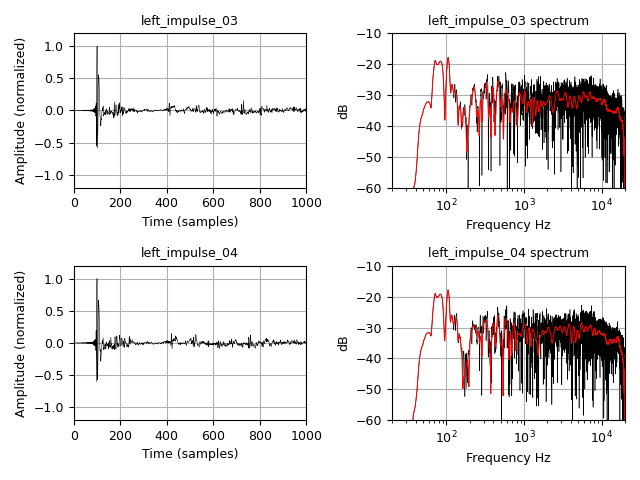

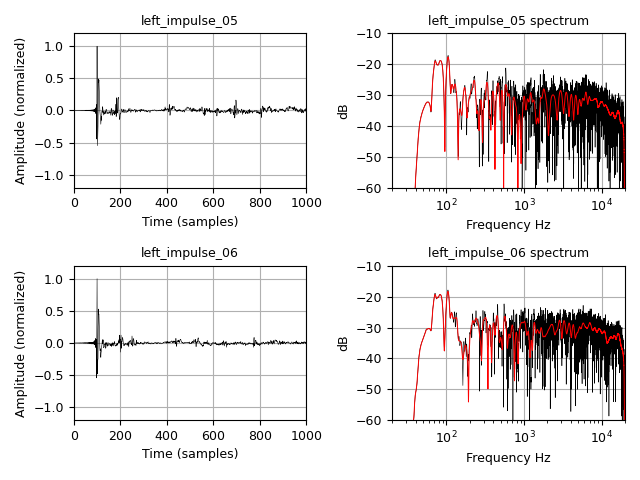

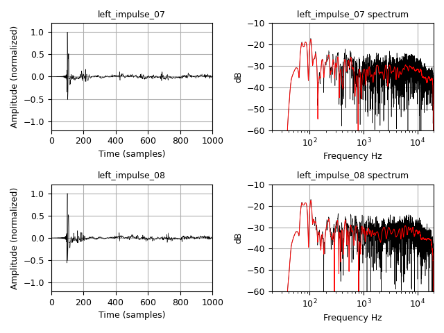

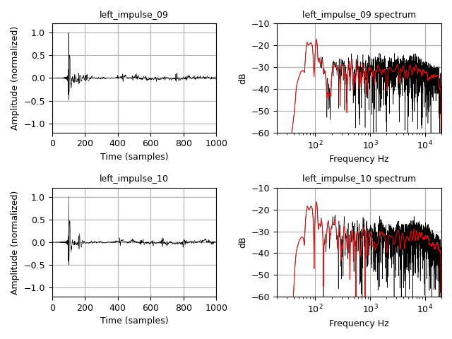

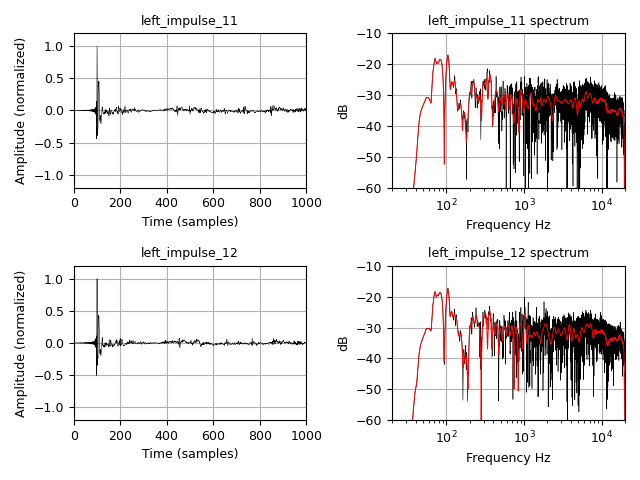

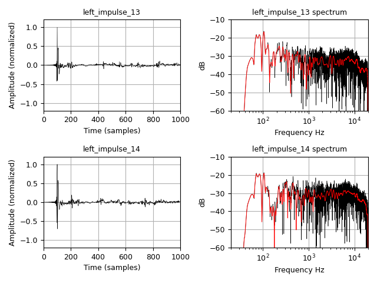

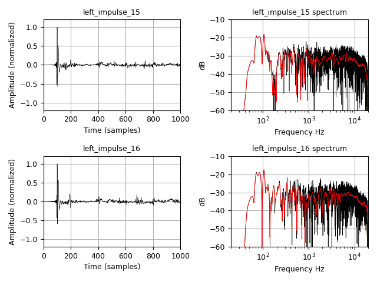

**Figures 1 to 8.** *Impulse responses and amplitude spectra of the 16 original measurements (left loudspeaker), shown in pairs. The impulse responses have been conditioned by centering their peaks, windowed with a Blackman window and, for visualization purposes, normalized to unit peak.*

The eigenvalues computed by PCA for this specific case were:

| Id | Eigenvalues (variance)| Explained fraction|
| --- | :---: | :---: |
|  0  |4.844e-08|   68.99 %|
|  1  |6.109e-09|    8.70 %|
|  2  |1.889e-09|    2.69 %|
|  3  |1.526e-09|    2.17 %|
|  4  |1.299e-09|    1.85 %|
|  5  |1.251e-09|    1.78 %|
|  6  |1.160e-09|    1.65 %|
|  7  |1.113e-09|    1.59 %|
|  8  |1.094e-09|    1.56 %|
|  9  |1.034e-09|    1.47 %|
| 10  |9.677e-10|    1.38 %|
| 11  |9.601e-10|    1.37 %|
| 12  |9.038e-10|    1.29 %|
| 13  |8.759e-10|    1.25 %|
| 14  |8.132e-10|    1.16 %|
| 15  |7.760e-10|    1.11 %|

Aspects worth highlighting, which, although already described previously, are clearly visible in the plots:

1. The loudspeaker's direct impulse responses are very similar across all the measurements and are the most prominent impulse. As will be shown later, the loudspeaker's own response will form a principal part of the final equalization.  
2. The first reflections are very different between impulse responses, both in level and in position. We will later see how they are represented in the PCA principal component.
3. The frequency responses of the impulse responses are very similar to one another at low frequencies. At low frequencies what dominates is the room's modal behavior. Since the points have been measured at a distance of less than 80 cm from one another, the modal behavior at all of them is very similar.
4. By contrast, in the high frequencies there is considerable variability, a clear effect of the distance and the angle of incidence between the microphone axis and the loudspeaker axis.

The plots of the impulse responses obtained by PCA, the 16 components, are shown below (Figures 9 to 16):

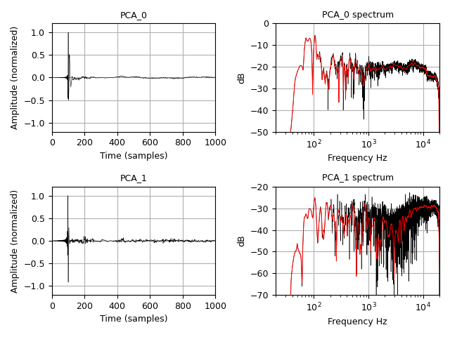

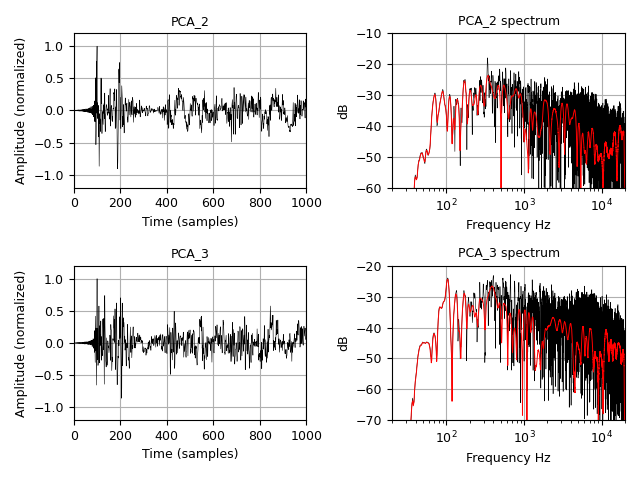

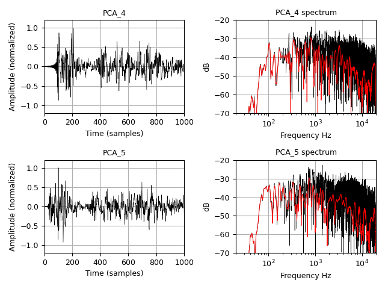

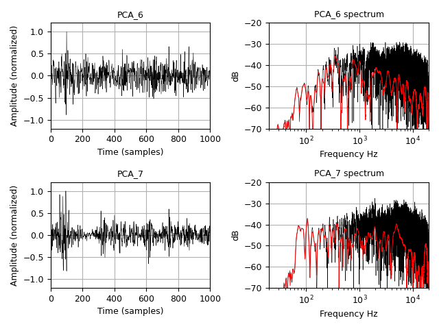

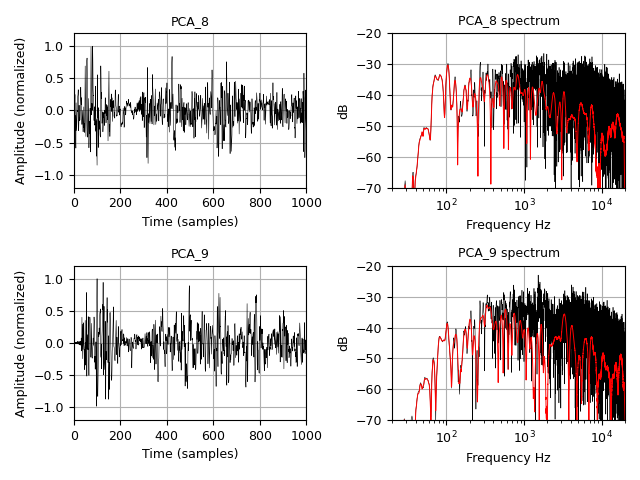

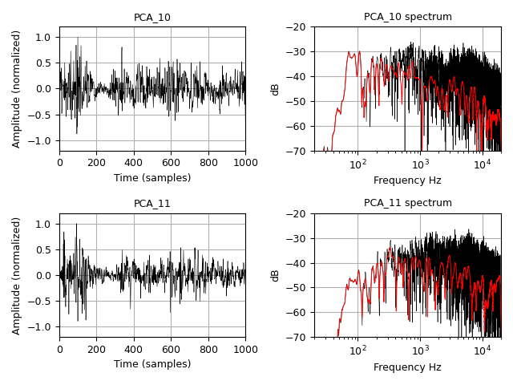

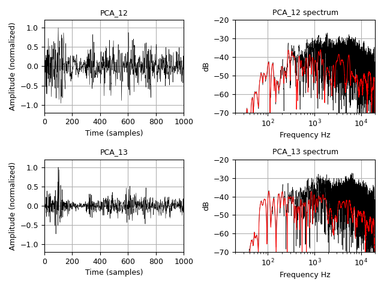

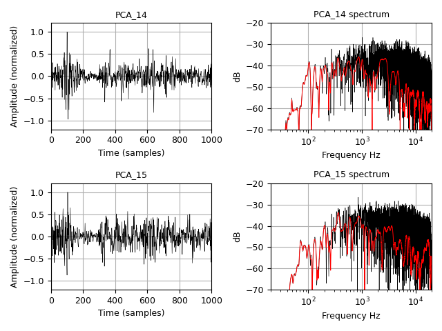

**Figures 9 to 16.** *PCA components obtained from the set of 16 original impulse responses, shown in pairs. The impulses are normalized to a peak of 1; the spectra are shown unnormalized in order to reveal the level differences between components.*

The representation of the impulses has been normalized to a peak of 1 so that they can be appreciated; this is not the case here for the spectra, which are unnormalized. As the eigenvalue table indicates, almost 70% of the total variance of the group of 16 samples is contained in the principal component.

As can be seen, the principal component has measurementd most of the common low-frequency modal behavior of the analyzed group of impulses.

Another significant aspect is that the principal component exhibits much less variation in the high frequencies than the rest of the components. This indicates, as the impulse response itself also shows, that the "hard" reflections have disappeared from this component, accumulating in the rest of the components of lower informational value. This aspect was already discussed in the previous section as a positive effect of the prior conditioning of the measured impulse responses.

The next step of the study is to generate the equalization FIR filter (in this case applying [DRC-FIR](https://drc-fir.sourceforge.net/) with a standard configuration) from this principal component, and to apply it back to the domestic sound system by using a convolver ([BruteFIR](https://torger.se/anders/brutefir.html)). And, at this point, to take another 16 measurements. These measurements will not be taken at points coinciding with the previous ones, but at new positions while maintaining the desired coherence: a 40 cm radius area around the same defined listening point and the domestic room under the same initial conditions.

These are the 16 new impulse responses measured after equalization (Figures 17 to 24):

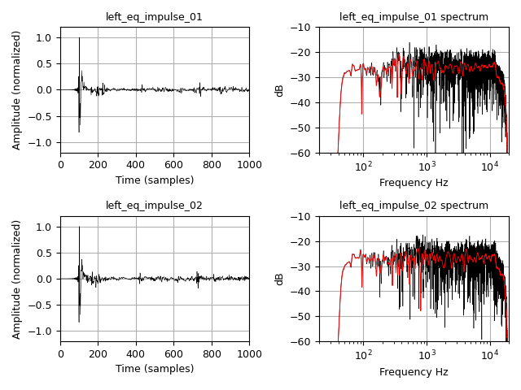

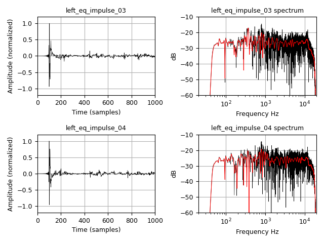

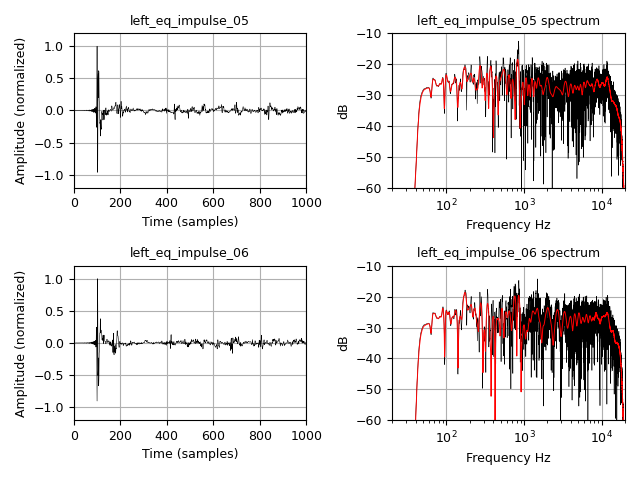

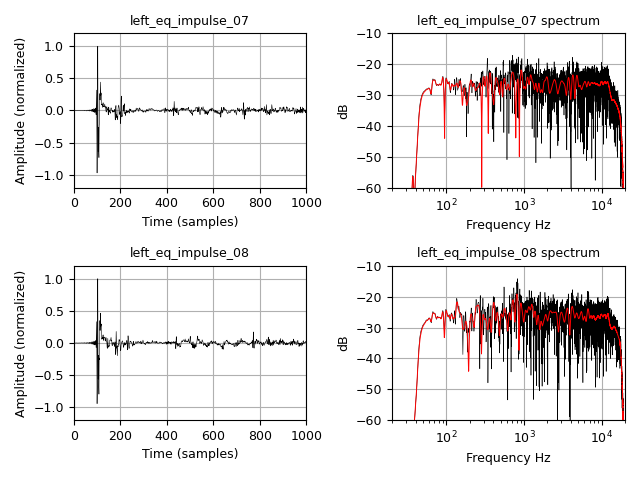

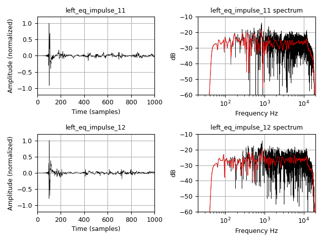

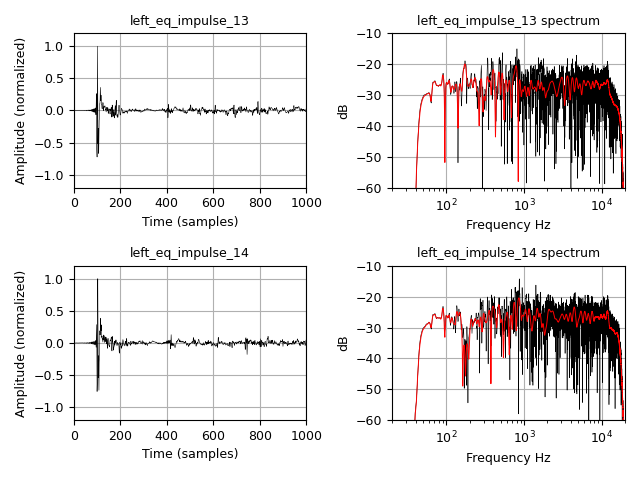

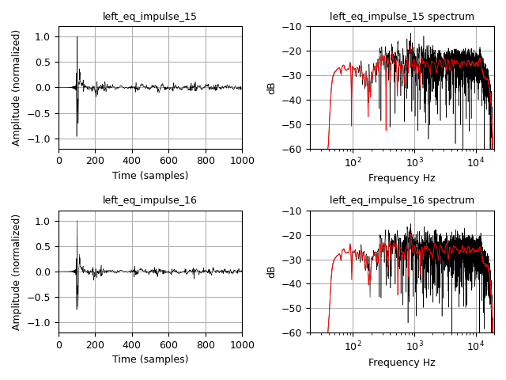

**Figures 17 to 24.** *Impulse responses and amplitude spectra of the 16 new measurements taken after applying the equalization FIR filter, at positions different from the originals but keeping the same experimental coherence (40 cm radius around the same listening point).*

The effect of the equalization on the newly recorded impulse responses is clearly visible; the variability of amplitude with frequency has noticeably decreased, for example by attenuating the resonant modes in the low-frequency region.

If a new PCA analysis is performed on this new measurement set, taken at new positions but in alignment with the initial objective, the following results are obtained (Figures 25 to 32):

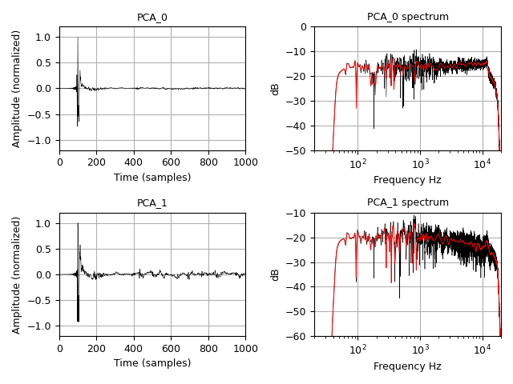

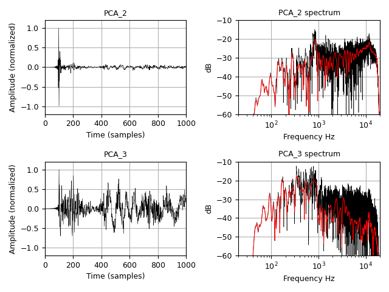

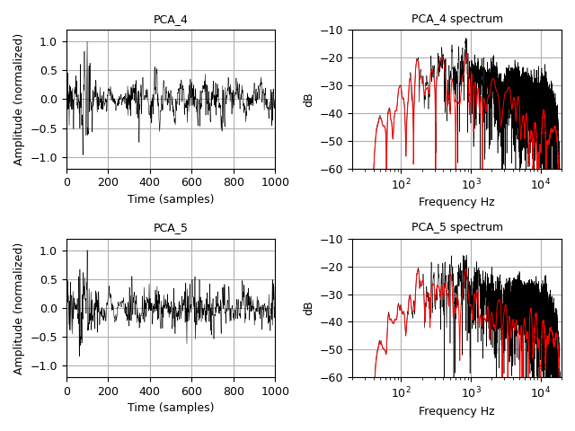

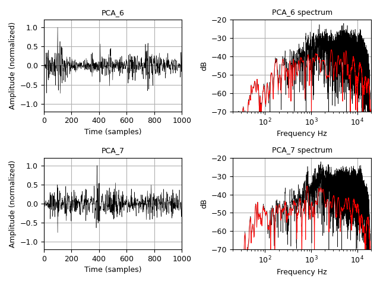

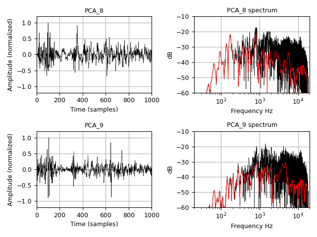

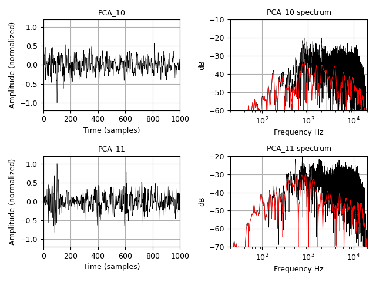

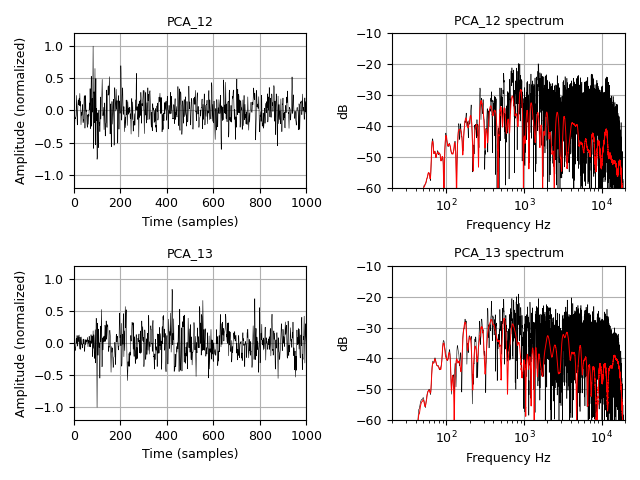

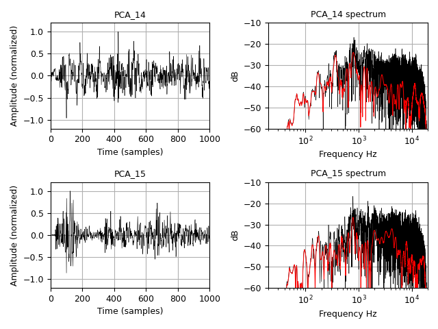

**Figures 25 to 32.** *PCA components of the set of 16 post-equalization measurements, shown in pairs. The spectra are shown unnormalized. The principal component (Figure 25) reveals the effects of the applied equalization.*

The first component clearly shows the target equalization (Figure 33):

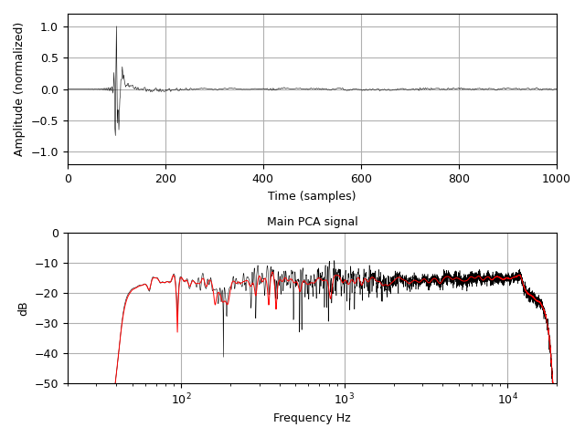

**Figure 33.** *Amplitude spectrum of the principal component (first PCA component) of the post-equalization measurement collection.*

The eigenvalue table for this new dataset of measurements is as follows:

| Id | Eigenvalues (variance) | Explained fraction|
| --- | :---: | :---: |
|  0  |1.304e-07   |57.47 %|
|  1  |3.295e-08   |14.52 %|
|  2  |1.479e-08   | 6.51 %|
|  3  |6.021e-09   | 2.65 %|
|  4  |5.692e-09   | 2.51 %|
|  5  |4.803e-09   | 2.12 %|
|  6  |4.149e-09   | 1.83 %|
|  7  |3.934e-09   | 1.73 %|
|  8  |3.623e-09   | 1.60 %|
|  9  |3.511e-09   | 1.55 %|
| 10  |3.394e-09   | 1.50 %|
| 11  |3.198e-09   | 1.41 %|
| 12  |2.989e-09   | 1.32 %|
| 13  |2.860e-09   | 1.26 %|
| 14  |2.486e-09   | 1.10 %|
| 15  |2.140e-09   | 0.94 %|

It is worth noting that the principal component of this second dataset concentrates a smaller fraction of variance than that of the original dataset (57.47 % versus 68.99 %). Far from being a problem, this is consistent with the desired effect: equalization has attenuated the common low-frequency modal energy, which is precisely what the first component concentrated. As that common, correctable part is reduced, what a single FIR filter cannot correct gains relative weight —the position-dependent differences, such as first reflections and high-frequency variability—, reducing the dominance of the principal component. In other words, the very drop in the fraction is a signature that the correction has acted on the common component of the set. To this is added, as a minor factor, that this second group has been measured at different positions (although coherent with the same zone of interest), which introduces additional sampling variability into the eigenvalue structure.

The experimental results obtained suggest that applying PCA to equalize a coherent measurement group (understanding coherence as described in the section on definitions) results in a FIR filter that also remains valid for another measurement group of similar coherence.

The procedure described here maximizes the fraction of information incorporated into the equalization process when it is restricted to a single representative impulse response. That is, to equalize a listening zone of the desired extent, after applying PCA to a measurement set coherent with the defined zone, the experimental results obtained suggest that the equalization remains valid for other groups of measurements coherent with the same experimental definition.

The most relevant aspect of the experiment is not that the initial principal component can be equalized, but that a second, independent acquisition campaign, carried out at new positions but under the same coherence conditions, again produces an equalized principal component. This suggests that the correction obtained does not act on specific measurement positions, but on the acoustic characteristics common to the group defined by the experimental process.

## Variants of the procedure to explore

As already mentioned, the objective for which the measurement conditions of the impulses set to be equalized are decided, through the application of a single component obtained by PCA decomposition, is not to have an exact representation of the system's overall space, but rather for that dataset to present coherent equalization conditions. The impulse responses included must be congruent with the acquisition decisions.

In this sense, there is a mathematical option that, by modifying the characteristics of these impulse responses, could increase their design coherence (in the sense of the defined objective). That option is to weight each impulse individually and differently. A first example would be to weight each impulse so that they are all normalized to equal peak, or to equal energy. Or to assign each impulse a different weight representative of the target condition.

These weighting modifications will in turn modify the result of the PCA analysis and, therefore, the principal component to be equalized will represent a different objective.

In fact, as already mentioned, the prior conditioning of the impulse responses to make them the same length and all centered on their peak is a decision in pursuit of coherence: to emphasize the important role of the first acoustic impulse generated by the loudspeaker.

Another way to modify the representativeness of the measured impulses in the PCA result is, simply, to repeat recordings under identical conditions.

All of these are equalization design decisions: taking a single measurement at the listening point can be just as valid as taking 48 measurements over an area of 1 $\text{m}^2$, as long as the operator is aware of the decision being made. Obviously, if the mutual correlations of the group of impulse responses are very low, it is very likely that the internal coherence of that group is not very representative. But those correlations need not be, in themselves, a measure of the quality of this set of impulses for its application in equalization.

Another possibility worth exploring is to use, as the impulse response to be inverted to generate the equalization FIR filter, not only the principal component but a linear combination of the first and second components. This increases the fraction of information that is incorporated into the equalization process.

## Conclusions

This article has presented a procedure for the multipoint characterization of listening regions for Digital Room Correction processes, based on Principal Component Analysis.

Unlike traditional approaches centered on a single-point impulse measurement, the proposed method starts from a measurement set obtained under previously defined geometric and environmental conditions. These conditions constitute the true equalization objective and form an inseparable part of the acquisition process.

To describe this process, two complementary concepts have been introduced. On the one hand, homogeneity, understood as the degree of statistical similarity between the measured impulse responses. On the other, coherence, understood as the degree to which a measurement set responds to a single, previously defined equalization objective. While homogeneity is a quantifiable property of the group of impulse responses, coherence is a property derived from the experimental design used to obtain them.

The application of PCA makes it possible to condense the information contained in a coherent measurement set into a single representative impulse response. The experimental analysis carried out shows that the resulting principal component preserves the dataset's common information and significantly reduces the influence of less correlated phenomena, such as certain specular reflections that depend on the exact measurement geometry.

The experimental validation carried out by means of a second independent measurement campaign shows that the equalization obtained from the principal component maintains its effects over new groups of measurements coherent with the same experimental definition. This result suggests that the correction obtained acts on the acoustic characteristics shared by the listening region considered, and not only on the specific positions used during the initial acquisition process.

From this perspective, the acquisition process ceases to be a passive phase of data collection and becomes an active phase of defining the equalization objective itself. The selection of the geometric and environmental measurement conditions becomes an essential part of the final result, making it possible to adapt the correction obtained to listening regions and use scenarios explicitly defined by the user or by the technician responsible for the calibration.

Finally, this procedure changes the way of thinking when equalizing an audio system with a FIR filter: the objective is no longer to find the correct impulse response of a specific position, but rather to construct an room impulse response representative of a set of previously defined listening conditions.

## References

[1] A. Mäkivirta, T. Lund, "Is single microphone position enough for immersive system equalization and level calibration in production monitoring?", *AES E-Library*, paper 20402, 2019. Available at: <https://aes.org/publications/elibrary-page/?id=20402>

[2] A. Mäkivirta, T. Lund, "Spatial stability of the frequency response estimate and the benefit of spatial averaging", presented at the *141st AES Convention*, Los Angeles, paper 9629, October 2016. Available at: <https://www.aes.org/events/141/papers/?ID=5035>

[3] S. Bharitkar, P. Hilmes, C. Kyriakakis, "Robustness of spatial average equalization: A statistical reverberation model approach", *J. Acoust. Soc. Am.*, vol. 116, no. 6, pp. 3491–3497, December 2004. DOI: 10.1121/1.1819509

[4] F. Lingvall, L.-J. Brännmark, "Multiple-point statistical room correction for audio reproduction: Minimum mean squared error correction filtering", *J. Acoust. Soc. Am.*, vol. 125, no. 4, pp. 2121–2128, April 2009. DOI: 10.1121/1.3075615

[5] S. Cecchi, L. Palestini, P. Peretti, L. Romoli, F. Piazza, A. Carini, "Evaluation of a multipoint equalization system based on impulse response prototype extraction", *J. Audio Eng. Soc.*, vol. 59, no. 3, pp. 110–123, 2011. Available at: <https://aes.org/publications/elibrary-page/?id=16789>

[6] S. Cecchi, A. Carini, S. Spors, "Room response equalization — A review", *Applied Sciences*, vol. 8, no. 1, p. 16, MDPI, January 2018. DOI: 10.3390/app8010016

[7] C. Tuna, A. Zevering, A. G. Prinn, P. Götz, A. Walther, E. A. P. Habets, "Data-driven local average room transfer function estimation for multi-point equalization", *J. Acoust. Soc. Am.*, vol. 152, no. 6, pp. 3635–3647, December 2022. DOI: 10.1121/10.0015218
