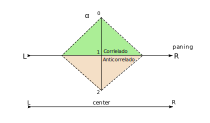

# Ideas y investigaciones sobre localización en estéreo

La propuesta del estéreo es clásica y de sobra conocida: dos señales distintas, pero relacionadas entre si, se emiten cada una por un altavoz, separados simétricamente a izquierda y derecha del oyente. El resultado es una escena sonora localizada en el espacio entre altavoces. El punto exacto de la localización depende de cual es la relación entre ambas señales que forman el estéreo.
El típico ejemplo es cuando ambas señales son iguales, entonces la localización es en el centro entre ambos altavoces. Otro ejemplo es cuando la señal de uno de los canales es el silencio. En esta situación se localiza la fuente sonora en la ubicación de altavoz opuesto. Este es el efecto muy conocido de "paning", el control de balance de una señal común mueve la localización de un extremo al otro en un juego de ping-pong.

Pero, ¿qué ocurre si se introduce otra variable al proceso, añadiendo al control de nivel entre canales, su correlación? Concretamente, jugando con la pareja correlación igual a 1 vs correlación igual a -1. Señal correlada vs señal anticorrelada. ¿Esta variable introduce algún efecto de localización al estilo del paning?

El siguiente apartado describe únicamente las observaciones perceptuales obtenidas durante la escucha. No pretende demostrar un modelo de localización, sino documentar un fenómeno que puede ser reproducido experimentalmente. La propuesta experimental es muy simple y repetible, lo cual invita a realizarse de modo independiente y obtener unas valoraciones subjetivas propias. Finalmente la reproducción estéreo es un fenómeno perceptual. Por lo tanto, estas notas se enfocarán en impresiones de escucha y, de modo inevitable, incluirán un cierto grado de subjetividad. En cualquier caso, el experimento aquí presentado es completamente reproducible de modo sencillo, por lo que se anima a los lectores de esta nota a repetirlo y comparar sus propias observaciones de escucha. 

Un experimento sencillo para valorar perceptualmente este efecto parte de modificar una señal común a ambos canales de la siguiente manera.

$$L=R$$
$$L^{'}=L$$
$$R^{'} = R + \alpha (-R)$$

Cuando $\alpha = [0,1]$ el efecto provocado es el clásico paning desde el centro hasta el extremo izquierdo. En el experimento, en todo este intervalo de $\alpha$ la señales tienen correlación 1.

Cuando $\alpha = [1,2]$ el experimento se mueve de manera distinta. El panning se desplaza del extremo izquierdo al centro, pero con unas señales que son anticorreladas (correlación -1). La correlación durante la prueba varía siguiendo:

$$\rho(\alpha) = \frac{L\cdot R}{|L||R|} = \frac{1-\alpha}{|1-\alpha|}$$

$$\rho(\alpha) = \left\{ \begin{array}{c}
+1 \space si \space 0 \leq \alpha \lt 1 \\
-1 \space si \space 1 \lt \alpha \leq 2 \\
0 \space si \space \alpha = 0
\end{array} \right.$$

La cuestión es: en esta situación, ¿el efecto panning es el mismo que en el intervalo [0,1]?¿O la anticorrelación genera otra localización?

Pues bien, este experimento es sencillo de realizar, y los resultados son llamativos en el caso de $\alpha = [1,2]$. Conforme aumenta $\alpha$ la localización no se desplazar hacía el centro del estéro, subjetivamente la fuente parece situarse unos grados por fuera del altavoz. En un desplazamiento de alrededor de 5° a 10°, no mucho más. Y conforme $\alpha$ se acerca a 2, entonces la localización tiende a volver al centro, pero con mucho menor foco, con imagen sonora más difusa, que en el caso de señales correladas.

Si se repite el proceso para el canal L, pero en un desplazamiento del intervalo $\alpha$ inverso (de 2 hasta 0), visualmente, parece que la fuente sonora realiza un camino del centro hacía un altavoz, luego se desplaza un poco más allá del altavoz, para volver hacía el centro, pero algo difuminada, con pérdida de foco. Posteriormente, aparece algo más allá del altavoz opuesto, y según aumenta $\alpha$, se desplaza hacia el centro, cerrando así un ciclo de desplazamientos de centro a un extremo, vuelta al centro en otras condiciones y reaparición en el otro extremo para volver a desplazarse hacia el centro.

Perceptualmente, la anticorrelación, en ciertas condiciones de panning, también actua sobre la localización estéreo, generando ambos unos efectos de localización complementarios entre sí.  
