# Parametrization of the operator $G$ in NatAmbio XTC

**Author:** Raúl Fernández Ortega  
**Date:** August 2026

> **Abstract —** *The NatAmbio XTC algorithm, described in [Design of a Convolution-Based Stereo Crosstalk Canceller (XTC) for NatAmbio](xtc_filters_en.md), reduces the whole crosstalk problem to a single operator, the function G, which is the ratio between the cross path and the direct path. This note addresses how that operator is determined in practice. It starts from the theoretically exact route —using individually measured HRTF responses— and discards it as unfeasible outside a scientific setting, moving on to the analysis of five public HRTF databases (HUTUBS, RIEC, BiLi, CIPIC and ARI). That analysis shows that the ITD and the broadband value of the ILD exhibit low inter-individual dispersion at the azimuths typical of stereo reproduction, and therefore admit a low-dimensional regression model; the spectral shape of the ILD, in contrast, is markedly irregular and specific to each anatomy, and is replaced by a monotonic empirical fit governed by a single parameter α. The resulting operator is described by four adjustable parameters —ITD, average ILD, azimuth Θ and α— and is realized in minimum phase for parsimony. The note also discusses two practical questions: why the ILD that is optimal by listening turns out to be systematically higher than the one derived from HRTF data, with early reflections proposed as the explanation, and why NatAmbio does not require the minimum-azimuth geometries of RACE. It closes with a step-by-step tuning procedure for the four parameters.*

## Abbreviations

| Acronym | Meaning |
|---|---|
| ARI | *Acoustics Research Institute* (Vienna); HRTF database |
| BiLi | *Base de données de l'Écoute Binaurale* (IRCAM); HRTF database |
| CIPIC | *Center for Image Processing and Integrated Computing* (UC Davis); HRTF database |
| DRC | *Digital Room Correction* |
| DTF | *Directional Transfer Function*: an HRTF with its direction-independent component removed |
| ERB | *Equivalent Rectangular Bandwidth* |
| FIR | *Finite Impulse Response* |
| HRTF | *Head-Related Transfer Function* |
| HUTUBS | HRTF database of the Technische Universität Berlin |
| IIR | *Infinite Impulse Response* |
| ILD | *Interaural Level Difference* |
| ITD | *Interaural Time Difference* |
| RACE | *Recursive Ambiophonic Crosstalk Elimination* |
| RIEC | *Research Institute of Electrical Communication* (Tohoku University); HRTF database |
| SOFA | *Spatially Oriented Format for Acoustics*: exchange format for HRTF measurements |
| XTC | *Crosstalk Cancellation* |

## Notation

| Symbol | Meaning |
|---|---|
| $H_{direct},\ H_{cross}$ | Direct and cross acoustic paths (symmetric versions) |
| $G = H_{cross}/H_{direct}$ | Normalized cross transfer function |
| $G_l,\ G_r$ | Left and right versions of $G$ in the asymmetric model |
| $F^{direct},\ F^{cross}$ | Resulting FIR filters (direct and cross paths) |
| $\delta$ | Unit impulse (identity element of convolution) |
| $\ast$ | Convolution operator |
| $N$ | Number of terms (iterations) in the summation |
| $f$ | Frequency |
| $\Theta$ | Angle of incidence (half-angle between loudspeakers; total separation $2\Theta$) |
| $\text{ITD}$ | Interaural Time Difference, in µs |
| $`\text{ILD}_{avg}`$ | Broadband value of the ILD, in dB (called $`\text{ILD}_{dB}`$ in the main note) |
| $`a = 10^{-\text{ILD}_{avg}/20}`$ | Linear attenuation factor associated with the ILD |
| $`\text{ILD}_{spectrum}(\Theta, f)`$ | Spectral shape of the ILD, normalized so as not to contribute level |
| $\alpha$ | Slope parameter of the spectral ILD model |

## The operator $G$

As already described in [Design of a Convolution-Based Stereo Crosstalk Canceller (XTC) for NatAmbio](xtc_filters_en.md) and in [Applying NatAmbio XTC in non-symmetric setups](xtc_no_simetrico_en.md), the XTC model depends on a single operator that condenses multiple acoustic and hearing-physiology aspects:

```math
G = \frac{H_{cross}}{H_{direct}}
```

$G$ represents the normalized acoustic operator between the cross path and the direct path. In the frequency domain it can be interpreted as the complex ratio

```math
G(f) = \frac{H_{cross}(f)}{H_{direct}(f)}
```

while in the time domain it corresponds to its equivalent impulse response, obtained by convolving $H_{cross}$ with the inverse filter of $H_{direct}$.

As already noted, the shadow of the head and torso makes it reasonable to assume that $|G| < 1$, since the direct path from the loudspeaker is unobstructed while the cross path is shadowed.

In the model developed for NatAmbio, two components of the acoustic paths have been separated: the acoustic environment (loudspeakers + room), whose response must be corrected by specific techniques outside the XTC algorithm (DRC, parametric equalization, etc.), and the acoustic path between the already equalized loudspeaker and the listener's ears. It is on this second component that $G$ acts.

## Relation between $G$ and the HRTF

The definitions of $H_{direct}$ and $H_{cross}$ given above coincide with the acoustic paths of the [HRTF](https://en.wikipedia.org/wiki/Head-related_transfer_function) model. Consequently, a first way of building the operator $G$ consists in starting directly from HRTF impulse responses measured for the listener and azimuth under consideration. For example, in this measurement from the ARI database, which includes more than 100 individual subjects:

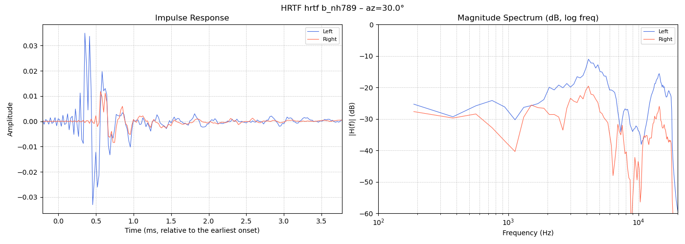

Given these impulse responses, obtaining $G$ amounts to computing the inverse operator of $H_{direct}$ and convolving it with $H_{cross}$. The result is an operator $G$ that can be used as the input of the NatAmbio XTC recursive algorithm to generate the cancelling filters:

```math
F^{cross} = \sum_{i=1}^{N} - G^{2i-1}
```

```math
F^{direct} = \delta + \sum_{i=1}^{N} G^{2i}
```

These expressions are the exact result of the algebra of successive cancellations; the filter actually realized applies the spectral shape only once per rung, as detailed in [Application of the ILD spectrum within the series](xtc_filters_en.md#application-of-the-ild-spectrum-within-the-series).

If the calculation is to be refined —since nobody is truly anatomically symmetric— the [asymmetric model](xtc_no_simetrico_en.md) would be applied, where $G_l$ and $G_r$ would be different:

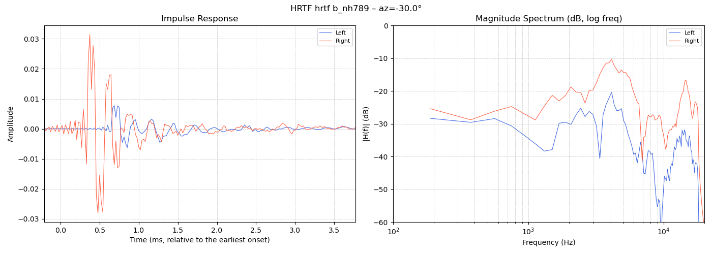

So far the procedure appears to be completely defined. However, before adopting this operator as the definitive model of $G$, it is worth analysing what information HRTF responses actually contain and which part of it is useful for crosstalk cancellation in a domestic environment.

### Synthesizing $G$ from public databases

The measurement process needed to obtain personal HRTFs, and thereby generate the XTC filter, is a particularly complex task, unfeasible outside scientific and technological settings, which makes the use of an individual HRTF model as a standard domestic method for determining $G$ enormously difficult.

There is another option: to use the information in public HRTF databases. Numerous HRTF databases are publicly available, containing measurements from many subjects, since HRTFs are inherently listener-specific. There may be similarities, but no two HRTFs are identical, not even for the two ears of the same person. Many of them can be found in this repository:

[https://sofacoustics.org/data/database/](https://sofacoustics.org/data/database/)

When exploring an HRTF database, the first thing one notices is its variety:

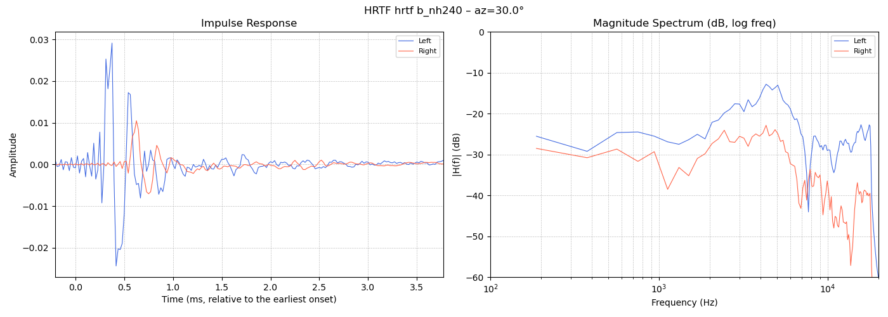

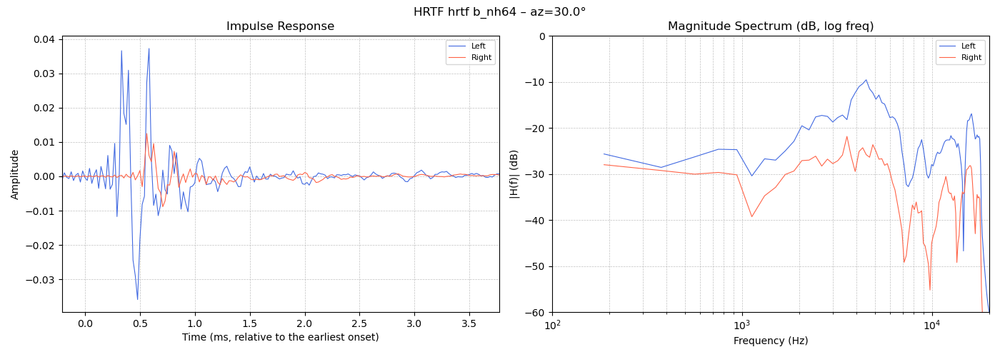

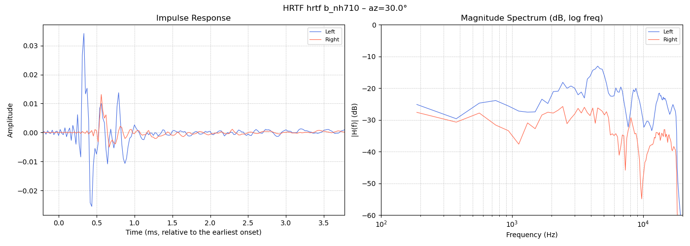

A first approach consists in directly averaging all the impulse responses contained in an HRTF database, looking for the features common to different individuals. However, before performing that averaging it is worth asking which properties of an HRTF are actually relevant for building the operator $G$.

### Averaging HRTF features

The proposed model of $G$ in NatAmbio includes a decomposition into three components that represent three characteristic aspects of those measurements:

```math
G \approx \delta \left( \text{ITD}(\Theta),\ \text{ILD}_{avg}(\Theta) \right) \ast \text{ILD}_{spectrum}(\Theta, f)
```

The motivation behind this decomposition is as follows:

- The **ITD** represents the time difference in the arrival of sound at the ipsilateral and the contralateral ear. In NatAmbio it is assumed to be a parameter constant with frequency, although in reality it does vary with it.

- The **ILD** represents the level difference between the signal perceived by the ipsilateral ear and the one perceived by the contralateral ear. It is also frequency-dependent, as is the ITD. In the NatAmbio model the ILD is decomposed into a broadband average value, $`\text{ILD}_{avg}`$, and a spectral curve, $`\text{ILD}_{spectrum}`$, assuming that the frequency dependence of the ILD is more significant than that of the ITD.

An analysis of some of the most popular HRTF databases shows that neither the ITD nor the $`\text{ILD}_{avg}`$ vary greatly from one individual to another[^1].

**BiLi** — [https://sofacoustics.org/data/database/bili%20(dtf)](https://sofacoustics.org/data/database/bili%20(dtf))

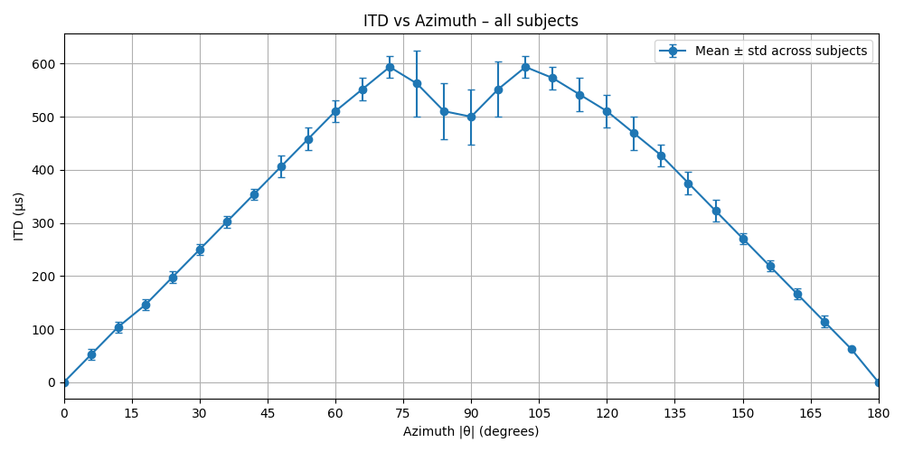

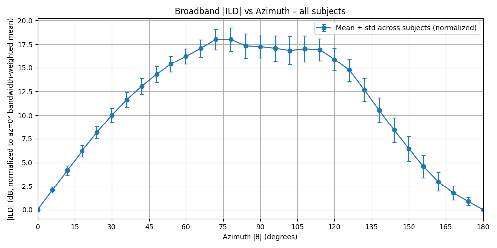

**ARI** — [http://sofacoustics.org/data/database/ari](http://sofacoustics.org/data/database/ari)

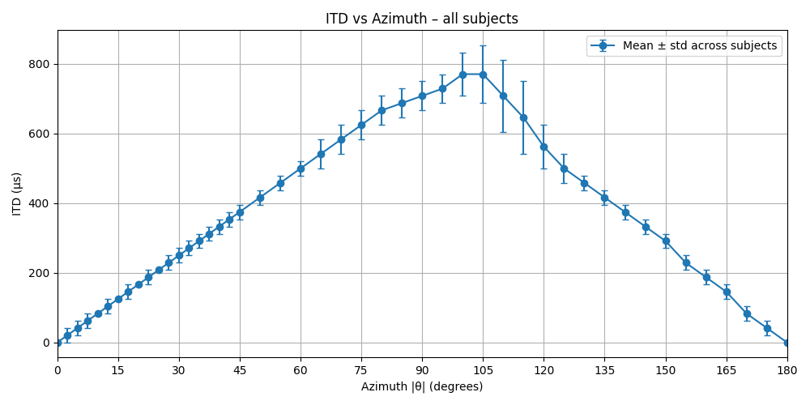

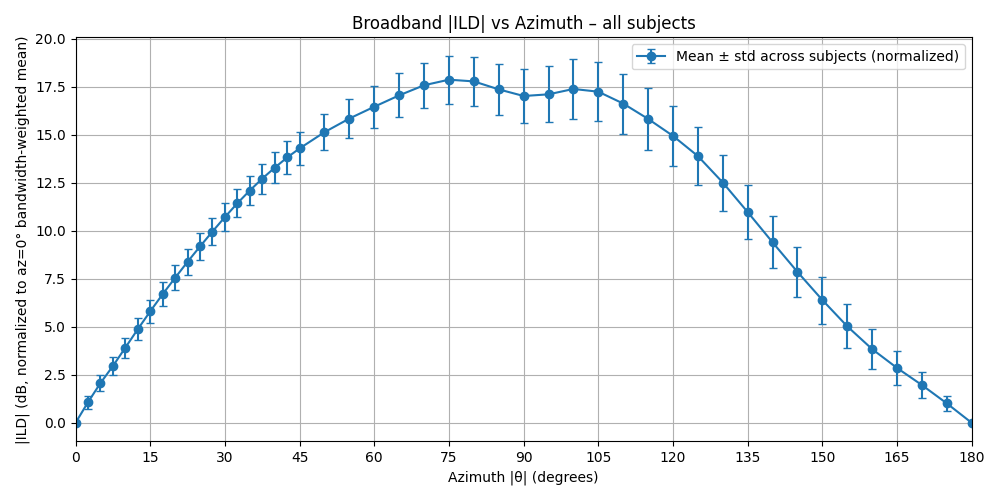

**CIPIC** — [http://sofacoustics.org/data/database/cipic](http://sofacoustics.org/data/database/cipic)

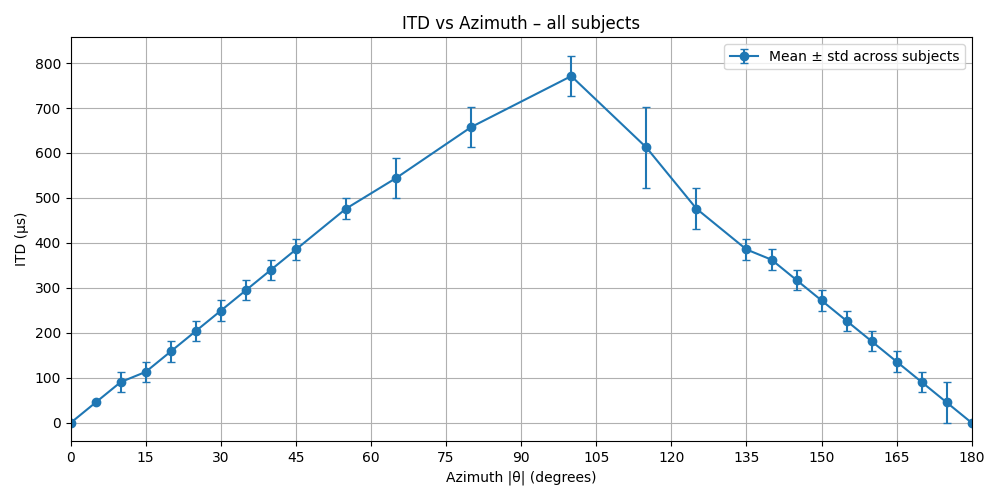

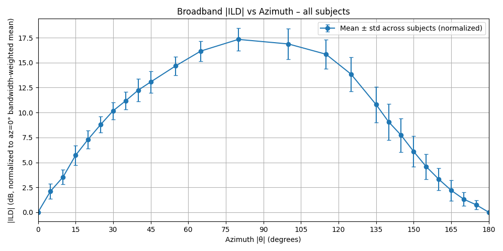

**HUTUBS** — [http://sofacoustics.org/data/database/hutubs/](http://sofacoustics.org/data/database/hutubs/)

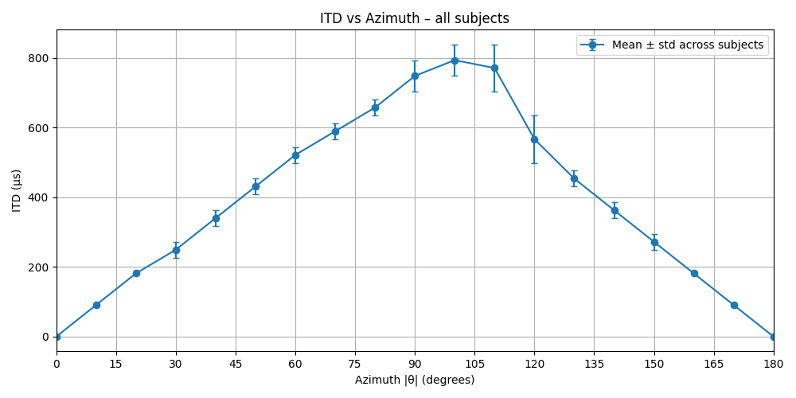

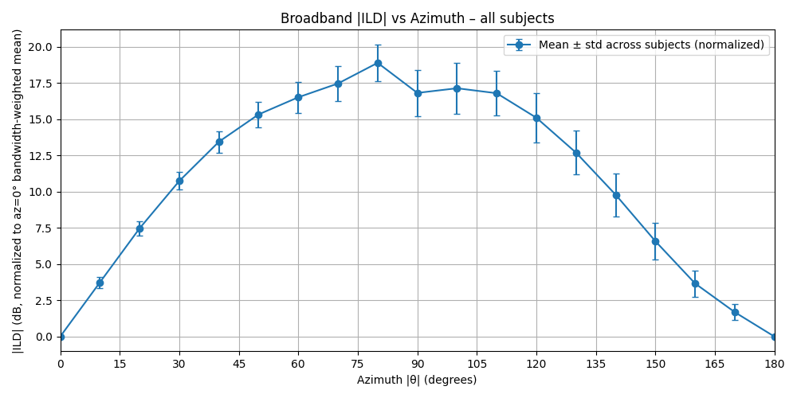

**RIEC** — [http://sofacoustics.org/data/database/riec](http://sofacoustics.org/data/database/riec)

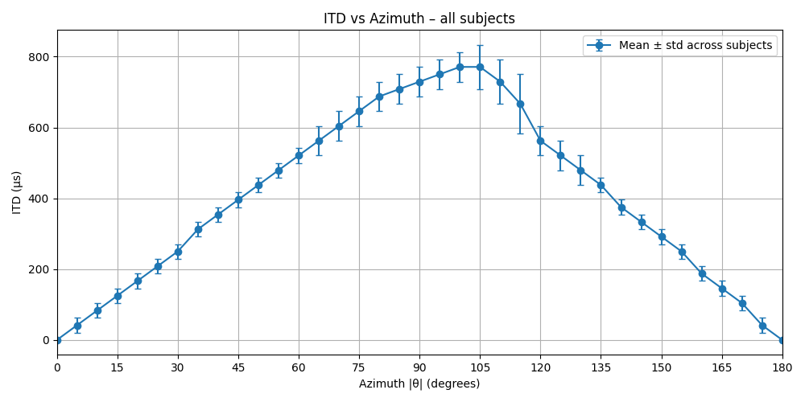

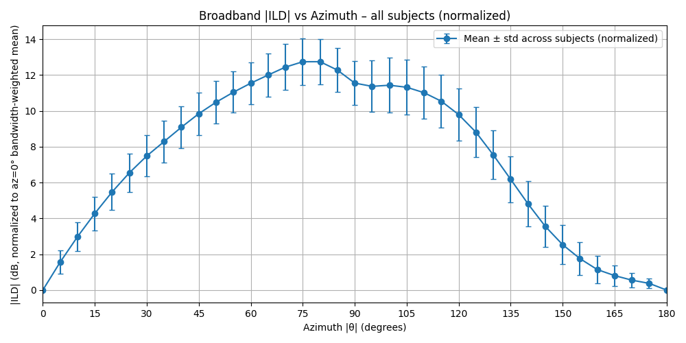

Basic information on all these HRTF databases is collected at [https://www.sofaconventions.org/mediawiki/index.php/Files](https://www.sofaconventions.org/mediawiki/index.php/Files).

The error bars represent the estimated standard deviation associated with each average. They can be seen to show fairly limited dispersion.

A first estimate of $\text{ITD}$ and $`\text{ILD}_{avg}`$ is easily obtained by regression:

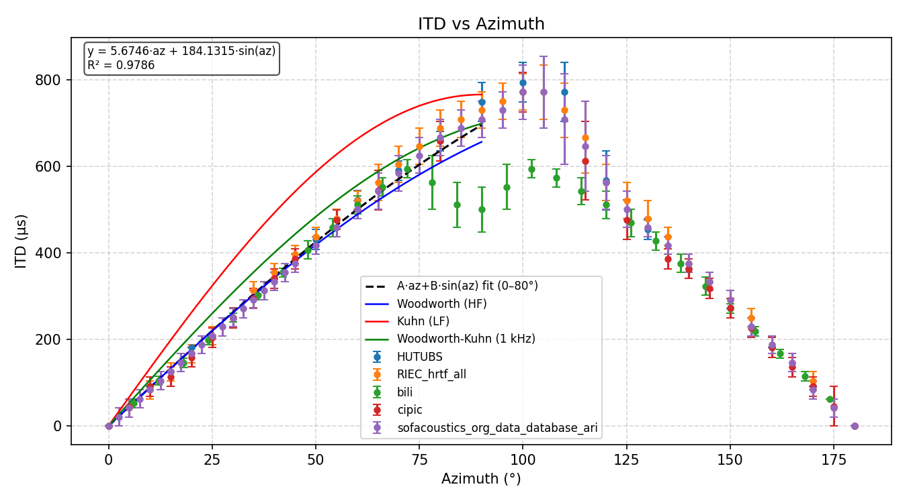

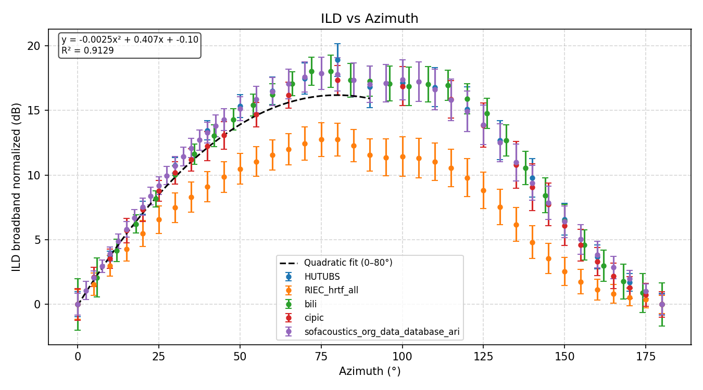

A noticeable difference can be seen between the $`\text{ILD}_{avg}`$ values given by RIEC and those of the other databases analysed. This discrepancy would deserve a study of its causes, but there is no intention of analysing it in detail in this note.

The equations proposed in the NatAmbio XTC regression model are:

```math
\text{ITD} = 5.6746 \cdot \Theta + 184.1315 \cdot \sin \Theta
```

```math
\text{ILD}_{avg} = -0.10 + 0.407 \cdot \Theta - 0.0025 \cdot \Theta^{2}
```

with $\Theta$ in degrees in both cases, $\text{ITD}$ in µs and $`\text{ILD}_{avg}`$ in dB.

As for the spectral shape of the ILD, the models show irregular curves, with peaks and notches that are most likely due to anatomical factors:

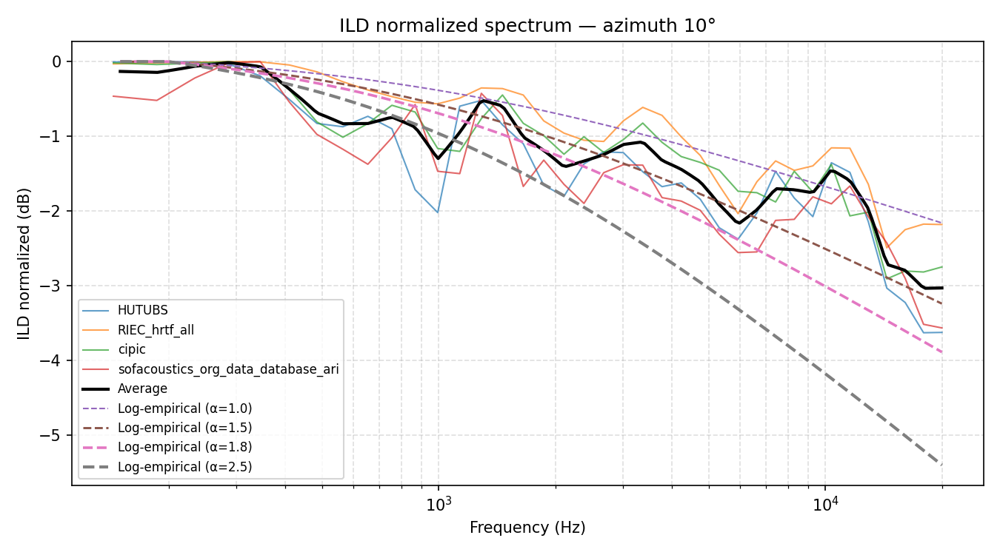

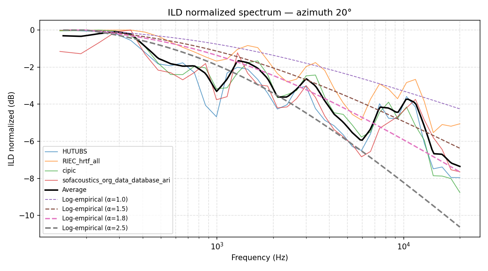

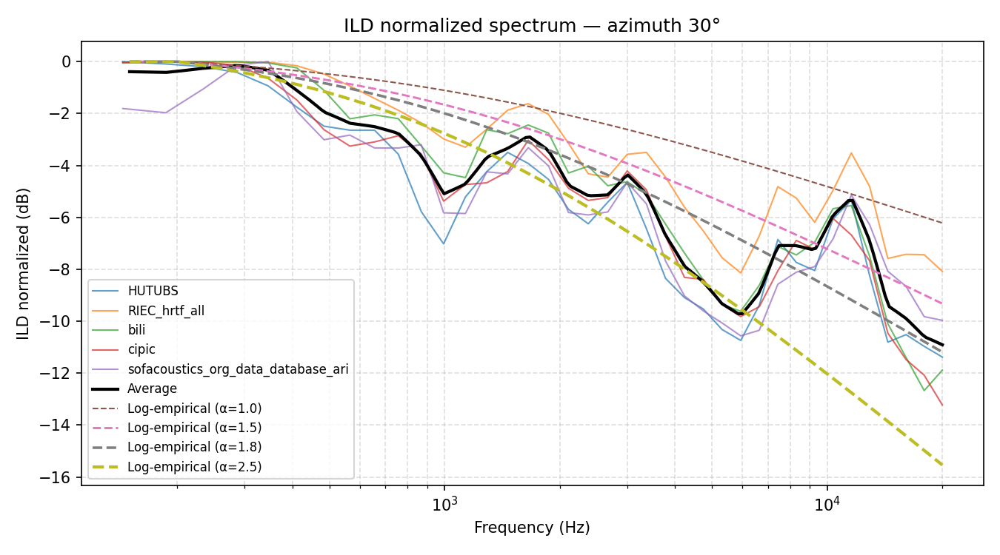

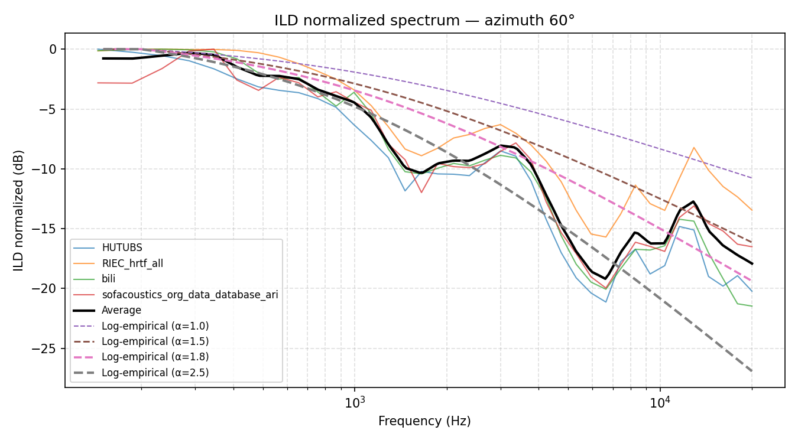

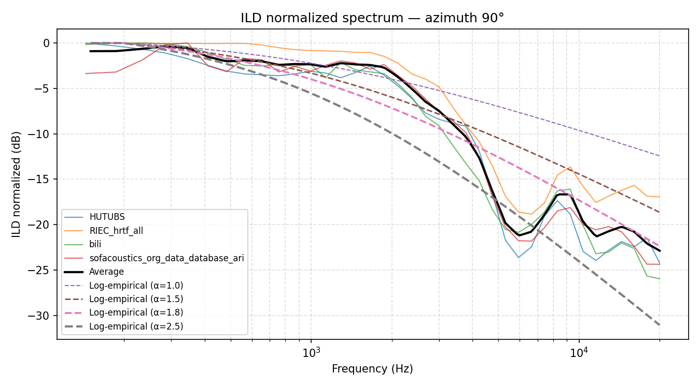

The risk of including these peaks and notches in the model of $`\text{ILD}_{spectrum}(\Theta, f)`$ for NatAmbio is that they may produce brightness or whistling during listening, since they may well not correspond to those of the actual listener in each case.

For this reason, a simple, monotonic empirical fit governed by two parameters has been adopted:

```math
\text{ILD}_{spectrum}(\Theta, f) = \alpha \cdot 10 \cdot \log_{10}(f/1000 + 1) \cdot \sin(\Theta)
```

Expressed in dB, the fit grows monotonically with frequency; that is, the magnitude of the cross path decays monotonically, with no peaks or notches. The azimuth $\Theta$ governs the overall magnitude of the tilt (through $\sin\Theta$) and the parameter $\alpha$ governs its slope. From the study of the averages of the different public HRTF databases it follows that, for $\Theta$ between 10° and 30°, the appropriate value is $\alpha \approx 1.5$ to $2.0$.

All the results obtained from the study of the publicly available HRTF databases show that the $\text{ITD}$ and the broadband value $`\text{ILD}_{avg}`$ present a relatively low dispersion between individuals, especially at the small azimuths customary in stereo reproduction. However, this stability does not imply that the spectral distribution of the ILD is equally stable. Plotting $`\text{ILD}_{spectrum}(f)`$ reveals a much more irregular structure, with local maxima and minima whose position and amplitude vary between databases and individuals. Hence the decomposition of $G$ proposed for NatAmbio XTC:

```math
G \approx \delta \left( \text{ITD}(\Theta),\ \text{ILD}_{avg}(\Theta) \right) \ast \text{ILD}_{spectrum}(\Theta, f)
```

That is: $\text{ITD}$ and $`\text{ILD}_{avg}`$ admit a low-dimensional model, whereas $`\text{ILD}_{spectrum}`$ needs to be regularized, because reproducing its individual details without knowing the individual introduces false precision.

## Implementation of the $G$ model in NatAmbio XTC

Finally, NatAmbio designs its XTC filters from a model of $G$ with three components: $\text{ITD}$, $`\text{ILD}_{avg}`$ and $`\text{ILD}_{spectrum}`$.

$\text{ITD}$ and $`\text{ILD}_{avg}`$ are user-configurable. The user can employ the regression approximations to obtain initial values as a function of the azimuth $\Theta$ of their audio system, and can then modify those values according to the listening results obtained, for example with [the test signals generated by the NatAmbio `testing_XTC` scripts](../../tools/testing_XTC/README.md).

As for $`\text{ILD}_{spectrum}`$, NatAmbio integrates the proposed empirical formula, and both $\Theta$ and $\alpha$ are user-adjustable.

This makes it possible to generate XTC in NatAmbio with a simple model, with four parameters —ITD, average ILD, azimuth Θ and α— and a proposal of initial values, while leaving enough freedom for fine tuning.

In this way, NatAmbio XTC provides an adjustment model that can operate with a sound system in which the loudspeakers are separated from each other by up to 60° (that is, azimuth $\Theta = 30^{\circ}$). At larger angles the inter-individual variability of $\text{ITD}$ and $`\text{ILD}_{avg}`$ increases, while the $`\text{ILD}_{spectrum}`$ approximation exhibits an increasingly steep slope. To date there is no experience with loudspeaker separations greater than 60°.

Finally, NatAmbio implements the spectral component of the $G$ model with minimum-phase filters. The motivation is not to reproduce the full phase of a measured HRTF, but to keep the time representation of the magnitude $`\text{ILD}_{spectrum}(f)`$ as compact as possible, while the physically relevant delay is incorporated explicitly through the $\text{ITD}$.

In this way, the response associated with $G$ concentrates its energy from the instant defined by the $\text{ITD}$ onwards, without requiring a symmetric response around that instant and without introducing an additional delay to make the filter causal. This property is especially convenient in a recursive structure, since the successive powers $G^{2}, G^{3}, \dots$ retain a clear temporal interpretation: each higher-order term appears only after the corresponding accumulated delay.

The alternative of using the complex phase of measured HRTF responses directly would introduce into $G$ a temporal structure far more dependent on the individual, on the measurement geometry and on the specific acquisition conditions. NatAmbio avoids incorporating that complexity when there is no explicit need to model it.

In this sense, the choice of minimum phase should be understood as a design decision based on parsimony: it introduces the minimum temporal structure compatible with the chosen spectral magnitude, while the physically relevant delay is incorporated explicitly through the $\text{ITD}$. The aim is not to claim that minimum phase constitutes a perceptually optimal solution in general terms, but to obtain a causal, compact realization consistent with the physical model adopted by NatAmbio XTC.

## Do the loudspeakers need to be close together for NatAmbio XTC?

Of all the XTC implementations developed, perhaps the most popular has been [RACE (*Recursive Ambiophonic Crosstalk Elimination*)](https://filmaker.com/papers/RGRM-RACE_rev.pdf) from Ambiophonics. RACE was an IIR filter modelled from recursive cancellations, delayed according to the ITD and attenuated according to the ILD. It was conceived for Ambiodipole configurations, with the loudspeakers placed at small angles with respect to the listener.

From the analysis of the RACE recursive algorithm it can be seen that it includes no model of $`\text{ILD}_{spectrum}(f)`$. A reasonable consequence of this simplification is that the model should work better the closer the actual acoustic response is to a single delay and a single attenuation, which favours small-azimuth geometries. An analysis of the $`\text{ILD}_{spectrum}`$ model at 5° azimuth shows why this approximation is especially suitable in that case:

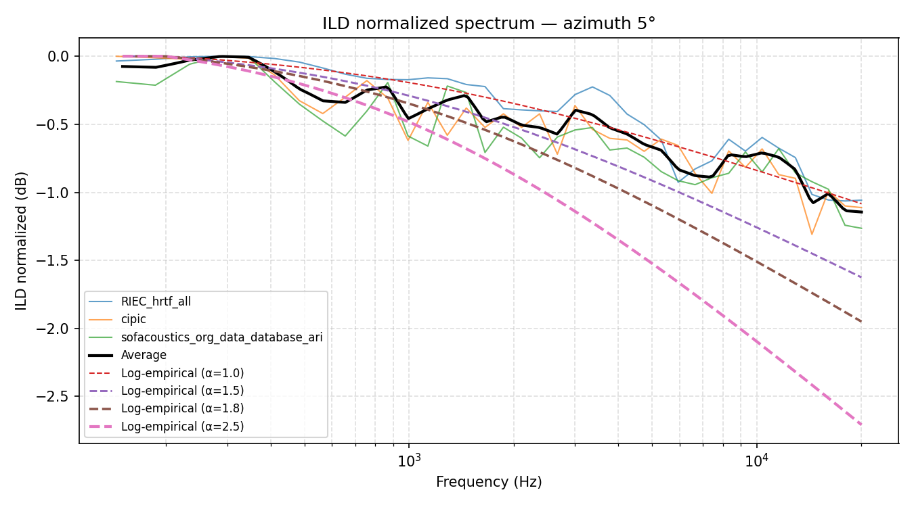

Under these conditions, $`\text{ILD}_{spectrum}(f)`$ has a maximum variation of barely 1.5 dB. At such small azimuth values the $\text{ITD}$ is approximately 45 µs and the $`\text{ILD}_{avg}`$ is barely 2 dB —the [original RACE paper](https://filmaker.com/papers/RGRM-RACE_rev.pdf) proposes an $\text{ITD}$ of 60 to 100 µs and an $`\text{ILD}_{avg}`$ of 2 to 3 dB, which is consistent with a small azimuth.

In addition, RACE limits the recursive cancellation to the band between 250 Hz and 5 kHz, leaving lower and higher frequencies out of the cancellation process. The lower limit reduces, among other effects, the problems associated with the high energy of recursive cancellations at low frequencies.

Clearly, from 2006 to 2026 real-time processing capacity has increased enormously, and what was once unfeasible with the standard computing of the time is today a low-cost calculation. The greater processing capacity available nowadays allows NatAmbio XTC to use a more complete spectral model and to compute filters suitable for moderate azimuths, with a practical maximum around 30°, thus offering a wider application range than RACE.

Is it possible that, even for NatAmbio, the best placement is still at azimuths of 5° or less? Since NatAmbio has been developed in a domestic environment and does not have extensive usage statistics, that hypothesis can currently be neither confirmed nor denied. Nevertheless, there is one consideration worth discussing, although it should not yet be regarded as experimentally validated.

One of the most widespread criticisms of XTC in general, and of RACE in particular, was that although it greatly widened the virtual soundstage, it did so at the cost of some coloration. This complaint may be explained, at least in part, by working with $`\text{ILD}_{avg}`$ values as low as 2 dB.

If the relative cross path has approximate magnitude

```math
|G| \approx 10^{-\text{ILD}_{avg}/20}
```

then with 2 dB its magnitude is approximately $|G| \approx 0.79$, whereas with 10 dB it is $|G| \approx 0.32$. In a recursive structure this difference is especially significant, since the successive terms of the cancellation contain increasing powers of $G$. By way of illustration, $0.79^{5} \approx 0.31$, whereas $0.32^{5} \approx 0.0034$. Therefore, with low $`\text{ILD}_{avg}`$ values the delayed terms retain appreciable energy over many more iterations, increasing the depth of the comb filtering and the potential spectral coloration.

In the tests carried out with NatAmbio, this mathematical dependence also matches subjective perception: as the $`\text{ILD}_{avg}`$ used in the model is increased, the tonal changes associated with the cancellation decrease.

If only the reduction of the energy required for cancellation were considered, it might seem that increasing the azimuth indefinitely would always be favourable and that, therefore, the best loudspeaker arrangement would be $\Theta = 90^{\circ}$. In this respect it is worth recalling an important perceptual characteristic of a properly adjusted XTC: the virtual central image can be considerably better defined than in conventional stereo reproduction, because the contribution of acoustic crosstalk is reduced. However, this advantage also depends on the geometry: as the azimuth of the loudspeakers is increased excessively, keeping a stable and precise central image becomes progressively more difficult.

In summary, NatAmbio aims to be a practical solution with a wide application range. It does not seek to optimize in isolation the maximum soundstage width, the maximum central focus or the minimum coloration, but rather to find a compromise region in which width, focus, tonal stability and geometric tolerance are simultaneously satisfactory. This makes it possible to retain great installation flexibility using configurations and equipment customary in domestic audio systems.

It remains to be determined experimentally whether, even with a more complete XTC model available, there is still a systematic perceptual advantage in reducing the azimuth towards Ambiodipole configurations. NatAmbio does not yet have a large enough population of measurements and listening sessions to answer this question. For now, the results suggest the existence of a compromise region rather than of a single optimal azimuth.

## The role of early reflections in setting the ILD

One of the main difficulties in achieving an optimal XTC effect is the presence of early acoustic reflections from the room or the surroundings. These reflections reach the listener's ears with different delays, levels and angles of incidence, introducing additional paths that do not match the crosstalk model corresponding to the direct sound. Lateral reflections are especially relevant, since they can introduce cross components that reduce the perceptual effectiveness of the cancellation.

During the design and basic validation tests of NatAmbio XTC it has been observed that the $`\text{ILD}_{avg}`$ value that yields the best perceptual results tends to be somewhat higher than the one estimated from the HRTF databases analysed —of the order of 4 dB higher, as reported in the [example in the main note](xtc_filters_en.md#example-of-filters-obtained-with-this-new-algorithm). Although this behaviour still requires specific experimental validation, the influence of early reflections is proposed as a possible explanation:

- Low $`\text{ILD}_{avg}`$ values require cancellation signals of greater energy. These signals do not propagate solely along the acoustic path that is meant to be cancelled; they also generate their own early reflections. Part of the advantage observed when using $`\text{ILD}_{avg}`$ values higher than those derived directly from HRTFs could come from the reduction of this additional acoustic energy: a less intense cancellation would also produce reflected components of lower energy, reducing the possibility that they interfere with the intended localization.

- For the $\text{ITD}$, by contrast, the values estimated from the HRTF databases used have provided an adequate setting without the need to introduce an equivalent correction. This is consistent with the aim of the model: the delay in NatAmbio XTC is set so that the cancellation signal coincides in time with the crosstalk linked to the direct sound. The crosstalk components associated with early reflections arrive later and with varied delays, so trying to accommodate them by modifying the single $\text{ITD}$ of the model would displace the cancellation with respect to the path that is to be cancelled as the priority.

Carrying out a detailed study of the impact of early reflections on crosstalk, taking into account their different delays, levels and arrival angles at the listener's ears, would be very complex. Instead of trying to incorporate that complexity explicitly into the model, NatAmbio uses the HRTF-derived values as an initial reference and allows $\text{ITD}$ and $`\text{ILD}_{avg}`$ to be adjusted independently. In the experience gained so far, the computed $\text{ITD}$ constitutes a sufficiently stable temporal reference, while the $`\text{ILD}_{avg}`$ acts as the main parameter for adapting to the acoustic conditions of the room.

## A proposed tuning method for NatAmbio XTC

With the $G$ model of NatAmbio XTC developed and its implementation explained, it is time to propose a practical method for determining and adjusting the four parameters involved: $\text{ITD}$, $`\text{ILD}_{avg}`$, $\Theta$ and $\alpha$.

First, the actual azimuth $\Theta$ of the sound system must be measured. It is important to stress that this azimuth is half the total opening angle between the loudspeakers as seen from the listener. For instance, a standard stereo layout with 60° of opening corresponds to an azimuth $\Theta = 30^{\circ}$.

Once that physical measurement is available, the proposed regressions provide first values for $\text{ITD}$ and $`\text{ILD}_{avg}`$. For the empirical formula of $`\text{ILD}_{spectrum}(f)`$, one can start from the measured $\Theta$ and an $\alpha$ of 1.8.

With the system configured as a starting point, the first step is to adjust the $`\text{ILD}_{avg}`$. Whether with well-known music or with test signals synthesized by the [`testing_XTC`](../../tools/testing_XTC/README.md) scripts, the goal is to achieve a wide soundstage without introducing perceptible tonal coloration. This adjustment can be made in steps of 1 or 2 dB: the acoustic reality of a domestic audio system is not so sensitive as to require very fine adjustments. Likewise, it is common that, within a margin of roughly $\pm 1$ dB around the optimum, the perceived differences are very subtle or plainly imperceptible.

The adjustment of $\alpha$ is done with music or with some sound signal containing strongly panned high-frequency content (percussion or drums, for example). The goal is to reach a value of $\alpha$ at which the treble is perceived as very lateral, but without a sensation of "brightness" or "halo" in the contralateral channel. This is admittedly a somewhat imprecise description, but when tuning real cases the sensation becomes evident. As with the $`\text{ILD}_{avg}`$, sensitivity to $\alpha$ is not very high: steps smaller than 0.1–0.2 are not practical, and there is usually an interval around the optimal value in which the differences are very subtle or imperceptible.

At this point, the sensitivity of the system to small $\text{ITD}$ variations may also be explored, although the main tuning objective has already been achieved.

In systems where the lateral extent of the virtual sound sources is asymmetric, the [asymmetric XTC model](xtc_no_simetrico_en.md) must be used. The model and the parametrization are identical, but two different sets of parameters are used, one per channel. A practical starting proposal in this case is to copy the values obtained in the symmetric adjustment and begin by slightly increasing the $`\text{ILD}_{avg}`$ of the side that shows the narrower soundstage. This recommendation follows from the hypothesis put forward above: if the asymmetry is related to a greater contribution of early reflections on that side, reducing the cancellation energy may also reduce the excitation of those reflected paths. It should therefore be regarded as an experimental starting point and not as a general rule.

Once a satisfactory setting is reached, it is advisable not to prolong the tests unnecessarily. It is preferable to enjoy ordinary music listening for a while and, after a period of acclimatization, return to fine tuning if desired. The goal is not to find a unique mathematical combination of parameters, but a stable operating region in which soundstage width, localization and tonal balance are satisfactory.

## Notes

[^1]: The ITD was obtained as the delay applied to the ipsilateral channel that maximizes the correlation between both channels, averaging the values obtained at azimuth Θ and 180° − Θ. The average ILD is the ratio between the energies of the two impulse responses. The ILD spectrum was obtained by convolving the impulse responses with a gammatone filterbank spaced 1 ERB apart (Glasberg and Moore model), averaging over the bandwidth of each ERB step and, finally, taking the ratio between the ipsilateral and the contralateral channel.

## References

**Crosstalk / XTC**

1. Glasgal, R. & Miller, R. (Robin). *Recursive Ambiophonic Crosstalk Elimination (RACE)*. Ambiophonics Institute / Filmaker Technology. <https://filmaker.com/papers/RGRM-RACE_rev.pdf>

**Auditory models**

2. Glasberg, B. R. & Moore, B. C. J. (1990). Derivation of auditory filter shapes from notched-noise data. *Hearing Research* 47(1–2), 103–138. <https://doi.org/10.1016/0378-5955(90)90170-T> (Gammatone filterbank and ERB scale used in the computation of $`\text{ILD}_{spectrum}`$.)

**HRTF datasets**

3. Brinkmann, F., Dinakaran, M., Pelzer, R., Wohlgemuth, J. J., Seipel, F., Voss, D., Grosche, P. & Weinzierl, S. (2019). *The HUTUBS head-related transfer function (HRTF) database*. Technische Universität Berlin. <https://doi.org/10.14279/depositonce-8487>
4. Watanabe, K., Iwaya, Y., Suzuki, Y., Takane, S. & Sato, S. (2014). Dataset of head-related transfer functions measured with a circular loudspeaker array. *Acoustical Science and Technology* 35(3), 159–165. (RIEC database, Tohoku University.) <https://www.riec.tohoku.ac.jp/pub/hrtf/>
5. Carpentier, T., Bahu, H., Noisternig, M. & Warusfel, O. (2014). Measurement of a Head-Related Transfer Function Database with High Spatial Resolution. *7th Forum Acusticum*. (BiLi database, IRCAM.)
6. Algazi, V. R., Duda, R. O., Thompson, D. M. & Avendano, C. (2001). The CIPIC HRTF database. *Proc. 2001 IEEE Workshop on Applications of Signal Processing to Audio and Acoustics (WASPAA)*, 99–102. <https://doi.org/10.1109/ASPAA.2001.969552>
7. Majdak, P., Balazs, P. & Laback, B. (2007). Multiple exponential sweep method for fast measurement of head-related transfer functions. *J. Audio Eng. Soc.* 55(7/8), 623–637. (Measurement method of the ARI database, Acoustics Research Institute, Austrian Academy of Sciences.)
8. Repository of databases in SOFA format. <https://sofacoustics.org/data/database/> — descriptive information at <https://www.sofaconventions.org/mediawiki/index.php/Files>
