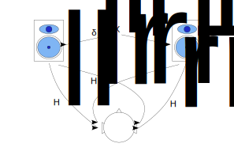
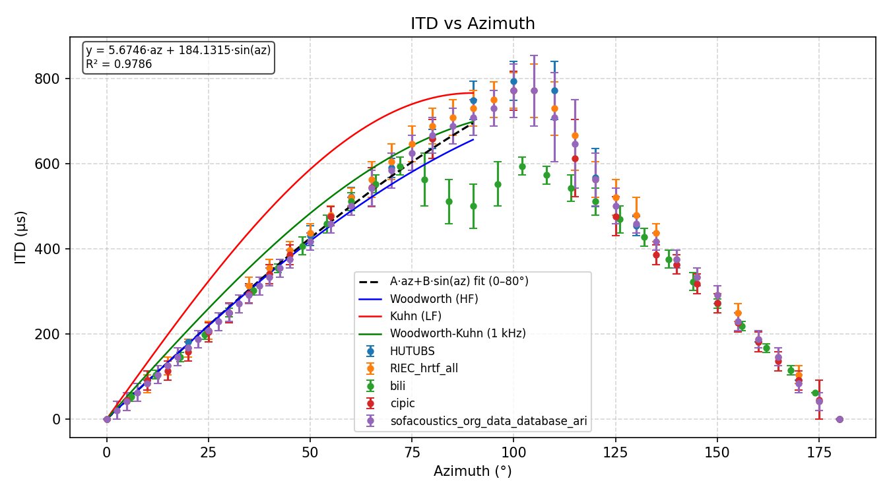
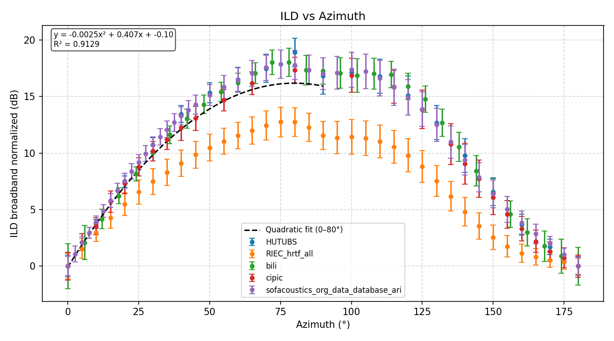
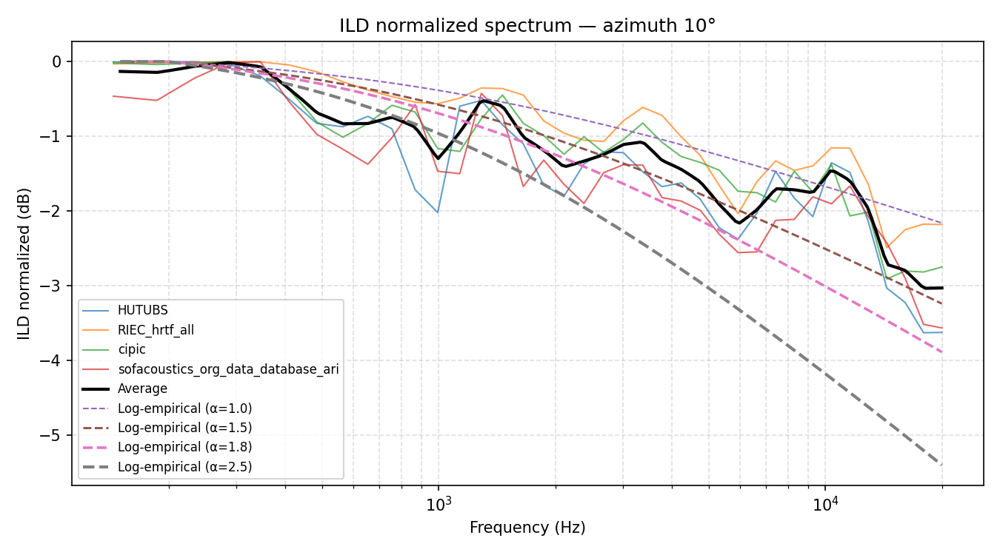
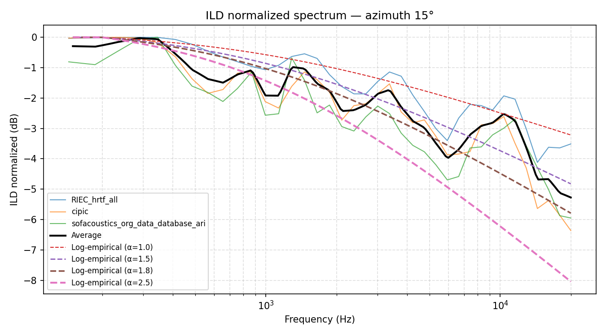
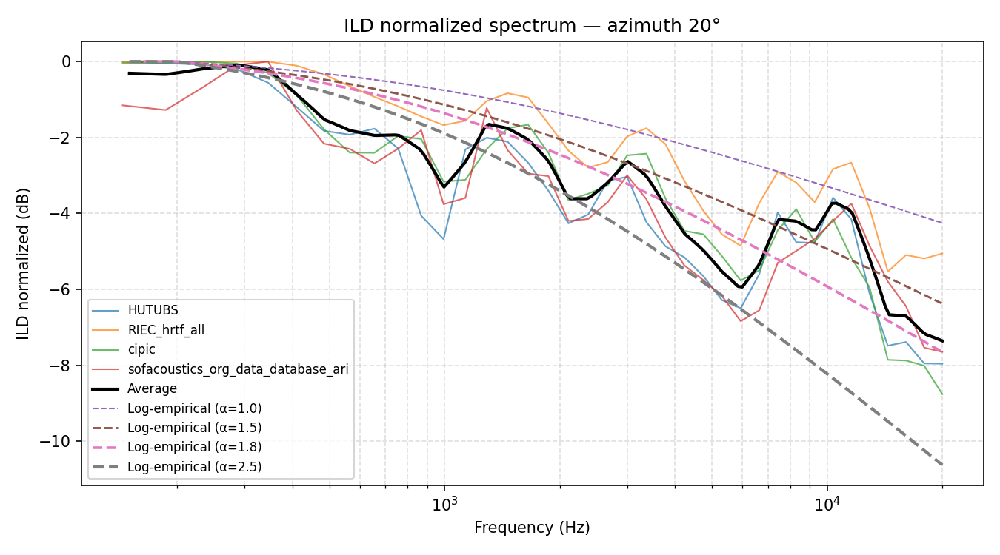
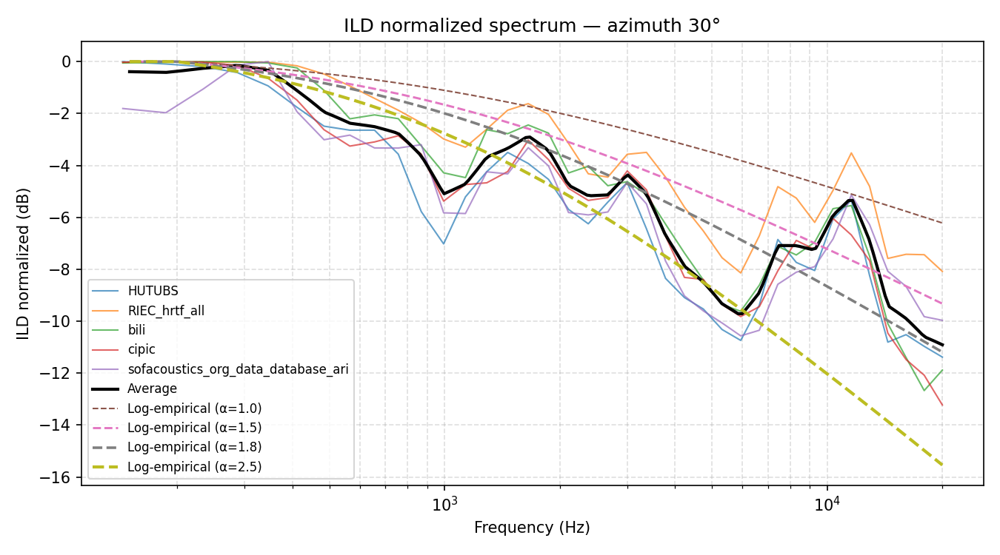
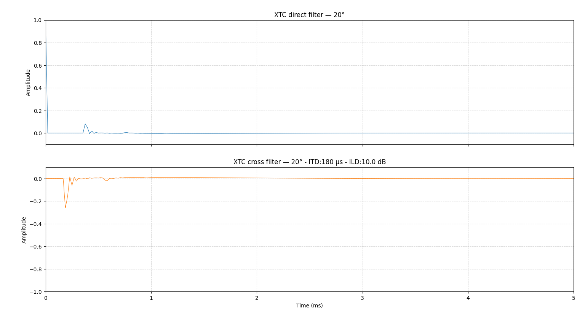
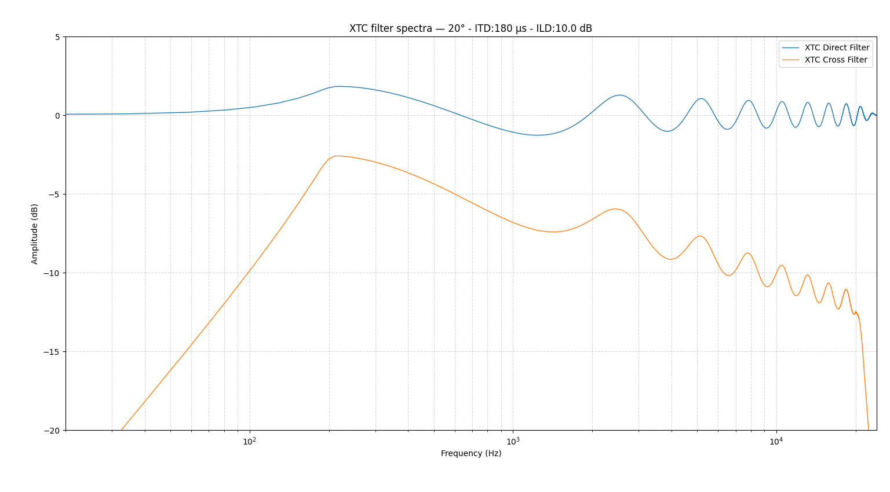

# Design of a Convolution-Based Stereo Crosstalk Canceller (XTC) for NatAmbio

**Author:** Raúl Fernández Ortega  
**Date:** June 2026  
**Email** natambio.audio@gmail.com

> **Abstract —** *NatAmbio implements stereo crosstalk cancellation (XTC) through the convolution of internally generated FIR filters. Acoustic crosstalk —each loudspeaker is heard by both ears— collapses and blurs the spatial image of stereo, and since physical isolation between channels is unfeasible in practice, mitigation is addressed by digital processing. A recurring criticism of existing XTC cancellers (of the recursive RACE family and of the FIR matrix-inversion family) is that they markedly improve sense of spaciousness at the cost of introducing some tonal coloration. This article presents the XTC filter design algorithm used by NatAmbio, conceived to balance maximum stereo image and minimum coloration, and formulated as an FIR generalization of the classic recursive schemes. Starting from an iterative analysis of the successive cancellations that keeps the direct acoustic paths intact, a direct filter and a cross filter are obtained, expressible as power series of the function G (the cross-to-direct path ratio). These series converge whenever |G| < 1 —a condition guaranteed by the acoustic shadow of the head— and are truncated to just N = 3–4 terms; although the design process is recursive, the realized filter is FIR and, being modeled in minimum phase, introduces no appreciable processing latency, which makes it suitable for audio synchronized to video. The function G is parametrized from HRTF models (ITD, average ILD and ILD spectrum), obtained by averaging five public databases (HUTUBS, RIEC, BiLi, CIPIC and ARI), with a monotonic empirical fit of the ILD spectrum governed by a parameter α. The result is a parametrizable solution —empirically validated over years of continuous domestic use— that, by adjusting ITD, ILD, α and the azimuth Θ, makes it possible to reach the optimal balance between spatial effect and tonal neutrality in each system.*

## Introduction

As already noted, NatAmbio is a system made up of two XTC stereo dipoles, one frontal and one surround. It therefore includes the XTC function in its software, here applied through the convolution of FIR filters generated for that purpose. The filters NatAmbio uses internally are generated by an algorithm whose mathematical design is presented below. First the problem is briefly introduced, then the best-known XTC proposals published to date are referenced, and finally the particular model used by NatAmbio is developed.

## Prior technical references

One of the hidden problems behind any multi-loudspeaker system for generating a spatial sound field (from stereo to Dolby Atmos) is the appearance of (natural) crosstalk: the signal from each loudspeaker is heard by both ears at once, and differently by each. In the well-known stereo case, the result is that the spatial layout of the virtual sound sources collapses and blurs, losing much of its potential.

That the distortion caused by stereo crosstalk is significant, and highly undesirable, is easy to verify through the physical experiment of placing a large acoustic isolation panel between the two loudspeakers, extended toward the listener, preferably with the loudspeakers very close together. It is an awkward arrangement, impossible in a domestic setting, but it allows one to experience very simply the potential of stereo to generate a sound image of very wide extent.

Since physical isolation is in practice unfeasible, research has focused on the possibility of generating crosstalk cancellers (XTC) using DSP techniques. One of the best-known solutions for mitigating undesirable crosstalk in a subjectively noticeable way is [ambiophonics](https://en.wikipedia.org/wiki/Ambiophonics). Ralph Glasgal, Robin Miller and Angelo Farina, its promoters, developed a DSP filter called [RACE (Recursive Ambiophonic Crosstalk Elimination)](https://filmaker.com/papers/RGRM-RACE_rev.pdf) that enables XTC functionality in amateur sound equipment or even professional systems.

In addition to IIR techniques, such as the aforementioned RACE, there are also [FIR implementations that produce XTC by convolution](https://www.researchgate.net/publication/228356916_Ambiophonic_Principles_for_the_Recording_and_Reproduction_of_Surround_Sound_for_Music). Edgar Choueiri's XTC work is also especially well known, and is available [commercially](https://www.bacch.com/ubacch). The vast majority of the XTC literature is fairly old, more than 15 years back, and since then public developments in the study of the possibilities of this type of digital filtering have largely disappeared.

The main literature on XTC applied via FIR filters, such as [Angelo Farina](https://www.angelofarina.it/Public/Papers/146-Sharc2000.PDF) and the already mentioned Edgar Choueiri, aims to invert the matrix of the four impulse responses between loudspeakers and ears. In this new study, the FIR XTC filter implementation is based on a recursive algorithm, similar to the original RACE, although the latter was an IIR filter.

One of the most frequently repeated criticisms of existing XTC algorithms is that they greatly improve the stereo image of the sound, but at the cost of some tonal coloration. With this in mind, the final design details of this recursive algorithm focus on striking a balance between minimizing coloration until it disappears and, at the same time, delivering the maximum possible spatial image. The result is a parametrizable solution that allows XTC filters to be generated for different configurations and, through adjustment, to reach the optimal balance in each case.

## Notation

| Symbol | Meaning |
|---|---|
| $X_l,\ X_r$ | Input signals of the left and right channels |
| $H_{ll},\ H_{rr}$ | Direct acoustic paths (loudspeaker → same-side ear) |
| $H_{lr},\ H_{rl}$ | Cross acoustic paths (loudspeaker → opposite ear) |
| $H_{direct},\ H_{cross}$ | Symmetric versions of the direct and cross paths |
| $G = H_{cross}/H_{direct}$ | Normalized cross transfer function |
| $F^{direct},\ F^{cross}$ | Resulting FIR filters (direct and cross paths) |
| $\delta$ | Unit impulse (identity element of convolution) |
| $\ast$ | Convolution operator |
| $\Theta$ | Angle of incidence (half-angle between loudspeakers; total separation $2\Theta$) |
| $\text{ITD}$ | Interaural Time Difference |
| $\text{ILD}_{dB}$ | Interaural Level Difference in dB |
| $a = 10^{-\text{ILD}_{dB}/20}$ | Linear attenuation factor associated with the ILD |
| $\alpha$ | Exponent of the spectral ILD model |
| $N$ | Number of terms (iterations) in the summation |
| $\mathbf{H}$ | Acoustic transfer matrix of the symmetric system |
| $\mathbf{C}_G$ | Normalized relative coupling matrix |
| $\mathbf{F}_{XTC}$ | XTC filtering matrix (direct and cross filters) |
| $\mathbf{A}$ | Cross coupling matrix ($\mathbf{C}_G=\mathbf{I}+\mathbf{A}$) |
| $\mathbf{I}$ | Identity matrix |
| $E$ | Equalization / room-correction filter (DRC) |

## Problem analysis and resolution

Starting from the sound scheme of the basic stereo system and its crosstalk:



In this analysis an iterative path will be developed. It is important to note that the first signal to be generated is each channel's own signal ( $\delta \ast X_l = X_l$ ), keeping the paths $H_{ll}$ and $H_{rr}$ without any filter so as to keep the real acoustic system intact along the direct paths. XTC filtering will be an addition to this natural acoustic response of the system.

Likewise, in developing the model, the real impulse response of the loudspeakers will not be considered, idealizing it as $\delta = 1$, and the environment will be assumed anechoic, with no contribution of any kind from the surroundings.

The signal $X_l$, fed into the left channel, will reach each ear as:

$$S_{l} = X_{l} \ast H_{ll}$$
$$S_{r} = X_{l} \ast H_{lr}$$

where $\ast$ is the convolution operator.

For the left channel, the direct signal will be delivered intact. $H_{ll}$ is assumed to represent the natural acoustic path between the listener's left loudspeaker and left ear. From the XTC standpoint there is no unwanted contribution along this path and therefore it does not need to be modified. Thus, in this first iteration only a cancellation FIR filter ($F_{r1}$) must be added to the right channel, which is the one that receives the crossed crosstalk.

To determine this filter $F_{r1}$, we start from the cross signal, which would be:

$$S_{r} = X_{l} \ast H_{lr} + X_{l} \ast H_{rr} \ast F_{r1} = X_{l} \ast \left ( H_{lr} + H_{rr} \ast F_{r1}\right )$$

For $S_{r}=0$, which is the crosstalk cancellation condition, the following must hold:

$$ H_{lr} + H_{rr} \ast F_{r1} = 0 $$
$$ F_{r1} = - H_{lr} \ast H_{rr}^{inv} = \frac {-H_{lr}} {H_{rr}}$$

Interpreting the division notation as convolution by the inverse: for example, a filter convolved with its inverse yields a $\delta$:

$$ H_{rr} \ast H_{rr}^{inv} = \frac {H_{rr}} {H_{rr}} = \delta $$

Now an additional filter must be generated in the left channel to cancel the crosstalk caused by applying the first filter, $F_{r1}$, to the right channel:

$$ F_{l1} \ast H_{ll} + H_{rl} \ast \frac {-H_{lr}} {H_{rr}} = 0$$
$$ F_{l1}  = \frac { H_{rl} \ast H_{lr}} {H_{rr}} \ast H_{ll}^{inv} = \frac {H_{rl} \ast H_{lr} } {H_{rr} \ast H_{ll}} $$

always understanding division as convolution by the inverse impulse responses. Following the analysis of the successive crosstalk cancellations, four filters are obtained: two for the cross channel (filters for the right channel due to the left-channel signal, and vice versa) and two for the direct channel (filters for the left channel due to the left-channel signal, and vice versa).

$$ F_{r}^{cross} = \sum_{i=1}^{N} \frac {-H_{lr}^{i} \ast H_{rl}^{i-1}} {H_{rr}^{i} \ast H_{ll}^{i-1}}$$
$$ F_{l}^{cross} = \sum_{i=1}^{N} \frac {-H_{rl}^{i} \ast H_{lr}^{i-1}} {H_{ll}^{i} \ast H_{rr}^{i-1}}$$
$$ F_{r}^{direct} = \sum_{i=1}^{N} \frac {H_{rl}^{i} \ast H_{lr}^{i}} {H_{rr}^{i} \ast H_{ll}^{i}}$$
$$ F_{l}^{direct} = \sum_{i=1}^{N} \frac {H_{lr}^{i} \ast H_{rl}^{i}} {H_{ll}^{i} \ast H_{rr}^{i}}$$

where the exponent $i$ denotes $i$ successive convolutions of the same filter, and where the function $H_{xy}$ appears in the denominator when its inverse is being referred to.

If we assume — something reasonable in symmetric (or near-symmetric) environments — that $H_{lr} = H_{rl} = H_{cross}$ and $H_{ll} = H_{rr} = H_{direct}$, the equations finally become:

$$ F^{cross} = \sum_{i=1}^{N} \frac {-H_{cross}^{2i-1}} {H_{direct}^{2i-1}} $$
$$ F^{direct} = \delta + \sum_{i=1}^{N} \frac {H_{cross}^{2i}} {H_{direct}^{2i}} $$

We now define a function $G$ as the convolution of the cross acoustic impulse response with the inverse of the direct acoustic impulse response:

$$G = \frac {H_{cross}} {H_{direct}}$$

This relation can be interpreted as the cross acoustic response normalized with respect to the direct path, that is, the amount of crossed signal that appears at the opposite ear for each unit of signal received at the corresponding ear. This interpretation, as will be developed later, opens the possibility of linking G with the main parameters of the HRTF model.

In the case of $F^{cross}$, $G$ convolves in anti-phase, and in phase for $F^{direct}$; moreover, for $F^{direct}$ the first term is a $\delta$, indicating that the filter's first output is the input signal itself, intact. Rewriting these equations in a more simplified form gives:

$$ F^{cross} = \sum_{i=1}^{N}- G^{2i-1}  $$
$$ F^{direct} = \delta + \sum_{i=1}^{N} G ^{2i}  $$

The series converge as long as $|G| < 1$, a condition that holds naturally in the mathematical model: the cross signal has a lower level than the direct signal due to the acoustic shadow created by the listener's head. In acoustic terms this is equivalent to the energy of the cross path being lower than that of the direct path.

Although, strictly speaking, the number of terms in the summation should be infinite, since each term decays as $|G|^{2i-1}$, its contribution drops to negligible levels within a few steps. As a reference, with $|G|\approx 0.32$ (the average value of the example in the final section, $ILD_{dB}=10$ dB), each increment of $i$ reduces the term by about 20 dB: term $i=4$ is already on the order of $-70$ dB, so $N=3–4$ is sufficient in practice.

It is worth emphasizing that, although the *design process* is recursive, the filter finally realized is **FIR** (not recursive at run time): the recurrence is resolved and truncated at design time, generating a finite-length impulse response. Note also that $F^{direct}\neq\delta$: what remains unchanged is the direct *acoustic path* $H_{direct}$, but the signal delivered to the direct-side loudspeaker does incorporate the correction terms $\sum G^{2i}$, needed to cancel the crosstalk that the cross emissions themselves reintroduce into the direct ear.

However, some practical aspects must be taken into account during implementation. At low frequencies (roughly below 200 Hz), the level difference between direct and cross reception decreases significantly, so that $|G|$ may approach unity. Under these conditions it is necessary to protect the stability of the system by limiting the energy associated with the higher-order recursive terms (the $G^{n}$ with increasing $n$). This is motivated by the fact that the mathematical convergence of the XTC filters does not by itself guarantee optimal acoustic behavior. In real systems, the interaction between the XTC filters, the room's modal response and the loudspeakers' own response can produce audible reinforcements at low frequencies. For this reason, it may be advisable to introduce additional attenuations or spectral limitations on the function $G$, regardless of whether the series remains mathematically convergent.

## Matrix formulation and separation between XTC and DRC

The iterative development of the previous section admits a compact matrix rewriting that, without introducing any new hypothesis, makes explicit a structural decision of the model: which part of the acoustic system is actually inverted and which part is deliberately preserved.

### The acoustic system in matrix form

Under the symmetry assumption already adopted ($H_{lr}=H_{rl}=H_{cross}$ and $H_{ll}=H_{rr}=H_{direct}$), the four acoustic paths between the two loudspeakers and the two ears can be grouped into a single transfer matrix:

```math
\mathbf{H} = \begin{bmatrix} H_{direct} & H_{cross} \\ H_{cross} & H_{direct} \end{bmatrix}
```

so that, if $\mathbf{x}=[X_l,\ X_r]^{\mathsf{T}}$ is the vector of emitted signals and $\mathbf{y}$ the pair of signals received at the ears, then $\mathbf{y}=\mathbf{H}\ast\mathbf{x}$ (understanding the matrix product with convolution in each term). This is exactly the same scene described earlier through $S_l$ and $S_r$, now expressed compactly.

Extracting the direct path as a common factor reveals the key structure of the model:

```math
\mathbf{H} = H_{direct}\,\mathbf{C}_G, \qquad \mathbf{C}_G = \begin{bmatrix} 1 & G \\ G & 1 \end{bmatrix}
```

where $G = H_{cross}/H_{direct}$ is the normalized cross function already defined. The factorization separates two objects of different nature: the direct path $H_{direct}$, which is to be preserved, and the relative coupling $\mathbf{C}_G$, the sole cause of crosstalk and therefore the only thing that XTC filtering must cancel.

### The XTC filter as the inverse of the normalized coupling

The two filters already obtained, $F^{direct}$ and $F^{cross}$, are grouped in the same way into a filtering matrix:

```math
\mathbf{F}_{XTC} = \begin{bmatrix} F^{direct} & F^{cross} \\ F^{cross} & F^{direct} \end{bmatrix}
```

As already shown, for $|G|<1$ the series converge to $F^{direct}=1/(1-G^2)$ and $F^{cross}=-G/(1-G^2)$, so that:

```math
\mathbf{F}_{XTC} = \frac{1}{1-G^2}\begin{bmatrix} 1 & -G \\ -G & 1 \end{bmatrix} = \mathbf{C}_G^{-1}
```

That is, the sequence of cancellations and recancellations developed iteratively is nothing other than the inverse of the normalized coupling matrix. It can also be seen as a Neumann series: writing $\mathbf{C}_G = \mathbf{I} + \mathbf{A}$ with

```math
\mathbf{A} = \begin{bmatrix} 0 & G \\ G & 0 \end{bmatrix}
```

the identity $(\mathbf{I}+\mathbf{A})^{-1} = \mathbf{I} - \mathbf{A} + \mathbf{A}^2 - \mathbf{A}^3 + \cdots$ reproduces the earlier development term by term: the even powers of $\mathbf{A}$ generate the direct terms $G^{2i}$ and the odd powers the cross terms $-G^{2i-1}$. The time-domain interpretation —a chain of alternating corrective echoes between the two loudspeakers— and the matrix interpretation —the inverse of $\mathbf{C}_G$— therefore describe the same system: the former explains how the solution is physically built, the latter which algebraic object it converges to.

### What is inverted and what is not: separation between XTC and DRC

The essential distinction is that NatAmbio does not compute the complete acoustic inverse. This would be

$$ \mathbf{H}^{-1} = \mathbf{C}_G^{-1}\,H_{direct}^{-1} $$

whereas the algorithm builds only $`\mathbf{F}_{XTC}=\mathbf{C}_G^{-1}`$, without the factor $`H_{direct}^{-1}`$. Consequently, the ideal result of filtering is not the identity, but:

$$ \mathbf{H}\,\mathbf{F}_{XTC} = H_{direct}\,\mathbf{C}_G\,\mathbf{C}_G^{-1} = H_{direct}\,\mathbf{I} $$

that is, each ear receives only its assigned signal ($y_l=H_{direct}\ast X_l$, $y_r=H_{direct}\ast X_r$) but through the natural direct path, which remains intact. This matches the premise the analysis started from: keeping the paths $H_{ll}$ and $H_{rr}$ unfiltered, leaving the real acoustic system unaltered along the direct paths.

Correcting $H_{direct}$ itself —loudspeaker response, room modes, spectral coloration— does not belong to the crosstalk problem and is delegated, as already mentioned, to the equalization stage (DRC). Formally, if $E$ is a correction filter common to both channels such that $E\ast H_{direct}\approx\delta$, the total processing is

$$ \mathbf{F}_{total} = E\,\mathbf{I}\,\mathbf{F}_{XTC}, \qquad \mathbf{H}\,\mathbf{F}_{total} = E\,H_{direct}\,\mathbf{I} \approx \mathbf{I} $$

so that the final identity is not reached through a single joint acoustic inversion, but through two independent operations: spatial decoupling (XTC) and spectral correction (DRC).

Keeping $H_{direct}^{-1}$ outside the XTC matrix is not an accidental simplification, but a design decision with practical advantages. Inverting the direct path can be problematic if it contains deep zeros, non-minimum-phase components, late reflections, measurement noise or listener-position dependence; were it included in the same operation, all those problems would become part of the cancellation filter. By separating the two problems, each stage can use its own smoothing criteria, gain limits, time window and phase strategy —which, in the case of $G$, takes the form of the parametric, minimum-phase model developed in the following sections—. This separation is also consistent with the low-frequency protection already described: by not carrying along the inverse of the direct path, the treatment of the region where $|G|\to 1$ is confined to the cross filter itself.

### Compact definition of the model

Gathering the above, the NatAmbio XTC filter can be defined as a causal, truncated FIR approximation to the inverse of the crosstalk matrix normalized with respect to the direct path:

$$ \mathbf{F}_{XTC} \approx \left(H_{direct}^{-1}\,\mathbf{H}\right)^{-1} = \mathbf{C}_G^{-1} \neq \mathbf{H}^{-1} $$

The difference between these two expressions —inverting $\mathbf{C}_G$ instead of $\mathbf{H}$— summarizes the complete architecture: XTC performs the relative spatial decoupling between channels, and DRC, in a later and independent stage, equalizes the preserved direct path.

## Final design development

Once the filters have been described in terms of successive convolutions of the impulse response $G$ from the loudspeakers to the listener's ears, it must be characterized so that it can be implemented via DSP.

It must be recalled that, in the analytical development of these XTC filters, the acoustic effects of the room and of the loudspeakers are not included, as these belong to equalization. Therefore, we are only considering the transfer functions to the listener's ears.

At this point the function $G$ can be approximated by parameters derived from HRTF models, mainly ITD (*Interaural Time Difference*) and ILD (*Interaural Level Difference*), since the impulse functions $H$, isolated from the characteristics of the loudspeaker and the listening room, are precisely the HRTF mathematical models.

A first, simplest approximation is to assume that the function $G$ is frequency-independent and depends only on azimuth:

$$ G = \delta \left ( \text{ITD}, a\right ) = \delta \left ( \text{ITD} \left ( \Theta \right), ILD \left ( \Theta \right )\right ) $$

Essentially, it is a delta function delayed by a time equal to the ITD and multiplied by a linear attenuation factor $a$. This factor relates to the interaural level difference expressed in dB through $a = 10^{-ILD_{dB}/20}$. The azimuth angle $\Theta$ is the angle of incidence from the loudspeakers to the listener (in a stereo system, the loudspeakers form an angle $2\times\Theta$ between them).

With this notation, the algorithm's convergence condition $|G| < 1$ is equivalent to the cross path always being below the direct one, that is, $a < 1$ or, equivalently, $ILD_{dB} > 0$.

The next approximation is to include the effect of frequency on the ILD. To do this, the ILD can be decomposed into an average attenuation factor and another that is its frequency spectrum for a given azimuth angle $\Theta$:

$$ G = \delta \left ( \text{ITD}, \text{ILD}\right ) = \delta \left ( \text{ITD} \left ( \Theta \right), \text{ILD}_{avg} \left ( \Theta \right ) \right ) \ast \text{ILD}_{spectrum} \left ( \Theta, f \right ) $$

The function G would be obtained by convolving the impulse response dependent on $\text{ITD}$ and $ILD_{avg}$ with the impulse response of the spectrum $ILD_{spectrum}(f)$.

## Parametrization of XTC from HRTF

In order to parametrize XTC (its function G), several public HRTF measurement libraries have been studied, obtaining averaged values for $ITD$, $ILD_{avg}$ and $ILD_{spectrum}(f)$. The list of libraries is as follows:

1. The HUTUBS head-related transfer function (HRTF) database.
2. The RIEC HRTF Dataset.
3. BiLi dataset.
4. CIPIC database.
5. ARI database.

All of them can be found at this link: https://www.sofaconventions.org/mediawiki/index.php/Files

By analyzing the five cited HRTF database sets (taking averaged values from the different available measurements), a reasonable general approximation to $\text{ITD}$ and $ILD_{avg}$ as a function of azimuth angle can be obtained.
<br>
<div align="center"></div>
<br>
<div align="center"></div>
<br>

On the other hand, for $ILD_{spectrum}(f)$ the averages of the different HRTF models were studied for different angles:

Azimuth at 10°:
<br>
<div align="center"></div>
<br>
Azimuth at 15°:
<br>
<div align="center"></div>
<br>
Azimuth at 20°:
<br>
<div align="center"></div>
<br>
Azimuth at 30°:
<br>
<div align="center"></div>
<br>

Seeking the least coloration, any peak or notch in the shape of $\text{ILD}_{spectrum}(f)$ must be avoided, since the placement of these peaks in the spectrum varies greatly with the listener's anatomy. Therefore, individual developments are avoided and general approximations are chosen.

A parametric model of $ILD(\Theta,f)$ (Akeroyd et al., 2021, fitted to the data of Shaw and Vaillancourt, 1985) was evaluated as a starting point, but its high-frequency upturn does not fit well the average of the public HRTF models studied. For this reason, a simpler and monotonic empirical fitting equation has been developed, of the following form:

```math
\text{ILD}_{spectrum}(f) = \alpha \cdot 10 \cdot log_{10}(f/1000 + 1) \cdot \sin(\Theta)
```

This form was fitted to the mean of the azimuth-normalized $\text{ILD}$ values of the public HRTF sets studied (HUTUBS, RIEC, BiLi, CIPIC and ARI; see References). As can be seen in the $ILD_{spectrum}(f)$ plots, the fit uses a parameter $\alpha$ with a value between 1.5 and 2.0.

Finally, one design decision remains: the phase of $G(f)$, which corresponds to the phase of $ILD_{spectrum}(f)$. When implementing this algorithm in NatAmbio, a minimum-phase model of $ILD_{spectrum}(\Theta,f)$ was chosen. In this way the filter adds no group delay (the energy is concentrated at the start of the impulse response), so XTC processing introduces no appreciable latency beyond that of the convolution engine itself, which makes it suitable for use with audio synchronized to video.

## Example of filters obtained with this new algorithm

The algorithm has been developed and evaluated in a real domestic environment over several years of continuous use. Although formal studies with listener groups or systematic perceptual measurements are not yet available, the practical experience gained has guided all the design decisions.

With the experience of this particular use, the final parametrization has been adjusted through listening and empirical evaluation, with the result that subjective perception gave the best results in terms of balance between the XTC effect and low tonal coloration when:

- ITD was kept close to typical values of the average HRTF models.
- ILD was set to values above (greater than) those indicated by the HRTF models (around 4 dB more). In this respect, subjective listening to the XTC filters with ILD values close to those of the natural HRTF produces the perception of some coloration, especially in the treble. These conclusions, valid for a particular case, require additional and systematic testing in different audio systems before they can be generalized.

In this particular case, the filters finally applied to the system were generated with parameters ITD = 180 µs, $ILD_{dB}$ = 10 dB, $\alpha$ = 1.8 and $\Theta$ = 20°. It should be noted that, while ITD corresponds to the natural HRTF value at 20°, ILD, as already mentioned, was left at a value above the natural HRTF value at that azimuth: an ILD greater than the natural one produces a gentler cross filter, trading some spatial image for less coloration. Interpreted from a mathematical standpoint, increasing ILD reduces the magnitude of G and accelerates the convergence of the series, simultaneously reducing the energy of the higher-order correction terms, which in turn diminishes the magnitude of the "comb filter" effect (as shown below), which is the main cause of the aforementioned tonal coloration.

A visualization of the impulse responses obtained and the frequency spectra of the applied XTC filters, obtained at a sampling rate of 48 kHz and a filter length of 4096 samples, is as follows:

<br>
<div align="center"></div>
<br>
<div align="center"></div>
<br>

It can be seen that the Direct XTC filter closely approximates a $\delta$ and that its "comb" ripple is kept within the $\pm 2$ dB band. As for the Cross XTC filter, its level is below that of the Direct XTC by an average of 10 dB. It is also visible that, starting from a minimum-phase impulse-response model, the resulting XTC filters introduce no additional latency to the processed signal (the Direct XTC peak is located at $t=0$).

As mentioned earlier, the cross XTC filter is bounded at 200 Hz, to prevent its effect from being perceived not as XTC but as an unwanted bass boost. For frequencies below 200 Hz the level is attenuated with a 6 dB/octave roll-off.

Finally, two filters are obtained, one for the direct path and another for the cross path, which must be applied by convolution to achieve the desired crosstalk cancellation. Of course, NatAmbio includes the mechanism for automatically generating XTC filters, also parametrizable, and applies them through its own convolution engine, integrated with the rest of the steps of its overall DSP process.

As a final summary, this new XTC algorithm can be interpreted as an FIR generalization of the classic recursive cancellation schemes of the RACE type, where the acoustic relationships between loudspeakers and ears are parametrized by simplified and adjustable HRTF models.

## References

**Crosstalk / XTC**

1. Glasgal, R. & Miller, R. (Robin). *Recursive Ambiophonic Crosstalk Elimination (RACE)*. Ambiophonics Institute / Filmaker Technology. <https://filmaker.com/papers/RGRM-RACE_rev.pdf>
2. Farina, A. et al. *Ambiophonic Principles for the Recording and Reproduction of Surround Sound for Music*. <https://www.researchgate.net/publication/228356916_Ambiophonic_Principles_for_the_Recording_and_Reproduction_of_Surround_Sound_for_Music>
3. Farina, A. *Crosstalk cancellation filters (SHARC 2000)*. <https://www.angelofarina.it/Public/Papers/146-Sharc2000.PDF>
4. Choueiri, E. *Optimal Crosstalk Cancellation for Binaural Audio with Two Loudspeakers (BACCH)*. 3D3A Lab, Princeton University. <https://3d3a.princeton.edu/sites/g/files/toruqf931/files/documents/BACCHPaperV4d_0.pdf>

**ITD models**

5. Woodworth, R. S. (1938). *Experimental Psychology*. Henry Holt, New York. (High-frequency limit.)
6. Kuhn, G. F. (1977). Model for the interaural time differences in the azimuthal plane. *J. Acoust. Soc. Am.* 62(1), 157–167. <https://doi.org/10.1121/1.381498> (Low-frequency limit.)
7. Aaronson, N. L. & Hartmann, W. M. (2014). Testing, correcting, and extending the Woodworth model for interaural time difference. *J. Acoust. Soc. Am.* 135(2), 817–823. <https://doi.org/10.1121/1.4861243> (Correction and LF–HF transition.)

**ILD models**

8. Shaw, E. A. G. & Vaillancourt, M. M. (1985). Transformation of sound-pressure level from the free field to the eardrum presented in numerical form. *J. Acoust. Soc. Am.* 78(3), 1120–1123. <https://doi.org/10.1121/1.393035> (Base data for the parametric ILD.)
9. Akeroyd, M. A., Firth, J., Graetzer, S. & Smith, S. (2021). A set of equations for numerically calculating the interaural level difference in the horizontal plane. *JASA Express Letters* 1(4), 044402. <https://doi.org/10.1121/10.0004261> (Parametric functional form ILD($\theta$, $f$); fitted to the Shaw and Vaillancourt 1985 data.)

**HRTF datasets (basis for the empirical ILD fit)**

10. Brinkmann, F., Dinakaran, M., Pelzer, R., Wohlgemuth, J. J., Seipel, F., Voss, D., Grosche, P. & Weinzierl, S. (2019). *The HUTUBS head-related transfer function (HRTF) database*. Technische Universität Berlin. <https://doi.org/10.14279/depositonce-8487>
11. Watanabe, K., Iwaya, Y., Suzuki, Y., Takane, S. & Sato, S. (2014). Dataset of head-related transfer functions measured with a circular loudspeaker array. *Acoustical Science and Technology* 35(3), 159–165. (RIEC database, Tohoku University.) <https://www.riec.tohoku.ac.jp/pub/hrtf/>
12. Carpentier, T., Bahu, H., Noisternig, M. & Warusfel, O. (2014). Measurement of a Head-Related Transfer Function Database with High Spatial Resolution. *7th Forum Acusticum*. (BiLi database, IRCAM.)
13. Algazi, V. R., Duda, R. O., Thompson, D. M. & Avendano, C. (2001). The CIPIC HRTF database. *Proc. 2001 IEEE Workshop on Applications of Signal Processing to Audio and Acoustics (WASPAA)*, 99–102. <https://doi.org/10.1109/ASPAA.2001.969552>
14. Majdak, P., Balazs, P. & Laback, B. (2007). Multiple exponential sweep method for fast measurement of head-related transfer functions. *J. Audio Eng. Soc.* 55(7/8), 623–637. (Measurement method for the ARI database, Acoustics Research Institute, Austrian Academy of Sciences.)
