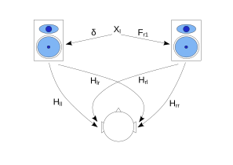

# Applying NatAmbio XTC in non-symmetric setups

**Author:** Raúl Fernández Ortega  
**Date:** July 2026

This technical note extends the design of XTC filters for conventional stereo environments to layouts in which, for whatever reason, the desired symmetry in loudspeaker placement does not hold.

## Notation

| Symbol | Meaning |
|---|---|
| $H_{ll},\ H_{rr}$ | Direct acoustic paths (loudspeaker → same-side ear) |
| $H_{lr},\ H_{rl}$ | Crossed acoustic paths (loudspeaker → opposite ear) |
| $G_l = H_{lr}/H_{ll}$ | Normalised crossed transfer function of the left loudspeaker |
| $G_r = H_{rl}/H_{rr}$ | Normalised crossed transfer function of the right loudspeaker |
| $b = H_{rr}/H_{ll}$ | Balance of the asymmetric stereo system |
| $g_x,\ S_x$ | Broadband part and spectral shape of $G_x = g_x \ast S_x$ |
| $\bar{S}$ | Spectral shape of the round trip (mean of the log-magnitudes of $S_l$ and $S_r$) |
| $P = G_l \ast G_r$ | Round-trip operator: one complete rung of the ladder (when implemented, $g_l \ast g_r \ast \bar{S}$) |
| $\mathbf{H}$ | Acoustic transfer matrix of the asymmetric system |
| $\mathbf{M}$ | Normalised relative coupling matrix (asymmetric counterpart of $\mathbf{C}_G$) |
| $\mathbf{D}$ | Diagonal balance matrix, $\mathbf{D} = \operatorname{diag}(1,\ b)$ |
| $\mathbf{F}_{XTC}$ | XTC filtering matrix (direct and cross filters) |
| $\Theta_l,\ \Theta_r$ | Incidence azimuth of each loudspeaker |
| $\delta$ | Unit impulse (neutral element of convolution) |
| $\ast$ | Convolution operator |
| $N$ | Number of terms (iterations) in the summation |

## Model formulation and mathematical development

We start again from the sound scene of a basic stereo system, showing the acoustic crosstalk paths:




As already developed in [Design of a convolution-based stereo crosstalk canceller (XTC) for NatAmbio](xtc_filters_en.md), the general matrix of acoustic paths can be defined as:

```math
\mathbf{H} = \begin{bmatrix} H_{ll} & H_{rl} \\ H_{lr} & H_{rr} \end{bmatrix}
```

If we take the direct acoustic paths out of the problem, since they will be [handled by equalisation through DRC and not by XTC](xtc_filters_en.md#what-is-inverted-and-what-is-not-separation-between-xtc-and-drc), we can make a first decomposition of the matrix $\mathbf{H}$:

```math
\mathbf{H} = H_{ll} \begin{bmatrix} 1 & {H_{rl}}/{H_{ll}} \\ {H_{lr}}/{H_{ll}} & {H_{rr}}/{H_{ll}} \end{bmatrix}
```

Assuming that both direct paths will subsequently be equalised by DRC so as to obtain a similar response at the listening position, we can approximate:

```math
{H_{rr}} = b \cdot H_{ll}
```

where $b = H_{rr}/H_{ll}$ is the linear ratio between the levels of the two direct paths of the asymmetric system, which is what is usually called the "balance" of the stereo system.

It is worth pausing on the scope of this approximation. The ratio $H_{rr}/H_{ll}$ is, strictly speaking, a full transfer function: it captures both the difference in frequency response between the two direct paths and the difference in time of flight arising from the different loudspeaker-to-listener distances typical of an asymmetric layout. That transfer function, however, is part of the inversion of $H_{ll}$ and $H_{rr}$ — that is, of the treatment of the direct paths — which, following the separation between XTC and DRC established in the main note, belongs entirely to the DRC stage and not to XTC filtering. Once DRC has matched the spectral shape and the delay of both direct paths, all that is left of that ratio is a real scalar: the relative gain between channels. The XTC model therefore ends up modelling $b$ as a scalar and deliberately accepts whatever residual acoustic mismatch may remain, both because it is not caused by the XTC filtering and because DRC, by its very nature, does not deal with the balance between channels.

Furthermore, as already defined in [Design of a convolution-based stereo crosstalk canceller (XTC) for NatAmbio](xtc_filters_en.md#problem-analysis-and-resolution), we can use the term $G$:

```math
G = \frac{H_{cross}}{H_{direct}}
```

```math
G_{l} = \frac{H_{lr}}{H_{ll}}
```

```math
G_{r} = \frac{H_{rl}}{H_{rr}}
```

The matrix $\mathbf{H}$ then decomposes as:

```math
\mathbf{H} = H_{ll} \begin{bmatrix} 1 & b \cdot G_{r} \\ G_{l} & b \end{bmatrix}
```

The matrix to be inverted through the recursive development shows two differences with respect to the symmetric case, both due to the asymmetry of the system itself: the first is that $G_{l} \neq G_{r}$, and the second is that a balance $b$ must be included in one of the two channels in order to equalise the sound pressure at the listening position.

Note that the model does not change. The only difference with respect to the symmetric case is that the system goes from using a single function $G$ to using two distinct functions, $G_{l}$ and $G_{r}$, one per loudspeaker.

Continuing with the approach of [Design of a convolution-based stereo crosstalk canceller (XTC) for NatAmbio](xtc_filters_en.md#final-design-development), both $G_{l}$ and $G_{r}$ can be expressed as dependent on:

```math
G_{l} = \delta \left ( \text{ITD}_{l}, \text{ILD}_{l} \right ) = \delta \left ( \text{ITD} \left ( \Theta_{l} \right), \text{ILD}_{avg} \left ( \Theta_{l} \right ) \right ) \ast \text{ILD}_{spectrum} \left ( \Theta_{l}, f \right )
```

```math
G_{r} = \delta \left ( \text{ITD}_{r}, \text{ILD}_{r} \right ) = \delta \left ( \text{ITD} \left ( \Theta_{r} \right), \text{ILD}_{avg} \left ( \Theta_{r} \right ) \right ) \ast \text{ILD}_{spectrum} \left ( \Theta_{r}, f \right )
```

The parametrization of each of these functions can follow the same model developed in the main XTC note for NatAmbio.

As for the matrix $\mathbf{H}$, we can further decompose it into:

```math
\mathbf{H} = H_{ll} \begin{bmatrix} 1 & G_{r} \\ G_{l} & 1 \end{bmatrix} \cdot \begin{bmatrix} 1 & 0 \\ 0 & b \end{bmatrix} = H_{ll} \cdot \mathbf{M} \cdot \mathbf{D}
```

so that the matrix to be inverted in order to obtain the XTC filters is:

```math
\mathbf{M} = \begin{bmatrix} 1 & G_{r} \\ G_{l} & 1 \end{bmatrix}
```

The inversion of the complete acoustic path $\mathbf{H}$ is:

```math
\mathbf{H}^{-1} = \left( H_{ll} \cdot \mathbf{M} \cdot \mathbf{D} \right)^{-1} = H_{ll}^{-1} \cdot \begin{bmatrix} 1 & 0 \\ 0 & 1/b \end{bmatrix} \cdot \mathbf{M}^{-1}
```

Note the order of the factors: $H_{ll}$ is a scalar and commutes, but $\mathbf{D}$ and $\mathbf{M}$ do not, so $\mathbf{D}^{-1}$ must pre-multiply $\mathbf{M}^{-1}$. As will be seen later, it is precisely this position that makes the gain $1/b$ act on the signal delivered to the right loudspeaker.

Consistently with the separation between XTC and DRC of the main note, NatAmbio does not implement the complete acoustic inverse: the factor $H_{ll}^{-1}$ is delegated to DRC and the XTC filtering matrix is

```math
\mathbf{F}_{XTC} = \mathbf{D}^{-1} \cdot \mathbf{M}^{-1} = \frac{1}{1 - G_{l} G_{r}} \begin{bmatrix} 1 & -G_{r} \\ -G_{l}/b & 1/b \end{bmatrix}
```

so that $\mathbf{H} \cdot \mathbf{F}_{XTC} = H_{ll} \cdot \mathbf{I}$: each ear receives only the signal intended for it, at the same level in both, and through the natural direct paths, which remain intact.

## Application in NatAmbio

As already shown in the main note on XTC for NatAmbio, inverting the matrix $\mathbf{M}$ is equivalent to its recursive solution. Applying the same recursive development described in the main note to the general case $G_l \neq G_r$ gives:

```math
F^{direct} = \delta + \sum_{i=1}^{N} P^i
```

```math
F^{cross}_l = - {G_{r}} \ast \sum_{i=1}^{N} P^{i-1} = - {G_{r}} \ast \left( \delta + \sum_{i=1}^{N-1} P^{i} \right)
```

```math
F^{cross}_r = - {G_{l}} \ast \sum_{i=1}^{N} P^{i-1} = - {G_{l}} \ast \left( \delta + \sum_{i=1}^{N-1} P^{i} \right)
```

where $P$ is the round-trip operator, that is, one complete rung of the recursive ladder. By definition it is the product of the two normalised crossed functions:

```math
P = G_{l} \ast G_{r}
```

which is exactly the path described by one rung of the recursion: the signal leaves the left loudspeaker towards the right ear — factor $G_{l}$ — and comes back from the right loudspeaker towards the left ear — factor $G_{r}$. It is also the product on which the convergence condition is stated, and the object, symmetric under the exchange of channels, on which both direct filters depend.

### Decomposition of the round-trip operator

The expression $P = G_{l} \ast G_{r}$ is what gives the development its meaning, but it is not what goes directly into code. In the step towards implementation each function $G$ is separated into its broadband part and its spectral shape, $G_x = g_x \ast S_x$, and the convention established in the main note comes into play — [application of the ILD spectrum within the series](xtc_filters_en.md#application-of-the-ild-spectrum-within-the-series): the spectrum is applied only once per rung, whereas the delay and the broadband attenuation do follow the full power law. The round-trip operator is then generated as

```math
P = g_l \ast g_r \ast \bar{S}
```

that is: the delays of both sides add, the attenuations multiply, and where the product $G_{l} \ast G_{r}$ would accumulate $S_l \ast S_r$ the spectrum intervenes only once, through an averaged shape $\bar{S}$. With this, term $i$ of the direct filter is $(g_l g_r)^i \ast \bar{S}^i$ and term $i$ of each cross filter is $g_r (g_l g_r)^{i-1} \ast S_r \ast \bar{S}^{i-1}$, so that the number of applications of the spectrum is $i$ in every case, with the same index $i$ numbering the same rung in the direct filter and in the cross ones.

It remains to determine which spectral shape corresponds to $\bar{S}$. Since the round trip crosses one head shadow on each side, and there is room for only one application, the natural choice is the mean of both log-magnitudes. Given that the empirical model of $ILD_{spectrum}$ is linear in the product $\alpha \sin\Theta$, that mean is obtained without averaging any responses: it suffices to evaluate the same model with

```math
\bar{\kappa} = \tfrac{1}{2} \left( \alpha_l \sin\Theta_l + \alpha_r \sin\Theta_r \right)
```

With both sides equal, $\bar{S}$ collapses into $S$ and all the expressions above reduce exactly to those of the symmetric case. The spectrum **of each side individually**, $S_l$ or $S_r$, does however appear in the first-order term of its own cross filter, which is the dominant one and the one that actually cancels the crosstalk: this is what keeps the two cross filters spectrally distinct in an asymmetric layout.

### Symmetry of the direct filters, and convergence

It is worth pointing out that the FIR filters for the direct components of each channel are identical — before the balance is applied — despite the system being asymmetric, since both depend only on $P$, which is symmetric under the exchange of channels. The asymmetry is reflected in the cross FIR filters, which differ in the factors $G_l$ and $G_r$.

The convergence condition in this asymmetric case is that the magnitude of the product $G_l \cdot G_r$ stays below unity at all frequencies:

```math
\left | G_l(e^{j\omega}) \cdot G_r(e^{j\omega}) \right | < 1 \quad \forall \omega
```

In the usual NatAmbio parametrization both functions represent attenuated crossed paths, so this condition is normally satisfied. Note that the condition now applies to the product and not to each term separately: the asymmetry allows one of the two crossed paths to be less attenuated than the other, as long as the product remains bounded.

The factor $b$ lies outside the recursive cancellation loop and therefore does not modify its convergence condition. Compensating for it consists in applying a gain $1/b$ to both the direct and the cross component destined for the right channel, which is exactly the effect of pre-multiplying $\mathbf{M}^{-1}$ by $\mathbf{D}^{-1}$. The choice of reference channel is arbitrary: the system could equally be normalised with respect to $H_{rr}$, applying the inverse factor to the left channel.

## Setting the balance between channels

In NatAmbio the matrix $\mathbf{D}^{-1}$ is not baked into the generated coefficients: it is realised as a gain in the convolution routing, set by the user. The filter generator produces $\mathbf{M}^{-1}$ only. The reason is that the balance is not a parameter of the acoustic model but a level adjustment of the particular system, and one that has to be made by hand — measuring or listening at the listening position — regardless of where the value lives.

Since $\mathbf{D}^{-1}$ pre-multiplies $\mathbf{M}^{-1}$, it scales a whole row of the filtering matrix, that is, **everything delivered to one loudspeaker**: both its direct and its cross component. In practice this means applying the same gain to the two convolutions feeding the same output, no matter which input each of them comes from.

### Attenuate, never amplify

The strict factor is $1/b$ on the right channel which, if $b<1$, means a boost and with it a loss of headroom and a risk of clipping. Multiplying the whole filtering matrix by $b$ is, however, equivalent as far as cancellation is concerned — only the ratio between the two gains matters — and yields $\operatorname{diag}(b,\ 1)$, that is, an attenuation of the left channel. The practical rule is therefore to **attenuate the channel that arrives louder at the listening position and leave the other one untouched**, never the other way round.

### Proposed procedure

The adjustment can be made by ear, with no instrumentation:

1. Play a **mono signal through both channels**, so that the resulting image must be perceived exactly centred. Any monophonic material will do, or a stereo recording summed to mono.
2. Progressively attenuate whichever channel is perceived as dominant — the two convolutions feeding that output, by the same amount — until the image sits in the centre.
3. Consider the adjustment done at that point. The ear's resolution for centring a mono phantom source is of the order of a tenth of a dB under favourable conditions and, in any case, comfortably better than the target justified below.

It should be noted that if the DRC stage already levels both channels against a common target, the residual balance is practically zero and the adjustment stays at 0 dB. The procedure is there for when that is not the case.

### Why the balance is not a cosmetic adjustment

One might think that a badly set balance only degrades the tonal equilibrium or the position of the image, leaving crosstalk cancellation intact. That is not the case. If $\mathbf{D}^{-1}$ is not applied, the effective filtering is $\mathbf{M}^{-1}$ instead of $\mathbf{D}^{-1}\mathbf{M}^{-1}$, and the result over the acoustic path is:

```math
\mathbf{H} \cdot \mathbf{M}^{-1} = \frac{H_{ll}}{1-P} \begin{bmatrix} 1-bP & G_r(b-1) \\ G_l(1-b) & b-P \end{bmatrix}
```

The crossed terms **do not vanish**: they remain proportional to $(b-1)$. In other words, the balance is part of the cancellation, not something added on top of it. This is perfectly consistent with what was said earlier — $b$ lies outside the *recursive loop* and does not affect convergence — but being outside the loop does not make it optional.

### Cancellation ceiling

The limit imposed by an imperfect balance follows from the expression above. The residual crosstalk relative to the direct signal is, to first order, $|1-b|$ times what it was before filtering, so the achievable cancellation is bounded by:

```math
\text{maximum cancellation} \approx 20 \log_{10} \left| 1 - b \right|
```

| Balance error | Cancellation ceiling |
|---|---|
| 0.5 dB | ≈ −25 dB |
| 1 dB | ≈ −19 dB |
| 2 dB | ≈ −14 dB |
| 3 dB | ≈ −11 dB |
| 6 dB | ≈ −6 dB |

The practical reading is that **setting the balance to within less than 1 dB places the ceiling at about 20 dB of cancellation**, which is of the same order as what the parametric model itself can deliver; refining it further adds nothing, whereas leaving a 3 dB error limits the system to about 11 dB, well below its potential. This is what turns "adjust it by ear" into a target with a defined tolerance, and what justifies the procedure of the previous section being sufficient.

## Low-frequency protection

As in the symmetric case, the mathematical convergence of the series does not by itself guarantee optimal acoustic behaviour. Below roughly 200 Hz the level difference between direct and crossed reception shrinks considerably — the head stops casting an acoustic shadow at large wavelengths — so that $|G_l|$ and $|G_r|$ approach unity. Even though their product stays below 1 and the series converges, the interaction of the cross filters with the modal response of the room and with the loudspeakers' own response can produce an audible reinforcement in the bass, perceived not as an XTC effect but as an unwanted, acoustically resonant boost.

The same protection as in the symmetric model is therefore applied: XTC action is bounded below **200 Hz**, attenuating the level with a **6 dB/octave** roll-off. It is built into the $ILD_{spectrum}$ model itself, so it affects $S_l$, $S_r$ and $\bar{S}$ alike, and therefore both cross filters and the corrective terms of the direct one. The $\delta$ component of the direct filter is unaffected, so that at low frequency the direct filter tends to unity and the system converges smoothly to unprocessed stereo.

Measured on the filters actually generated for an example asymmetric layout (left 180 µs / 10 dB / 20°, right 140 µs / 8 dB / 15°, 4096 taps at 48 kHz), both cross filters show a slope of about 6 dB/octave below 200 Hz while the direct filter approaches 0 dB. The low-frequency behaviour is therefore the same as in the symmetric case.

## Reduction to the symmetric case

The main equations of the XTC technical note are readily obtained from those of the asymmetric model by simply setting $g_l = g_r = g$ and $S_l = S_r = \bar{S} = S$, which gives $P = g^2 \ast S$ and reduces the expressions term by term, for the same $N$, to those of the symmetric case: $F^{direct} = \delta + \sum_{i=1}^{N} P^{i}$ and $F^{cross} = -G \ast \sum_{i=1}^{N} P^{i-1}$, whose term $i$ is $g^{2i} \ast S^{i}$ and $g^{2i-1} \ast S^{i}$ respectively. This equivalence is what the `make check` test in `lib/` verifies, requiring the asymmetric generator to reproduce the symmetric one when both sides carry the same parameters.

Although the model covers it, an XTC implementation in asymmetric environments cannot reasonably be expected to reach the performance of an equivalent symmetric layout, so it will always be advisable to arrange a stereo setup that is, if not standard, at least symmetric.
